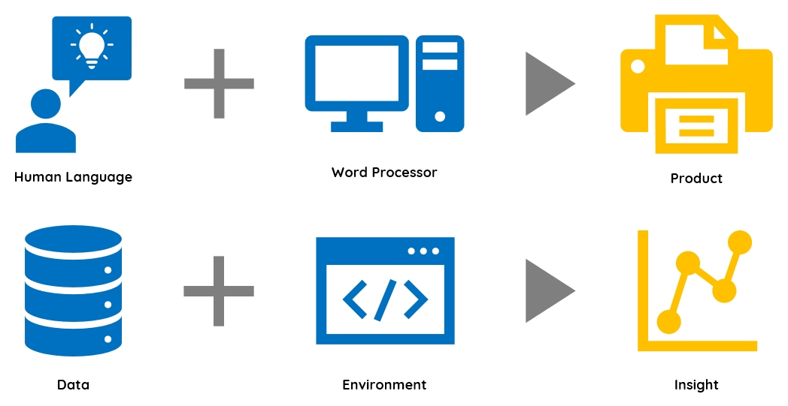
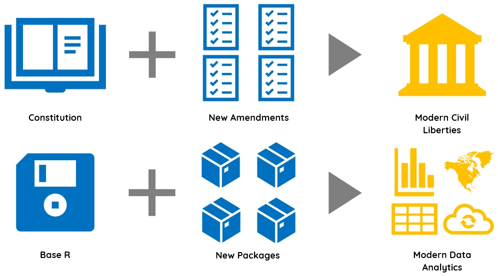

---
output:
  html_document:
    theme: readable
    highlight: tango
    self_contained: false
    css: textbook.css
---


# The **R** Language

```{r, echo=F, fig.align="left", out.width="30%"}

knitr::include_graphics("https://upload.wikimedia.org/wikipedia/commons/thumb/1/1b/R_logo.svg/724px-R_logo.svg.png")

```


<br>
<br>


<div class="tip">

## Key Concepts

R is a specialized programming language created by statisticians for data analysis and visualization. 

* R Console
* Base R 
* Packages
* Comprehensive R Archive Network (CRAN)

<br>
<br>

</div>


## R: An Open Source Language for Statistical Computing

R is a language that was designed for **statistical computing**, the art of combining computer science tools for problem-solving with models from statistics. The goal is to turn raw data into useful, actionable insights. This field has come to be known as **Data Science**. 


R is an **open source** language, which means that applications built in R are not only free, but users are allowed to access and modify the *source code*. 

As a result of this design approach, it is extremely easy to develop and adapt code in R. Because of the freedom this provides, R users have expanded the power and functionality of **Core R** for nearly a quarter century. 

Custom applications and tools that users create for R are called **packages** (also called **libraries** when you are loading them). Packages are programs designed to perform a specific type of analysis or visualization. 

The best part of R is how easy it is to access cutting edge software by installing new packages in a two lines of code:

```{r, eval=F}
install.packages( "tidyverse" )   # install the package
library( "tidyverse" )            # load the package
```

<br>

**Popular R Packages:**  [ [**A RECENT LIST**](https://support.rstudio.com/hc/en-us/articles/201057987-Quick-list-of-useful-R-packages) ]

<br>

## R as a Social Network

The R Foundation is a nonprofit that maintains the R language and ensures it remains free and accessible to everyone in the world. Packages are shared through the Comprehensive R Archival Network (The **CRAN**), a group of servers housed primarily at universities that store R packages so they can be quickly downloaded and deployed. 

There are over 15,000 packages that users have created for R. They perform a wide variety of tasks such as data preparation, specialized statistical analysis, custom data visualizations, or specific analytical tasks such as text analysis or network analysis.

This functionality is a primary reason R has become one of the most popular languages used by academics and data scientists. Provides a very simple way for people to develop cool tools and share them with the world. It became popular because it was built by smart and creative people, who attracted other smart and creative people, who created cool tools, which then attracted more smart and creative people. 
[**R Package Downloads**](http://gallery.shinyapps.io/087-crandash)


<br>

## R as an Operating System

R is a **programming language**. We can think of a programming languages as instructions that are evaluated and carried out by a computer. R, then, is simply one way to give instructions to computers.

This is a limited view of R, though. It is better understood as an operating system for data science software. Just as Windows allows you to turn on your computer, open a web browser, moved files around, and write a paper using MS Word, R allows you to access the CRAN, install and run packages, and manage files while organizing large data projects. Just like Windows would be a very boring piece of software without all of the applications you run while on the computer, R would be a boring language without all of the packages it can run. 


```{r 000.a, echo=F, fig.align="center", fig.cap="*R is both a programming language and programming environment.*", out.width="75%"}



```


<br>


## Downloading & Installing R

You can download and install R quickly and easily from the [**Comprehensive R Archive Network**](https://cran.r-project.org/), or **CRAN**. It is a decentralized website that's hosted and updated by academic institutions all over the world. In other words, R would survive a semi-global catastrophic event. It contains:

* The latest version and past versions of R
* Extensions, also called **packages**, for R
* Package and version documentation
* Books, blogs, conferences, news, etc.

<br>


## R Console

After installing, when you open Base R directly you will see the **command-line interface**, or a **console**. This is used to type R code is directly evaluated by the environment, a process known as working *interactively*. 

While this is practice is a quick way to run some simple code, it is difficult to develop complex programs in real-time (it would be like writing a play while it is being acted out). A more typical and organized way to create data recipes is through **scripting**, which we address below.


## Extending R's Functionality: Packages

**Packages** are collections of new commands, a.k.a. **functions**, that are developed and shared by the worldwide R userbase. Packages greatly expand the power and functionality of **base R**, the "vanilla" or unmodified version of R. While [CRAN](https://cran.r-project.org/) is the most popular package archive, others include [Bioconductor](http://www.bioconductor.org/) and [GitHub](https://cran.r-project.org/web/packages/githubinstall/vignettes/githubinstall.html).

<br>

If R were the Constitution of a nation, packages would be its amendments - they not only provide more freedom for the user, they address new ideas and practices that were unforeseen by R's founders. More on packages:

* Functions and packages are developed in response to identified needs
* If your needs are unmet by base R, there's likely a package for it
* Altogether, there are over 15,000 packages on CRAN, alone 
* There are tens of thousands of unpublished packages
* Entire ecosystems of packages exist, e.g, *Tidyverse*


<br>

```{r 000.b, echo=F, fig.align="center", fig.cap="*Packages give users more freedom and resolve issues unforeseen by R's founders.*", out.width="75%"}



```

<br>

You can **install packages** in R by calling the `install.packages()` function, *with the package name in quotations*: 

```{r 000.1, eval=F}

install.packages("my_package")

```


Once installed, you can **load packages** by calling the `library()` function, *without quotations*.

**Note:** You only need to install a package *once*. However, you must load each package *every time you start R*:

```{r 000.2, eval=F}

library(my_package)

```


**Note:** "Packages" and "libraries" are two words for the same thing. They both refer to a set of **functions** that have been "packaged" or are organized into a "library" to be shared. 

<br>


<div class="note">

**Fun Fact:** R is an implementation of an older programming language, **S**. John Chambers first developed S in 1976 to make statistical analysis a point-and-click, interactive, and user-friendly process. However, Chambers' underlying philosophy reflects the use of R packages to this day:

> “We wanted users to be able to be in in an interactive environment, where they did not consciously think of themselves as programming. Then as their needs became clearer and their sophistication increases, they should be able to slide gradually into programming, when the language and system aspects would become more important.”

</div>

<br>


## Resources

There's a litany of online and print resources introducing the R language. Here are a few that we find instructive:

<br>

**I) Full-Length Introductions to R:**

* ["Part I: Foundations, Introduction to R"](https://ds4ps.org/Data-Science-Class/TEXTBOOK/docs/introduction-to-r.html) (Lecy, 2018)
* ["Intro to R: Nuts * Bolts"](https://rpubs.com/jamisoncrawford/nutsandbolts) (Crawford, 2018)

**II) Publications & Articles:**

* ["What is R? Introduction to R and the R Environment"](https://www.r-project.org/about.html) (CRAN, 2001)
* ["R: A Language for Data Analysis and Graphics"](http://srv2.lemig.umontreal.ca/donnees/geo1512/IHAKA_JCGS_1996_R_concepts_implementation.pdf) (Ihaka & Gentleman, 1996)

**III) Handouts & Cheat Sheets:**

* ["R: Some Helpful Vocabulary"](https://github.com/jamisoncrawford/dp4ss-textbook/raw/master/ch-001-core_r_files/ch-001_handout1_r_vocabulary.pdf) (Lecy, 2017)
* ["Base R Cheat Sheet"](https://www.rstudio.com/wp-content/uploads/2016/05/base-r.pdf) (RStudio, 2016)

**IV) Videos:**

* ["R in 60 Seconds"](https://player.vimeo.com/video/180644880) (Lecy, 2018)
* ["John Chambers Interview [On the History of S & R]"](https://www.youtube.com/watch?time_continue=135&v=jk9S3RTAl38) (Statistical Learning, 2013)

<br>
