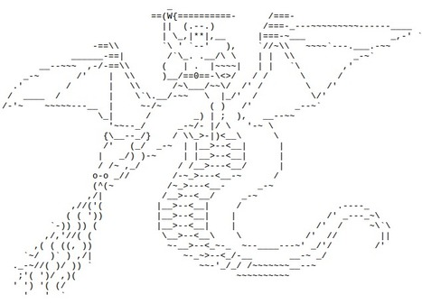

---
output:
  html_document:
    theme: readable
    highlight: tango
    self_contained: false
    css: textbook.css
---


```{r, eval=F, echo=F}

```


# *Here There be ASCII Dragons*





<div class="tip">

## Key Concepts

You will get stuck while learning to code. 

R has lots of resources for problem-shooting. You should familiarize yourself with the following:

* Error messages
* Documentation 
* Discussion boards 
* Vignettes

<br>
<br>

</div>

<br>


# HELP! 

  *When I was younger, so much younger than today*  
  *I never needed anybody's help in any way*  
  *But now these days are gone, I'm not so self assured*  
  *Now I find I've changed my mind and opened up the doors*  

<br>

Your code is going to fail. A lot. Bugs and broken ~~dreams~~ code are a normal part of any programming task. They never go away, but you get better at diagnosing and fixed them!

The following is a brief taxonomy of errors in R, and some strategies to overcome them.

<br>

## What Does It Mean for Code to Fail?

Two simple criteria must be met in order to recognize trouble with your code ([Peng et al. 2017](https://bookdown.org/rdpeng/RProgDA/)):

1. You expect your code to behave in a certain way
2. Your code doesn't behave as expected

Oftentimes, the best case scenario is that R will throw an **error message**. Error messages signal that R has encountered some fatal flaw in your code and, in consequence, nothing happens.

The next best scenario is that R will throw a **warning message**. Warning messages signal that R has successfully evaluated and executed code, but something unexpected happened, and R wants you to know about it.


<center> Source: [Rex Analytics](http://rex-analytics.com) </center>

<br>

The worst and most pernicious scenario is when your code runs perfectly fine, without error or warning messages, yet the output isn't exactly what you'd wanted. If you recognize this, that's great. If you don't recognize this, errors flow downstream and can be difficult to detect and fix. *Always inspect your output*.


Oftentimes, users place too much emphasis on fixing their expected results and fail to consider their original expectations. *Never neglect revisiting your expectations*, as it's possible that they, not your code, may explain an error ([Peng et al. 2017](https://bookdown.org/rdpeng/RProgDA/)).


<br>

## Documentation 

When you're in a jam, the foremost strategy for resolving said jam is to read any relevant documentation.


### Built-In Documentation

All base R functions, as well as packages, functions, and datasets downloaded from CRAN (Comprehensive R Archie Network) contain documentation that can be accessed via the `help()` or `?` functions. 

When called, the **Help** pane displays built-in documentation, which typically contains names, descriptions, templates, arguments, values, references, related objects, and examples.

Observe the following calls to `help()` on function `median()`:

```{r eval=FALSE}
help(median)
?median
```

```{r img_helpdoc, echo=F, fig.align="center", fig.cap='*Built-in documentation is displayed with function* `help()` *and an object name.*', out.width="75%"}

knitr::include_graphics("https://raw.githubusercontent.com/DS4PS/dp4ss-textbook/master/figures/helpdoc_med.jpg")

```

<br>

### External Documentation

Datasets found "in the wild" often have documentation containing metadata, variable definitions, and other helpful information, while many functions have external documentation outside of CRAN.

<br>

<center>

**[Documentation for RStudio's "dplyr" Package](https://db.rstudio.com/dplyr/)**

</center>

```{r img_ext_doc_dplyr, echo=F, fig.align="center", fig.cap="*More stylized documentation on package* `dplyr`  *from the Tidyverse website.*", out.width="75%"}

knitr::include_graphics("https://github.com/DS4PS/dp4ss-textbook/blob/master/figures/externaldoc_dplyr.jpg?raw=true")

```

<br>

**Documentation for the Pheonix Fire Department Data**

</center>

```{r img_ext_doc_pfd, echo=F, fig.align="center", fig.cap="*Documentation on operational statistics data on the City of Phoenix Open Data portal.*", out.width="75%"}

knitr::include_graphics("https://raw.githubusercontent.com/DS4PS/dp4ss-textbook/master/figures/externaldoc_pazfiredep.jpg")

```

<br>

<center>


### Vignettes

> “A vignette is like a book chapter or an academic paper: It can describe the problem that your package is designed to solve, and then show the reader how to solve it.” (Hadley Wickham)

Some R packages have **vignettes**, or more comprehensive and thorough overviews than typical documentation. Vignettes are written for the express purpose of learning how to use a package. While vignettes are easy to find in a conventional search engine, you can open a vignette from within R by calling function `browseVignettes()` and a quotes package name. For example:

```{r eval=FALSE}
browseVignettes("tidyr")
```

```{r img_vignettes, echo=F, fig.align="center", fig.cap='*Available vignettes appear in your browser with* `browseVignettes()`', out.width="75%"}

knitr::include_graphics("https://raw.githubusercontent.com/DS4PS/dp4ss-textbook/master/figures/browse_vignettes.jpg")

```


# Making Sense of Error Messages

*Help me if you can, I'm feeling down*  
*And I do appreciate you being round*  
*Help me get my feet back on the ground*  
*Won't you please, please help me*  


<br>


## Troubleshooting: Web Searches & Forums

While documentation tends to require a bit more reading, there's a good chance that someone has run into the same problem you've encounters. The internet has a long memory and the following strategies show how to exploit it.


### Quoting Your Console

You can take advantage of error and warning messages by copying them from your console and pasting them directly into an online search engine, verbatim and quoted. It often helps to include the function or package name outside of the quoted console message.

<br>

<center>

**Quoting Error Messages in Search Engines**

</center>

```{r img_console_quote, echo=F, fig.align="center", fig.cap="*Quoting your console's error message in a search engine often yields helpful results.*", out.width="75%"}

knitr::include_graphics("https://github.com/DS4PS/dp4ss-textbook/blob/master/figures/console_quote.jpg?raw=true")

```


### Forums & Archives

One of the best troubleshooting strategies is to search for answers in online forums like [Stack Overflow](https://stackoverflow.com/) or [Cross Validated](https://stats.stackexchange.com/). Archives like the ["R-help" mailing list](https://www.r-project.org/mail.html) are also searchable. 

<br>

<center>

**Potential Solutions as Seen on Stack Overflow**

</center>

```{r img_stack_overflow, echo=F, fig.align="center", fig.cap="*Stack Overflow often provides multiple potential solutions. The best rise to the top.*", out.width="75%"}

knitr::include_graphics("https://github.com/DS4PS/dp4ss-textbook/blob/master/figures/stack_overflow.jpg?raw=true")

```

<br>

# Phone a Friend

*Help, I need somebody*  
*Help, not just anybody*  
*Help, you know I need someone, help*  


## Consulting Humans

Asking for help from another human *should always be your last recourse* after exhausted all of the above strategies. That said, if you're still in a jam, there are several sources for human help:

* Mailing lists like "R-help" and forums like Stack Overflow
* Message boards in universities and MOOCs (massive open online classes)
* R user communities, e.g. [Reddit's r/Rstats](https://www.reddit.com/r/rstats/)
* Email and in-person inquiries

<br>

```{r nerd_sniping, echo=F, fig.align="center", fig.cap="*There is an incredible amount of good will in the R community, but try to be respectful.*", out.width="75%"}

knitr::include_graphics("https://imgs.xkcd.com/comics/nerd_sniping.png")

```

<br>

Importantly, there are established best practices in asking R-related questions. Make sure to:

1. Comply with any and all forum, community, and mailing list rules
2. In email headers or topic threads, label with a succinct but detailed description
3. Clearly state the expected behavior and unexpected result of your code
4. Provide a reproducible example, including code and imitation data
5. Include real or imitation output, e.g. error messages
6. If using random number generation, include the seed
7. Ensure your code is legible and organized
8. Include your R and RStudio versions
9. Include your operating system
10. Be polite

<br>

<div class="tip">

**Pro Tip:** While not the best for specific coding problems, consider "tweeting" a question that includes the hashtag "#rstats". Followers of [#rstats](https://twitter.com/hashtag/rstats?ref_src=twsrc%5Egoogle%7Ctwcamp%5Eserp%7Ctwgr%5Ehashtag) often respond quickly, accurately, and sometimes in great numbers.

</div>

<br>

### A Brief Note on Language Precision

Whether your poring over documentation, performing web, forum, and archive searches, or asking another human, *language precision is key to troubleshooting*. Hence, building your R vocabulary is critical to learning how to learn R. For example, instead of searching: "How do I combine two tables that share a column?", search "join data frames on key variable r", or something similar. The latter term, with precise R-specific jargon, is much more quick to fructify.

<br>


## Further Resources

The following resources may prove valuable for both learning how to learn R and troubleshooting:

**I) Full-Length Text**

* ["Intro to R: Nuts & Bolts"](https://rpubs.com/jamisoncrawford/nutsandbolts) (Crawford, 2018)

**II) Documentation & Vignettes**

* ["Vignettes: Long-Form Documentation"](http://r-pkgs.had.co.nz/vignettes.html) (Wickham, 2019)

**III) Forums, Email Lists, & Communities**

* [Stack Overflow](https://stackoverflow.com/)
* [Cross Validated](https://stats.stackexchange.com/)
* [R Mailing Lists](https://rpubs.com/jamisoncrawford/nutsandbolts)
* [Reddit's r/Rstats](https://www.reddit.com/r/rstats/)
* [Twitter's #Rstats](https://twitter.com/hashtag/rstats?ref_src=twsrc%5Egoogle%7Ctwcamp%5Eserp%7Ctwgr%5Ehashtag)

**IV) Asking R-Related Questions**

* ["Hot to Ask Questions the Smart Way"](http://www.catb.org/esr/faqs/smart-questions.html) (Raymond, 2014)
* ["How to Make a Great R Reproducible Example"](https://stackoverflow.com/questions/5963269/how-to-make-a-great-r-reproducible-example) (Stack Overflow, 2018)
* ["Posting Guide: Hot to Ask Good Questions that Prompt Useful Answers"](https://www.r-project.org/posting-guide.html) (Plate, 2013)
* [Errors vs Warnings](http://rex-analytics.com/decoding-error-messages-r/) (Rex Analytics)

**V) More ASCII Dragons**

* [danadaldoss](https://danadaldos.wordpress.com/2015/02/06/padded-with-%E2%88%8F/) 
* [Doug](https://www.dougsartgallery.com/ascii-art-dragon.html) 
* [Ahmad](https://www.deviantart.com/ahmadsaifulhakim/art/Dragon-ascii-art-525981480) 

<br>
<br>
