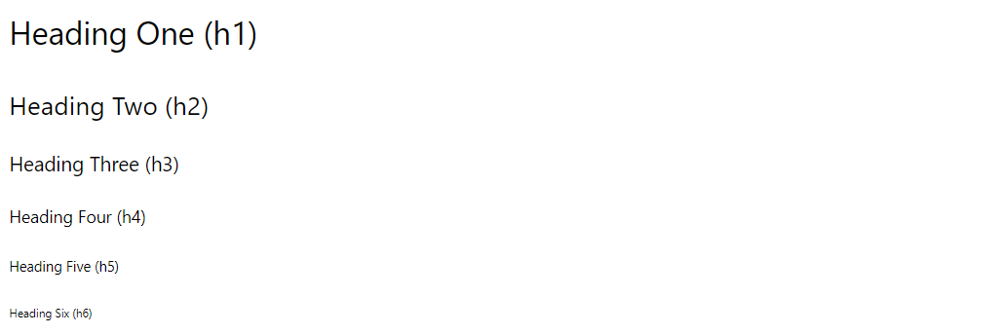
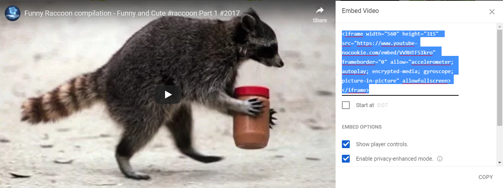

<br>
<br>


Markdown is a set of simple conventions for formatting text in R Markdown (RMD) files. 

It makes it easy to create professional documents with minimal effort. 

Here are the basic formatting rules for Markdown:


---

# Headers

```
# Heading One (h1)

## Heading Two (h2)

### Heading Three (h3)

#### Heading Four (h4)

##### Heading Five (h5)

###### Heading Six (h6)
```




---


# Text Style

```
With Markdown, it is possible to emphasize words by making them *italicized*, using *astericks* or _underscores_, or making them **bold**, using **double astericks** or __double underscores__. 

Of course, you can combine those two formats, with both _**bold and italicized**_ text, using any combination of the above syntax. 

You can also add a strikethrough to text using a ~~double tilde~~.
```

With Markdown, it is possible to emphasize words by making them *italicized*, using *astericks* or _underscores_, or making them **bold**, using **double astericks** or __double underscores__. 

Of course, you can combine those two formats, with both _**bold and italicized**_ text, using any combination of the above syntax. 

You can also add a strikethrough to text using a ~~double tilde~~.


---

# Lists

## Unordered

```
* First item
* Second item
* Third item
    * First nested item
    * Second nested item
```
* First item
* Second item
* Third item
    * First nested item
    * Second nested item

## Ordered

```
1. First item
2. Second item
3. Third item
    1. First nested item
    2. Second nested item
```
1. First item
2. Second item
3. Third item
    1. First nested item
    2. Second nested item


---


# Hyperlinks

Create links by wrapping the link text in square brackets [ ], and the URL in adjacent parentheses ( ). 

```
[Google News](https://news.google.com)
```

[Google News](https://news.google.com)


---


# Images

Insert images in a similar way, but add an exclamation mark in front of square brackets ![ ], and the image file name goes in the parentheses ( ). 

```

```

The *alt text* appears when the image cannot be located, or is read by devices for the blind when the mouse hovers over the image. It 

It is common practice to place all of the image files in an "assets" or "images" folder to keep your directory tidy. You can reference files inside a folder using the folder name and the forward slash:

```

```


---

Or you can link directly to an image online using the URL address of the image:

```

```


---

If you want to include images you need to add the image file to the [images folder](https://github.com/DS4PS/ddm-textbook-summer-2019/tree/master/images) in this repository. Web-friendly formats like PNG, JPEG, or GIF are preferred. 

You can just drag and drop the images into the folder, and GitHub will automatically initiate an upload option. After the upload progress bar is complete, click on the green "Commit changes" icon to complete the upload process.

You will then reference images in text using markdown syntax (see the Markddown Guide above for more details):


---


# Tables

```
| Title 1          | Title 2          | Title 3         | Title 4         |
|------------------|------------------|-----------------|-----------------|
| First entry      | Second entry     | Third entry     | Fourth entry    |
| Fifth entry      | Sixth entry      | Seventh entry   | Eight entry     |
| Ninth entry      | Tenth entry      | Eleventh entry  | Twelfth entry   |
| Thirteenth entry | Fourteenth entry | Fifteenth entry | Sixteenth entry |

```

| Title 1          | Title 2          | Title 3         | Title 4         |
|------------------|------------------|-----------------|-----------------|
| First entry      | Second entry     | Third entry     | Fourth entry    |
| Fifth entry      | Sixth entry      | Seventh entry   | Eight entry     |
| Ninth entry      | Tenth entry      | Eleventh entry  | Twelfth entry   |
| Thirteenth entry | Fourteenth entry | Fifteenth entry | Sixteenth entry |


---


# Videos

If you would like to post a video:

1. Upload the video to a video platform like YouTube, and insert an iframe of the video into your document.  
2. In YouTube, you will find iframes by clicking on the Share option, and the "Embed" icon. 



3. Paste this text into your markdown document, and it will add the video to your page:  

```
<iframe width="560" height="315" src="https://www.youtube-nocookie.com/embed/VVRHTF5Ikro" frameborder="0" allow="accelerometer; autoplay; encrypted-media; gyroscope; picture-in-picture" allowfullscreen></iframe>
```

<iframe width="560" height="315" src="https://www.youtube-nocookie.com/embed/VVRHTF5Ikro" frameborder="0" allow="accelerometer; autoplay; encrypted-media; gyroscope; picture-in-picture" allowfullscreen></iframe>

---


# Blockquotes

## Single line

```
> My mom always said life was like a box of chocolates. You never know what you're gonna get.
```
> My mom always said life was like a box of chocolates. You never know what you're gonna get.

## Multiline

```
> What do you get when you cross an insomniac, an agnostic and a dyslexic?
>
> Someone who stays up all night wondering whether there really is a dog.
>
> – _Hal Incandenza_
```

> What do you get when you cross an insomniac, an agnostic and a dyslexic?
>
> Someone who stays up all night wondering whether there really is a dog.
>
> – _Hal Incandenza_


---

# Horizontal Rule

```
---
```

---


<br>
<br>
<br>


