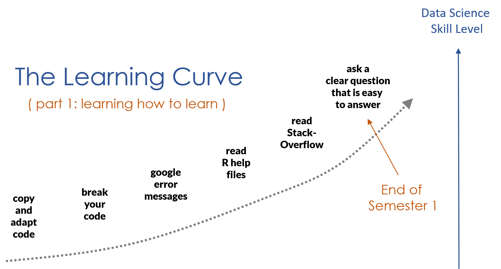
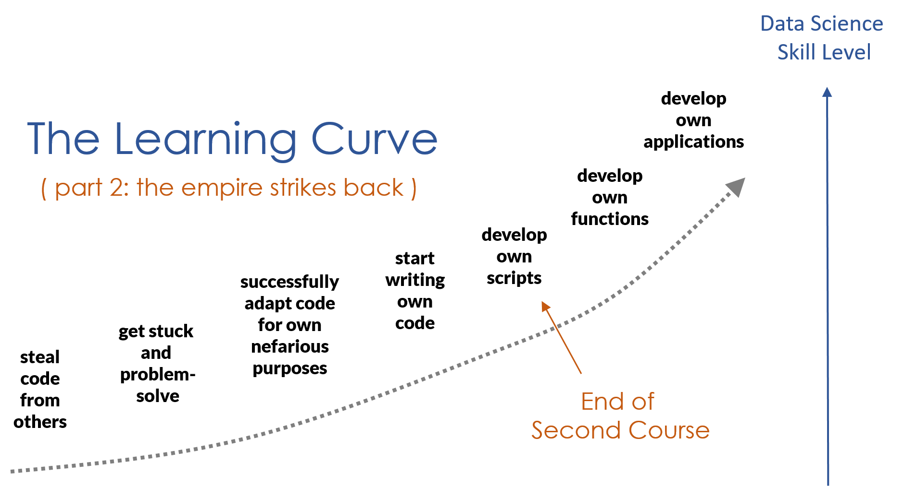
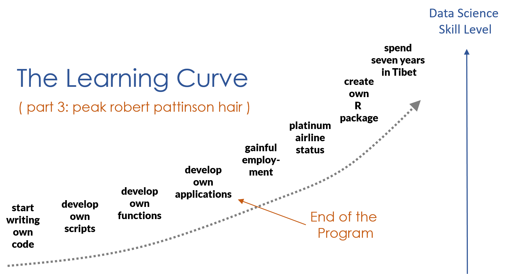

---
output:
  html_document:
    theme: readable
    highlight: tango
    self_contained: false
    css: textbook.css
---


## "I am always doing that which I cannot do, in order that I may learn how to do it." 

> Pablo Picasso


<center><h2> Nailed it  </h2></center>


# LEARNING HOW TO LEARN


<div class="tip">

## Key Concepts

* As you begin learning a new programming language you need to master nouns and verbs. 
* Nouns represent the jargon specific to the field (objects, arguments, assignment, etc.).
* Verbs represent functions.
* Fluency takes time! Find ways to practice "speaking R" productively. 

**Learning to Learn**

* R has thousands of packages and new ones are created daily. There is no way to learn everything about the language. 
* The goal, rather, is figuring out how to quickly master new functions so you can leverage R for whatever problem you are working on. 
* This requires learning to read help files and adapt code, and learning how to get help when you are stuck. 

<br>
<br>

</div>

<br>

## Learning How to Learn


---

Let's begin this chapter by stating and unpacking a few assertions: 

1. Learning R is very similar to learning a spoken language. 
2. Fluency in a programming language is different than fluency in a spoken language.
3. The ultimate end to learning R is to *learn how to learn* so you can quickly master whatever packages are necessary for your current project.

---

<br>


### Similarities Between Human & Machine Languages 

The similarities between human languages (e.g. English, Arabic, Mandarin) and machine languages (e.g. R, Python, JavaScript) are astounding, but a nuanced discussion as to why is beyond the scope of this introduction. 

As examples, however, both human and machine languages:

* Persist or disappear depending on the size of communities that use them
* Derive from older languages and have evolved into new languages
* Differ semantically but are arranged with similar grammatical elements (e.g. nouns, verbs)

<br>

Why is this important? *You learn R the same way you would a foreign language*:

* **Vocabulary:** You need to learn words for things before all else.
* **Reinforcement:** You learn by doing and repeating. 
* **Immersion:** You can't be fluent without being immersed. Get involved in professional and volunteer work, podcasts, and regular reading about your topic.
* **Necessity:** You learn best when success or survival depends on it. Use R in projects that have deadlines as a commitment mechanism.  
* **Languages are Social:** You learn faster through collaboration, meetups, forums, conferences.
  
If this is your first programming language, you will get frustrated at times. Take a step back and remember that after a semester of Spanish you can only operate at the level of a three-year old. You only know one verb tense, a few dozen verbs, and several hundred words. You have so many emotions that you can't express in your new language! 

Similarly, you are going to have so many ideas that you want to to translate into code! More realistically you will end up melting down in office hours and then taking a nap.  

<br>


<div class="note">

**Fun Fact:** The popular [ggplot2](https://ggplot2.tidyverse.org/) data viz package is based on Leland Wilkinson's framework, "The Grammar of Graphics" (1999), i.e. the `gg` in `ggplot2`. Similarly, the [dplyr](https://dplyr.tidyverse.org/) package is described as a "grammar of data manipulation", in which functions are described as "verbs".

</div>

<br>

### You Can't Learn Everything in R (Nor Should You)

There are thousands of R packages. The body of knowledge in the field is growing exponentially. It's impossible (and unnecessary) to learn (or retain) everything the language offers. 


Data science is a fast-moving field of practice. 

* New R packages are released every day.
* Packages and functions are constantly being updated, replaced, consolidated, or deprecated.
* There are nuances to every computational science applied to each natural or social science.


In sum, to remain current in R, one must remain current with... everything.


Accepting these limitations is liberating. It allows one to focus on an *ab initio*, or "first principles" approach to learning R. That is, build solid foundations, then specialize as necessary.

<br>

### The Ultimate Objective: Learning How to Learn R


There are few telltale signs that you're becoming fluent in R. For example, you may:

* Achieve the same results as your old code with significantly less code
* Use search engines less frequently or not at all while coding
* Be approached by others for collaborative work
* Appraise the quality of code and data products
* Begin dreaming in R (just kidding, not kidding...)

<br>

The goal of "learning R" is just *learning how to learn R*. This means knowing when to step on the gas and try to power through a problem, and knowing when to hit the brake in order to take a step back, assess, and make a plan. Knowing when and how to ask for help is a basic level of situational awareness you need to develop.  

For example, imagine you've reached some impasse that the "first principles" approach to R fails to resolve. Do you:

* Pore over online forums? 
* Explore documentation and vignettes?
* Search for packages with potential solutions?
* Boldly install and learn said package(s) without hesitation?
* Recover when fail to resolve the issue? Fail and recover again?
* Remain firm in your conviction that you will resolve the issue?

<br>

```{r img_troubleshooting, echo=F, fig.align="center", out.width="60%"}

knitr::include_graphics("https://imgs.xkcd.com/comics/wisdom_of_the_ancients.png")

```


<center> *The struggle is real. Source: [XKCD](https://xkcd.com/979/)* </center>

<br>


This is only one of many hypothetical scenarios. Learning how to learn R is not a matter of learning something new everyday (e.g. a function, package, technique, or theory), but the cyclical process of learning in the face of necessity, shoring up your knowledge over some indefinite period, and learning again when the need arises. Above all, you'll know you've learned how to learn R when you no longer doubt your ability to resolve what once seemed impossible.

<br>

<div class="tip">

## You are not alone in your quest


When working on labs make sure you have a game plan for success. If you are stuck for more than 20 minutes on the same problem *without making progress* you should (1) phone a friend, (2) post to the **Get Help** discussion board on the course site, (3) attend a review session, or (4) schedule virtual office hours. 

Your morale is a limited commodity, so spend it wisely! If you are doing the wrong thing over and over while stuck you might actually be reinforcing bad habits. 

The qualifier *without making progress* is a relative term. You will spend more than 20 minutes on a problem without arriving at a solution. Stuck means you don't understand the question or you are out of things to try.

Technically, for 3-credit class you should be spending about 12 hours per week on the class (3 hours of class time, 9 hours on homework/projects). If it's a condensed semester (7.5 week schedule) that translates to 24 hours per week.

This will vary for everyone depending on background knowledge, speed, and interest! But it's a good rule of thumb to keep in mind, and a good reminder that you are not slow or incapable - there is a reason that they call education "investment in human capital"!

<br>
<br>

</div>

<br>
<br>


## Troubleshooting in R


Your code is going to fail. A lot. 


We encounter errors all the time. The following is a brief overview for recognizing a problem, as well as myriad strategies to overcome one.

<br>

### Recognizing & Understanding Trouble

> "The first step in fixing a broken program is getting it to fail repeatably." (Tom Duff)

<br>

Two simple criteria must be met in order to recognize trouble with your code ([Peng et al. 2017](https://bookdown.org/rdpeng/RProgDA/)):

1. You expect your code to behave in a certain way
2. Your code doesn't behave as expected

Oftentimes, the best case scenario is that R will throw an **error message**. Error messages signal that R has encountered some fatal flaw in your code and, in consequence, nothing happens.

The next best scenario is that R will throw a **warning message**. Warning messages signal that R has successfully evaluated and executed code, but something unexpected happened, and R wants you to know about it.

The worst and most pernicious scenario is when your code runs perfectly fine, without error or warning messages, yet the output isn't exactly what you'd wanted. If you recognize this, that's great. If you don't recognize this, errors flow downstream and can be difficult to detect and fix. *Always inspect your output*.

<br>

<div class="tip">

**Pro Tip:** Oftentimes, users place too much emphasis on fixing their expected results and fail to consider their original expectations. *Never neglect revisiting your expectations*, as it's possible that they, not your code, may explain an error (ibid.).

</div>

<br>


# The Learning Curve

Are you on track? How should you measure progress? 

Again, the language metaphor comes in handy. 


### Vocab 

We will emphasize vocabulary the first course. The concepts in programming are not hard, but they require a lot of jargon. 

Most help files were written by computer scientists or statisticians. In other words, weirdos. Don't be surprised if it takes time to, um, decode their syntax. 

### Adapting Code

One of the first skills you learn while programming is how to start from existing code and adapting it for a new purpose. It is way more common to do this than to write code from scratch. 

An important milestone is reaching a point where you can read code written by others and understand it without having to run it. 

### Critical Thinking

You might think that the most valuable skill you take from this course is knowledge of R. This is not correct. 

**The real value in learning to program is learning how to think critically with data and problem-solve.**

Programming languages are rigid and unforgiving. 

> Did you use a capital letter when I was expecting a lower-case one? I'm sorry, I can't run your program then. 

Although frustrating, it does teach your precision and discipline. You need to think very systematically about the problem in order to design something that works. 

You will learn to value **pseudo-code**, which is a way of sketching out a basic blue-print for a script in plain English before you write any code. Then you can work incrementally and translate each step into R, refining as you go. 

### Writing Your Own Code

Drafting code from scratch is the equivalent of fluency in programming. This will come in time, but do not expect to jump right into creating elegant scripts. You need to practice the skills above, develop your vocabulary, master some data verbs (functions) before it all comes together. But you are on your way! 


### A Preview of What's Ahead 


```{r, echo=F, fig.align="center", out.width="90%"}

```


<br>

```{r, echo=F, fig.align="center", out.width="90%"}

```

<br>

```{r, echo=F, fig.align="center", out.width="90%"}

```

<br>


## Further Resources

The following resources may prove valuable for both learning how to learn R and troubleshooting:

**I) Full-Length Text**

* ["Intro to R: Nuts & Bolts"](https://rpubs.com/jamisoncrawford/nutsandbolts) (Crawford, 2018)

**II) Documentation & Vignettes**

* ["Vignettes: Long-Form Documentation"](http://r-pkgs.had.co.nz/vignettes.html) (Wickham, 2019)

**III) Forums, Email Lists, & Communities**

* [Stack Overflow](https://stackoverflow.com/)
* [Cross Validated](https://stats.stackexchange.com/)
* [R Mailing Lists](https://rpubs.com/jamisoncrawford/nutsandbolts)
* [Reddit's r/Rstats](https://www.reddit.com/r/rstats/)
* [Twitter's #Rstats](https://twitter.com/hashtag/rstats?ref_src=twsrc%5Egoogle%7Ctwcamp%5Eserp%7Ctwgr%5Ehashtag)

**IV) Asking R-Related Questions**

* ["Hot to Ask Questions the Smart Way"](http://www.catb.org/esr/faqs/smart-questions.html) (Raymond, 2014)
* ["How to Make a Great R Reproducible Example"](https://stackoverflow.com/questions/5963269/how-to-make-a-great-r-reproducible-example) (Stack Overflow, 2018)
* ["Posting Guide: Hot to Ask Good Questions that Prompt Useful Answers"](https://www.r-project.org/posting-guide.html) (Plate, 2013)
* [Errors vs Warnings](http://rex-analytics.com/decoding-error-messages-r/) (Rex Analytics)

**V) ASCII Dragons**

* [danadaldoss](https://danadaldos.wordpress.com/2015/02/06/padded-with-%E2%88%8F/) 
* [Doug](https://www.dougsartgallery.com/ascii-art-dragon.html) 
* [Ahmad](https://www.deviantart.com/ahmadsaifulhakim/art/Dragon-ascii-art-525981480) 

<br>
<br>
