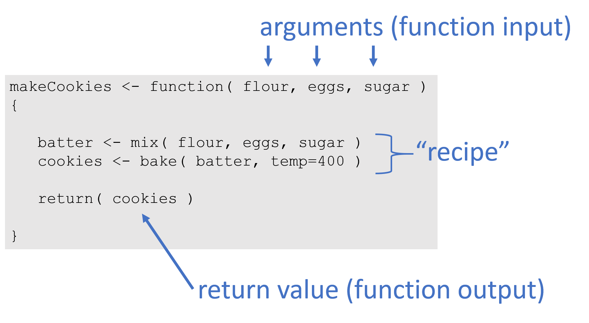

<div class="tip">

## Key Concepts

A function is a data recipe, and a building block of longer scripts. 

You can think of functions as input-output machines that take raw data and transform it into useful statistics. 

They accepts **arguments** (data or parameters), and **return** the requested calculation or transformation. 

For example, the **mean()** function requires a vector of measurements as the input and return the average measure for the group as the output. 


### VOCABULARY:

* The function `function()`
* arguments 
* argument values
* default values
* explicit vs implicit argument calls 
* return values 
* arrow vs. equal sign 

<br>
<br>

</div>


## Loan Calculator

Let's look at a slightly more comlicated example by creating an amortization calculator to determine monthly payments that would be required from a home mortgage loan.

```{r, echo=F, fig.align="center", fig.cap="Example monthly payment based upon loan amount (P), interest rate (R), and time period of repayment (T).", out.width="50%"}

knitr::include_graphics("figures/calculate-amortization.jpg")

```

Where:

* T = time of loan period
* P = loan principal, or total amount borrowed 
* R = annual interest rate, or annual percentage rate (APR)


A mortgage calculator considers the total loan amount (the principal), the interest rate or APR (annual percentage rate), and the period of the loan in order to determine how much needs to be paid each month so that payments are distributed equally across the loan term. If we look up a formula, we will find:


We can simplify this formula a bit by putting everything in monthly periods:


$$
PAYMENTS = \frac{principal \cdot interest \ rate}{1-(1+interest \ rate)^{- \ months}}
$$

Where: 

* months = years **T** x 12 months
* interest rate (monthly) = annual interest rate **R** / 12 months 

When we translate this mathematical formula into R code, the new function will look like this:

```{r eval=FALSE}
 calcMortgage <- function( principal, years, APR )
 {
   
    months <- years * 12   # covert years to months
    int.rate <- APR / 12   # convert annual rate to monthly
    
    # amortization formula
    monthly.payment <- ( principal * int.rate ) / 
                       (1 - (1 + int.rate)^(-months) )
    
    monthly.payment <- round( monthly.payment, 2 )
    
    return( monthly.payment )
 
 }
```


```{r, include=FALSE}
tutorial::go_interactive( greedy=FALSE )
```

```{r ex="example-01", type="pre-exercise-code", tut=TRUE}
 calcMortgage <- function( principal, years, APR )
 {
    months <- years * 12
    int.rate <- APR / 12
    
    # amortization formula
    monthly.payment <- ( principal * int.rate ) / 
                       (1 - (1 + int.rate)^(-months) )
    
    monthly.payment <- round( monthly.payment, 2 )
    
    return( monthly.payment )
 
 }
```


```{r ex="example-01", type="sample-code", tut=TRUE}
# Check the function's arguments:
args( calcMortgage )

# Calculate a mortgage for a $100,000 house for 30 years with a 4.5 percent interest rate (0.045 APR)
calcMortgage( principal=100000, years=30, APR=0.045 ) 

# Try: calcMortgage( principal=100000 )
calcMortgage( principal=100000, APR=0.045 )
```


<div class="question">

What happens if you omit an argument from the function?  Why?

</div>


# Default Arguments

We can add default values for arguments. These defaults allow us to utilize the function without specifying values for those arguments.

```{r eval=FALSE}
 calcMortgage <- function( principal, years=30, APR=0.05 )
 {
   
    months <- years * 12   # covert years to months
    int.rate <- APR / 12   # convert annual rate to monthly
    
    # amortization formula
    monthly.payment <- ( principal * int.rate ) / 
                       (1 - (1 + int.rate)^(-months) )
    
    monthly.payment <- round( monthly.payment, 2 )
    
    return( monthly.payment )
 
 }
```


```{r ex="example-02", type="pre-exercise-code", tut=TRUE}
 calcMortgage <- function( principal, years=30, APR=0.05 )
 {
    months <- years * 12
    int.rate <- APR / 12
    
    # amortization formula
    monthly.payment <- ( principal * int.rate ) / 
                       (1 - (1 + int.rate)^(-months) )
    
    monthly.payment <- round( monthly.payment, 2 )
    
    return( monthly.payment )
 
 }
```


```{r ex="example-02", type="sample-code", tut=TRUE}
# Notice the new default arguments:
args( calcMortgage )

# Calculate a mortgage for a $100,000 house for 30 years with a 4.5 percent APR
calcMortgage( principal=100000, years=30, APR=0.045 )

# Now try: calcMortgage( principal=100000 )
calcMortgage( principal=100000 )
```

<div class="question">

Note that **calcMortgage( principal=100000 )** now works because the function uses the default values for years and APR. 

</div>


## Defaults

```{r ex="example-03", type="pre-exercise-code", tut=TRUE}
 calcMortgage <- function( principal, years=30, APR=0.045 )
 {
    months <- years * 12
    int.rate <- APR / 12
    
    # amortization formula
    monthly.payment <- ( principal * int.rate ) / 
                       (1 - (1 + int.rate)^(-months) )
    
    monthly.payment <- round( monthly.payment, 2 )
    
    return( monthly.payment )
 
 }
```

```{r ex="example-03", type="sample-code", tut=TRUE}
args( calcMortgage )

# Calculate a mortgage for a $100,000 house for 15 years with a 3 percent APR

calcMortgage( principal=100000, years=15, APR=0.03 )
```

<div class="question">

Can you still use custom values for those arguments after defaults are set? 

</div>


# Implicit Argument Calls

An explicit call to arguments always uses the formal argument name such as `principal=100000`.

You can, however, also use implicit argument calls. These rely on the order arguments are specified in the function, and the order of your values in your call.

Implicit arguments calls can be risky, however, because it is very easy to mix them up. 


```{r ex="example-04", type="pre-exercise-code", tut=TRUE}
 calcMortgage <- function( principal, years=30, APR=0.045 )
 {
    months <- years * 12
    int.rate <- APR / 12
    
    # amortization formula
    monthly.payment <- ( principal * int.rate ) / 
                       (1 - (1 + int.rate)^(-months) )
    
    monthly.payment <- round( monthly.payment, 2 )
    
    return( monthly.payment )
 
 }
```

```{r ex="example-04", type="sample-code", tut=TRUE}
# Try these:

calcMortgage( 100000, 30, 0.05 )

calcMortgage( 30, 100000, 0.05 )
```


<div class="question">

Which of these calculations is correct? 

Explain why. 

</div>


# Object Assignment vs Argument Assignment

Assignment is the process of assigning a name to an object or value in order to store the data for future use and allow it to be referenced later. 


```{r, eval=F}
x <- 3
```

We use assignment in data recipes (scripts) to save values, and in functions to assign values to specific arguments. Note that we use different assignment operators in each case.


Object assignment uses the **arrow operator**.

Argument assignment inside a function uses the **equal sign**.

```{r, eval=F}
principal <- 100000               # never use equals here
calcMortgage( principal=100000 )  # never use arrows here
```


<br>

----


# Your Turn


<div class="quiz">

Create a function to convert Fahrenheit temperatures to Celsius.

* What arguments do you need?
* How many decimals do you need? Consider using the `round( number, decimals )` function to simplify output.
* Don't forget a return statement!

</div>


$$
celsius = ( \ fahrenheit − 32 \ ) × \frac{5}{9}
$$

If you want to check your work, **212 degees Fahrenheit** is equivalent to **100 degrees Celsius**.


<br>


```{r ex="example-05", type="sample-code", tut=TRUE}
convertToCelsius <- function()  # arguments here
{
    # your code here
}

temp.in.fahrenheit <- 212
convertToCelsius( temp.in.fahrenheit )
```


<div class="question">

Can you use this function to convert from Celsius to Fahrenheit?

</div>


<br>

----

<br>
<br>


```{css, echo=F, eval=F}
div.powered-by-datacamp{
   margin-bottom:40px;
   display: none;
}
div.datacamp-exercise{
   margin-bottom:40px;
}
.datacamp-exercise .dcl-btn-primary {
    /* background-color: #fdc551; */
    /* color: #6d561e; */
    background-color: LightSteelBlue; /* #d9f5ff;  #008B8B; */
    color: white; /* #008B8B; */
}
```


