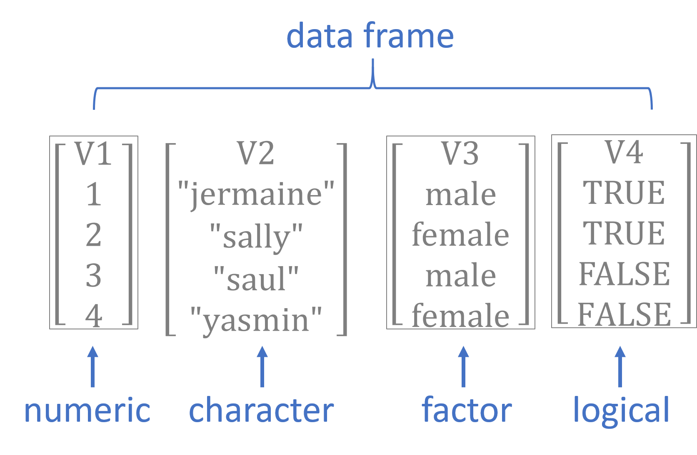

---
output:
  html_document:
    theme: readable
    highlight: tango
    self_contained: false
    number_sections: true
    css: textbook.css
---


```{r setup, include=FALSE}
knitr::opts_chunk$set( echo = TRUE, message=F, warning=F, fig.width=8 )
library( dplyr )
library( Lahman )
library( pander )
```


# VECTORS AND DATA TYPES

Vectors are the building blocks of data programming in R, so they are extremely important concepts. 

This section will cover basic principles of working with vectors in the R language, including the different types of vectors (data types or "classes"), and common functions used on vectors. 

<br><br>

```{r, fig.cap="Components of a Vector", echo=F, out.width='40%' }
knitr::include_graphics( "figures/vectors.png" )
```


<br>
<br>
<br>
<br>


<div class="tip">

## Key Concepts

In this chapter, we'll learn about the four main types of vectors:

* numeric
* character
* factor
* logical


## Key Takeaways


* All data in R is an **object**
* Objects have **classes** that specify what type of object it is 
* Vectors can be numerica, character, factor or logical
* Vectors are the building blocks of data frames - the columns of a dataset
* They are created using constructors like the combine function **c()**
* You can change data types using **casting**


<br>
<br>

</div>

<br>
<br>


## Key Concepts

```{r, fig.cap="Components of a Vector", echo=F, out.width='60%' }
knitr::include_graphics( "figures/vectors.png" )
```

```{r, fig.cap="Basic data types in R", echo=F }

```


# Vectors 


Generally speaking a vector is a set of numbers, words, or other values stored sequentially:

* [ 1, 2, 3]
* [ apple, orange, pear ]
* [ TRUE, FALSE, FALSE ]

In social sciences, a vector usually represents a variable in a dataset, often as a column in a spreadsheet. 

We might manually build a dataset by entering data as follows:

```{r}
strength <- c( 167, 185, 119, 142 )

name <- c( "adam", "jamal", "linda", "sriti" )

sex <- factor( c( "male", "male", "female", "female" ) )

study.group <- c( "treatment", "control", "treatment", "control" )

is.treated <- study.group == "treatment"

dat <- data.frame( name, sex, study.group, is.treated, strength )
```

```{r, echo=F}
dat <- data.frame( name, sex, study.group, is.treated, strength )
dat %>% pander
```


Here are the important things to pay attention to:

* Each vector was created with the combine **c()** function. 
* Numbers do not require quotation marks around elements.
* Characters require quotation marks.
* The *is.treated* vector represents membership in a group.


# Data Types


There are four primary vector types ("classes") in R: 


Class      | Description
---------- | -----------
numeric    | Only numbers
character  | A vector of letters or words, always enclosed with quotes
factor     | Categorical variables
logical    | TRUE or FALSE values

Each type of vector serves different purposes:

* **numeric**: keep track of quantitative measures, counts, or orders of things 
* **character**: store non-numeric data, typically unstructured text
* **factor**: represent distinct and mutually-exclusive categories 
* **logical**: disignate cases that meet some criteria, usually group inclusion


Each vector in R is stored as an **object**, a technical term in computer science that we will discuss more later. For now know that each object has a **class** that represents the data type. We can ask R for the data types using the **class()** function:


```{r}
class( name )
class( strength )
class( study.group )
class( is.treated )
class( dat )
```


## Common Vectors Functions

You will spend a lot of time creating data vectors, transforming variables, generating subsets, cleaning data, and adding new observations. These are all accomplished through **functions** that act on vectors.

Here are some common vector functions:


### vector length

We often need to know how many elements belong to a vector, which we find with the **length()** function.

```{r}
length( strength )
```


### combine

To combine several elements into a single vector, or combine two vectors to form one, use the **c()** function.

```{r}
c( 1, 2, 3 )        # create a numeric vector
c( "a", "b", "c" )  # create a character vector
```


Combining two vectors:

```{r}
x <- 1:5
y <- 10:15
c( x, y )
```

Combining two vectors of different data types:


```{r}
x <- c( 1, 2,3 )
y <- c( "a", "b", "c" )
c( x, y )
```

<div class="quiz">

What happened to the numeric elements here?

</div>


## Casting

You can easily move from one data type to another by **casting** a specific type as another type:

```{r}
# character casting
x <- 1:5
x
as.character(x)  # numbers stored as text
```

The rules for casting vary by data type. Take logical vectors, for example. Re-casting them as character vectors produces an expected result. What about as a numeric vector?

```{r}
y <- c( TRUE, FALSE, TRUE, TRUE, FALSE )
y
as.character( y )
as.numeric( y )
```

If you are familiar with boolean logic or dummy variables in statistics, it actually makes sense that TRUE would be represented as **1** in numeric form, and FALSE as **0**.


But in some cases it might not make sense to cast one variable type as another and we can get unexpected or unwanted behavior.

```{r}
z <- c( "a", "b", "c" )
z
as.numeric( z )
```

<div class="tip">

The element **NA** is read as **NOT AVAILABLE** or **NOT APPLICABLE**, and is the value R uses to represent missing or deleted data. 

NA's are really important (and somewhat annoying). We will discuss missing values more in-depth later.

</div>

## Care When Casting

Casting will often be induced automatically when you try to combine different types of data. For example, when you add a character element to a numeric vector, the whole vector will be cast as a character vector. 

```{r}
x1 <- 1:5
x1
x1 <- c( x1, "a" )   # a vector can only have one data type
x1                   # all numbers silently recast as characters
```


If you consider the example above, when a numeric and character vector are combined all elements are re-cast as strings because numbers can be represented as characters but not vice-versa. 

R tries to select a reasonable default type, but sometimes casting will create some strange and unexpected behaviors. Consider some of these examples. 


```{r, include=FALSE}
tutorial::go_interactive( greedy=FALSE )
```


```{r ex="example-01", type="sample-code", tut=TRUE}
x1 <- c(1,2,3)                    # numeric
x2 <- c("a","b","c")              # character
x3 <- c(TRUE,FALSE,TRUE)          # logical
x4 <- factor( c("a","b","c") )    # factor
# combine a numeric and logical vector
case1 <- c( x1, x3 )
# combine a character and logical vector
case2 <- c( x2, x3 )
# combine a numeric and factor vector
case3 <- c( x1, x4 )
# combine a character and factor vector
case4 <- c( x2, x4 )
```


<div class="question">

Which data type will each step produce? Type the case# to see the results. 

</div>


<br>

```{r, echo=F}
x1 <- c(1,2,3)                    # numeric
x2 <- c("a","b","c")              # character
x3 <- c(TRUE,FALSE,TRUE)          # logical
x4 <- factor( c("a","b","c") )    # factor
case1 <- c( x1, x3 )
case2 <- c( x2, x3 )
case3 <- c( x1, x4 )
case4 <- c( x2, x4 )
```

The answers to *case1* and *case2* are somewhat intuitive. 

```{r}
case1  # combine a numeric and logical vector
```

Recall that TRUE and FALSE are often represented as 1 and 0 in datasets, so they can be recast as numeric elements. The numbers 2 and 3 have no meaning in a logical vector, so we can't cast a numeric vector as a logical vector. This will default to numeric because we do not lose any information - the one's and zero's can always be re-cast back to logical vectors later if necessary. 


```{r}
case2  # combine a character and logical vector
```

Similarly characters have no meaning in the logical format, so we would have to replace them with NA's if we converted the character vector to a logical vector. 

```{r}
as.logical( x2 )
```

So converting the logical vector to characters allows us to retain all of the information in both vectors. 


*case3* and *case4* are a little more nuanced. See the section on factors below to make sense of them.

```{r}
case3  # combine a numeric and factor vector
case4  # combine a character and factor vector
```


<div class="tip">

TIP: When you read data in from outside sources, R will sometimes try to guess the data types and store numeric or character vectors as factors. To avoid corrupting your data see the section below on factors for special instructions on re-casting factors as numeric vectors.

</div>


## Numeric Vectors

There are some specific things to note about each vector type.

Math operators will only work on numeric vectors.


```{r, include=FALSE}
tutorial::go_interactive( greedy=FALSE )
```


```{r ex="example-02", type="sample-code", tut=TRUE}
x1 <- c(1,2,3)                    # numeric
x2 <- c("a","b","c")              # character
x3 <- c(TRUE,FALSE,TRUE)          # logical
x4 <- factor( c("a","b","c") )    # factor


# add all elements in the vector:
sum( x1 )
# the summary() function returns summary stats
summary( x1 )

sum( x2 )
```


<div class="question">

Note that if we try to run this mathematical function we get an error:

</div>


<br>

Many functions in R are sensitive to the data type of vectors. Mathematical functions, for example, do not make sense when applied to text (character vectors). In many cases R will give an error. 

In some cases R will silently re-cast the variable, then perform the operation. Be watchful for when silent re-casting occurs because it might have unwanted side effects, such as deleting data or re-coding group levels in the wrong way. 


### Integers 

Integers are simple numeric vectors. The integer class is used to save memory since integers require less RAM space than numbers that contain decimals points (you need to allocate space for the numbers to the left and the numbers to the right of the decimal). Google "computer memory allocation" if you are interested in the specifics. 

If you are doing advanced programming you will be more sensitive to memory allocation and the speed of your code, but in the intro class we will not differentiate between the two types of number vectors. In **most** cases they result in the same results, unless you are doing advanced numerical analysis where rounding errors matter!


```{r}
n <- 1:5
n
class( n )

n[ 2 ] <- 2.01   # replace the second element with "2.01"
n                # all elements converted to decimals
class( n )
```


## Character Vectors

The most important rule to remember with this data type: when creating character vectors, all text must be enclosed by quotation marks.

This one works:

```{r}
c( "a", "b", "c" )   # this works
```

This one will not:

```{r, eval=F}
c( a, b, c )  
# Error: object 'a' not found
```

When you type characters surrounded by quotes then R knows you are creating new text (**"strings"** of letters in programming speak). 

When you type characters that are not surrounded by quotes, R thinks that you are looking for an object in the environment, like the variables we have already created. It gets confused when it doesn't find the object that you typed.

In generate, you will use quotes when you are creating character vectors, and for arguments in functions. You do not use quotes when you are referencing an active object. 

An active object is typically a dataset or vector that you have imported or created. You can print a list of all active objects with the `ls()` function.

### Quotes in Arguments

When you first start using R it can be confusing about when quotes are needed around arguments. Take the following example of the color argument (`col=`) in the `plot()` function.

```{r, fig.width=10}
group <- factor( sample( c("treatment","control"), 100, replace=TRUE ) )
strength <- rnorm(100,100,30) + 50 * as.numeric( group=="treatment" )

par( mfrow=c(1,2) )
plot( strength, col="blue", pch=19, bty="n", cex=2 )
plot( strength, col=group,  pch=19, bty="n", cex=2 )
```


*These graphs show patterns in the strength measures from our study. The first plots all subjects as blue, and the second plots subjects in the treatment group as red, control group as black.*

In the first plot we are using a **text argument** to specify a color (`col="blue"`), so it must be enclosed by quotes.

In the second example R selects the color based upon group membership specified by the **factor called 'group'**. Since the argument is now referencing an object (`col=group`), we do not use quotes.

The exception here is when your argument requires a number. **Numbers are not passed with quotes, or they would be cast as text.** For example, (`bty="n"`) tells the plot to not draw a box around the graph, and the **cex** argument controls the dot size: (`cex=2`). 


I know. I'm with you. 


## Factors

When there are categorical variables within our data, or groups, then we use a special vector to keep track of these groups. We could just use numbers (1=female, 0=male) or characters ("male","female"), but factors are useful for two reasons.

First, it saves memory. Text is very "expensive" in terms of memory allocation and processing speed, so using simpler data structure makes R faster. 

Second, when a variable is set as a factor, R recognizes that it represents a group and it can deploy object-oriented functionality. When you use a factor in analysis, R knows that you want to split the analysis up by groups.

```{r}
height <- c( 70, 68, 69, 74, 72, 69, 68, 73  )
strength <- c(167,185,119,142,175,204,124,117)
sex <- factor( c("male","male","female","female","male","male","female","female" ) )

par( mfrow=c(1,2) )
plot( height, strength,            # two numeric vectors: scatter plot
      pch=19, cex=3, bty="n" )   
plot( sex, strength )              # factor + numeric: box and whisker plot       
```

<div class="tip">

Note in this example the same **plot()** function produced two different types of graphs, a scatterplot and a box and whisker plot. How does this work?

R uses the object type to determine behavior:
* If input vectors are both numeric, then produce scatterplot
* If input vectors are factor + numeric, then produce a box and whisker.

This is called object-oriented programming - the functions adapt based upon the type of object they are working with. 

It makes the process of creating data recipes much faster! We will revisit this concept later. 

</div>

<br>
<br>


Factors are more memory efficient than character vectors because they store the underlying data as a numeric vector instead of a categorical (text) vector. Each group in the data is assigned a number, and when printing items the program only has to remember which group corresponds to which number:

```{r}
as.numeric( sex )
#  male = 2
#  female = 1
```

If you print a factor, the computer just replaces each category designation with its name (2 would be replaced with "male" in this example). These replacements can be done in real time without clogging the memory of your computer as they don't need to be saved.

In some instances a categorical variable might be represented by numbers. For example, grades 9-12 for high school kids. These can be tricky to re-cast.

```{r}
grades <- sample( x=9:12, size=10, replace=T )
grades

grades <- as.factor( grades )
grades

as.numeric( grades )
as.character( grades )

# proper way to get back to the original numeric vector
as.numeric( as.character( grades ))
```

<br>

<div class="tip">

The **very important** rule to remember with factors is you can't move directly from the factor to numeric using the **as.numeric()** casting function. This will give you the underlying data structure, but will not give you the category names. To get these, you need the **as.character** casting function.

</div>

<br>
<br>


TIP: When reading data from Excel spreadsheets (usually saved in the comma separated value or CSV format), remember to include the following argument to prevent the creation of factors, which can produce some annoying behaviors.

```{r, eval=F}

dat <- read.csv( "filename.csv", stringsAsFactors=F )
```


## Logical Vectors

Logical vectors are collections of a set of TRUE and FALSE statements. 

Logical statements allow us to define groups based upon criteria, then decide whether observations belong to the group. A logical statement is one that contains a logical operator, and returns only TRUE, FALSE, or NA values. 

Logical vectors are important because organizing data into these sets is what drives all of the advanced data analytics (set theory is at the basis of mathematics and computer science). 

```{r, echo=F}
strength <- c(167,185,119,142)
name <- c("adam","jamal","linda","sriti")
sex <- factor( c("male","male","female","female") )
treat <- c( "treatment","control","treatment","control" )
dat <- data.frame( name, sex, treat, strength )
dat %>% pander()
```


```{r}
dat$name == "sriti"
dat$sex == "male"
dat$strength > 180
```

When defining logical vectors, you can use the abbreviated versions of T for TRUE and F for FALSE.

```{r}
z1 <- c(T,T,F,T,F,F)
z1
```


Typically logical vectors are used in combination with subset operators to identify specific groups in the data.

```{r}
# isolate data on all of the females in the dataset
dat[ dat$sex == "female" , ]
```

See the next chapter for more details on subsets.


## Generating Vectors

You will often need to generate vectors for data transformations or simulations. Here are the most common functions that will be helpful.


### Repeated Values

```{r, include=FALSE}
tutorial::go_interactive( greedy=FALSE )
```


```{r ex="example-03", type="sample-code", tut=TRUE}
# repeat a number, or series of numbers
rep( x=9, times=5 )
rep( x=c(5,7), times=5 )
rep( x=c(5,7), each=5 )

# also works to create categories
rep( x=c("treatment","control"), each=5 )  
```


### Sequence of Values

```{r, include=FALSE}
tutorial::go_interactive( greedy=FALSE )
```


```{r ex="example-04", type="sample-code", tut=TRUE}
# create a sequence of numbers
seq( from=1, to=15, by=1 )
seq( from=1, to=15, by=3 )

# shorthand if by=1
1:15   
3:6
```


### Random Sample

```{r, include=FALSE}
tutorial::go_interactive( greedy=FALSE )
```


```{r ex="example-05", type="sample-code", tut=TRUE}
# create a random sample
bag.of.letters <- c("a","b","c","b","f")
sample( x=bag.of.letters, size=3, replace=FALSE )
sample( x=bag.of.letters, size=3, replace=FALSE )
sample( x=bag.of.letters, size=3, replace=FALSE )

# for multiple samples use replacement
sample( x=bag.of.letters, size=10, replace=TRUE )
```


### Draw From a Normal Distribution

```{r, include=FALSE}
tutorial::go_interactive( greedy=FALSE )
```


```{r ex="example-06", type="sample-code", tut=TRUE}
# create data that follows a normal curve
# IQ follows a normal distribution
# with a mean of 100 and sd of 15

iq <- rnorm( n=1000, mean=100, sd=15 )
hist( iq, col="gray" )
abline( h=mean(iq), col="darkred" )
```


## Recycling

When we create a new variable from existing variables, it is called a 'transformation'. This is very common in data science. Crime is measures by the number of assaults *per 100,000 people*, for example (crime / pop). A batting average is the number of hits divided by the number of at bats. 

In R, mathematical operations are *vectorized*, which means that operations are performed on the entire vector all at once. This makes transformations fast and easy.


```{r}
x <- 1:10
x + 5
x * 5
```


R uses a convention called "recycling", which means that it will re-use elements of a vector if necessary. In the example below the x vector has 10 elements, but the y vector only has 5 elements. When we run out of y, we just start over from the beginning. This is powerful in some instances, but can be dangerous in others if you don't realize that that it is happening.


```{r}
x <- 1:10
y <- 1:5
x + y
x * y

# the colors are recycled

plot( 1:5, 1:5, col=c("red","blue"), pch=19, cex=3, bty="n" )
```

Here is an example of recycling gone wrong:

```{r, echo=F}
dat %>% pander()
```


```{r}
# create a subset of data of all female study participants

dat$sex == "female"
these <- dat$sex == "female"
dat[ these, ]  # correct subset


# same thing with a mistake
# whoops! should be double equal for a logical statement
# the female element is recycled 
# just wrote over my raw data! 

dat$sex = "female"    
these <- dat$sex == "female" 
dat[ these , ]
```


## Missing Values: NA's

Missing values are coded differently in each data analysis program. SPSS uses a period, for example. In R, missing values are coded as "NA".

The important thing to note is that R wants to make sure you know there are missing values if you are conducting analysis. As a result, it will give you the answer of "NA" when you try to do math with a vector that includes a missing value. You have to ask it explicitly to ignore the missing value.


```{r, include=FALSE}
tutorial::go_interactive( greedy=FALSE )
```


```{r ex="example-07", type="sample-code", tut=TRUE}
x5 <- c( 1, 2, 3, 4 )
x5
sum( x5 )
mean( x5 )


x5 <- c( 1, 2, NA, 4 )
x5

# should missing values be treated as zeros or dropped? 

sum( x5 )
mean( x5 )
sum( x5, na.rm=T )   # na.rm=T argument drops missing values
mean( x5, na.rm=T )  # na.rm=T argument drops missing values
```


You cannot use the *==* operator to identify missing values in a dataset. There is a special **is.na()** function to locate all of the missing values in a vector.


```{r, include=FALSE}
tutorial::go_interactive( greedy=FALSE )
```


```{r ex="example-08", type="sample-code", tut=TRUE}
x5 <- c( 1, 2, NA, 4 )

# which elements are missing?
x5 == NA       # this does not do what you want
is.na( x5 )    # much better

! is.na( x5 )  # if you want to create a selector vector to drop missing values 
x5[ ! is.na(x5) ]

x5[ is.na(x5) ] <- 0  # replace missing values with zero
x5
```


