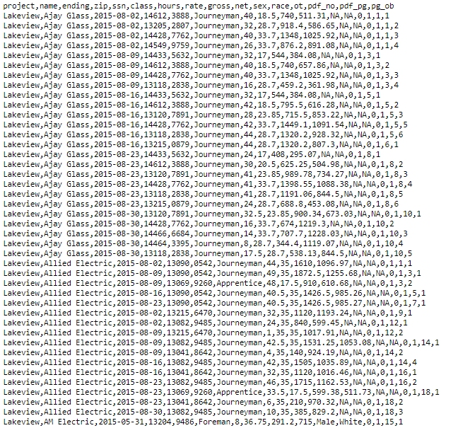
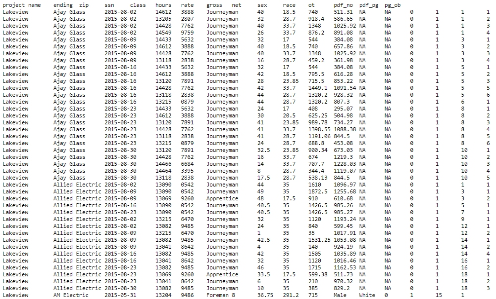
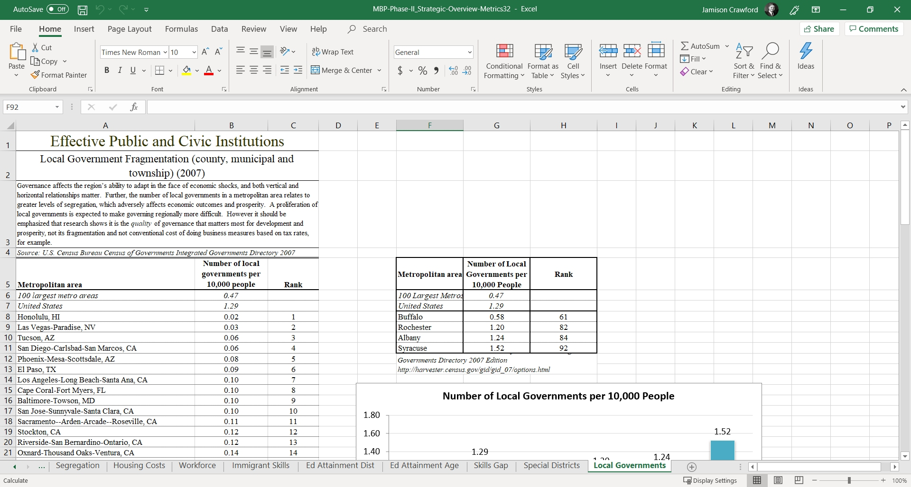
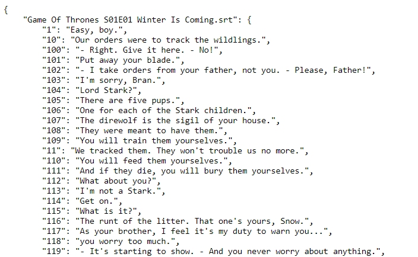
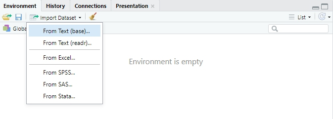
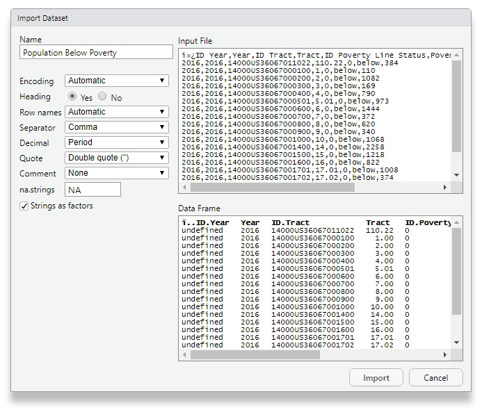
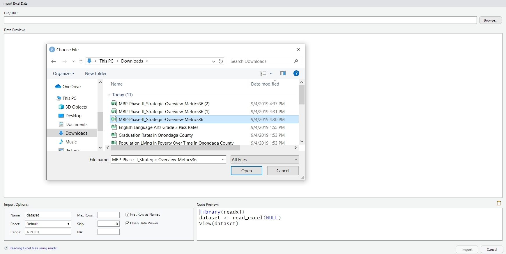
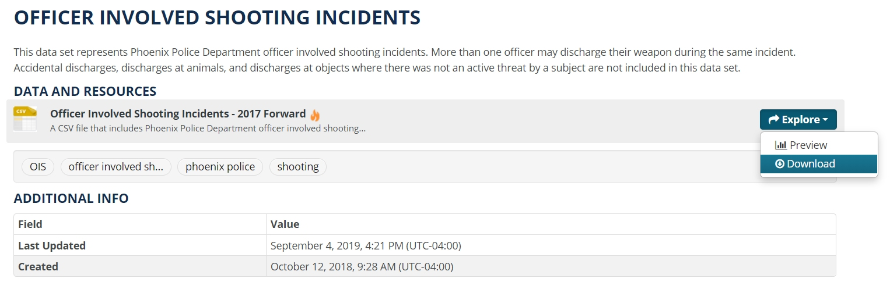
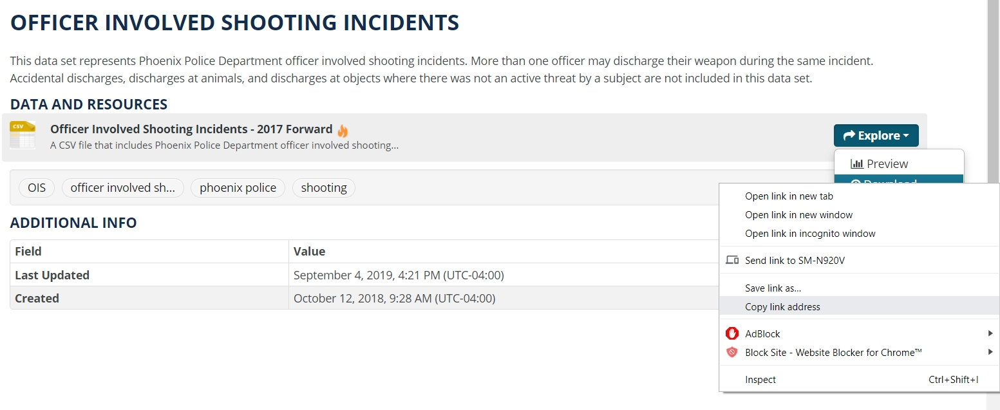
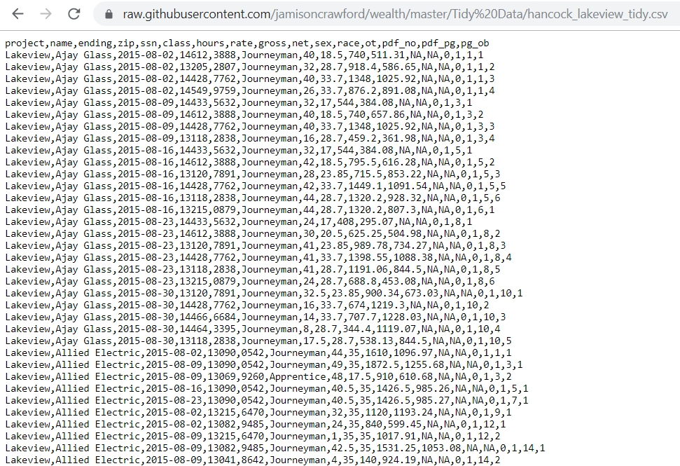

---
output:
  html_document:
    theme: readable
    highlight: tango
    self_contained: false
    css: textbook.css
---

# Getting Data into R

<br>
<br>

<div class="tip">

## Key Concepts

In this chapter, we'll explore the following key concepts:

* File Formats
* RData Format
* Flat or Text Files 
* Wrapper Functions

## Key Takeaways

Too long; didn't read? Here's what you need to know:

* Importing data is called "reading in" data in R, and done with `read*()` functions
* Know as what format your data are stored to use the appropriate function
* Read in statistical software files with packages "foreign" or "haven"
* Read in JSON files with package "jsonlite"
* Read directly from the web with URLs

<br>
<br>

</div>

<br>
<br>

## "Reading In" Data

**Importing data** is also called **reading in data** in R. 

Many base R functions begin with `read`, like `read.csv()` and `read.table()`.

Some R packages have new reading functions, like `read_csv()` in the **"readr"** package.

<br>

```{r, echo=F, fig.align="center", fig.cap="Be careful with what you read into R!",out.width="75%"}

knitr::include_graphics("https://pbfcomics.com/wp-content/uploads/2016/04/PBF130-Book_World.png")

```

<center> Source: [Perry Bible Fellowship](https://pbfcomics.com/comics/book-world/) </center>

<br>
<br>

## Know Thy Data: File Formats

> "If you know the [data] and know yourself, 

> you need not fear the result of a hundred [analyses]."

> Sun Tzu, The Art of [Data Science]

<br>

If you want to get certain data into R, you must know the **file format**. 

* File formats are standardized frameworks for encoding and storing information
* Some file formats are better than others, depending on the information stored
* Determine a file's format by its *filename extension*, e.g. `.csv`
* The most common data file formats include `.csv`, `.tsv`, and `.xlsx`

<br>

```{r, echo=F, fig.align="center", fig.cap='Certain formats are better for storing data.',out.width="75%"}

knitr::include_graphics("https://imgs.xkcd.com/comics/file_extensions.png")

```

<center> Source: [XKCD](https://xkcd.com/1301/) </center>

<br>
<br>

### Text or "Flat" Files

> **flatly** /ˈflatli/ 

> 1. Showing little interest or emotion.

> 2. In a firm and unequivocal manner; absolutely.

> 3. In a smooth and even way.

> *Oxford English Dictionary*

<br>

The far most familiar family of file formats includes **text data** or **flat files**.

* Flat files are simple, standard formats that use plain text
* Flat files are ubiquitous, non-proprietary, and accessible
* Converting a spreadsheet into a text file will "flatten it", removing all formatting

<br>

<div class="tip">

**PRO TIP:**

Flat files are ideal for sharing data with collaborators.

* Not everyone has spreadsheet software, but anyone can use flat files
* Flat files don't preserve formats, like borders and highlighted cells
* Flat files force users to store data tabularly "flatly"

</div>

<br>

**Comma-separated values** or **CSV** files store data in plain text:

* Each line in a CSV file represents one row
* Each value in a CSV file is separated by a comma
* Therefore, each comma designates a separate column

<br>

**A CSV in the Wild:** Observe the following [public construction records](https://github.com/jamisoncrawford/wealth/blob/master/Tidy%20Data/hancock_lakeview_tidy.csv) on GitHub:

```{r, echo=F, fig.align="center", fig.cap='What can you decode by observing this raw CSV file?',out.width="90%"}



```

<br>

**A Wrangled CSV:** R (and other software) interpret and tame these formats tabularly. 

```{r echo=F, warning=F, message=F}

url <- paste0("https://raw.githubusercontent.com/jamisoncrawford/",
              "wealth/master/Tidy%20Data/hancock_lakeview_tidy.csv")

head(read.csv(url), 10)

```

<br>
<br>

**Tab-separated values** or **TSV** files store data in plain text:

* Like CSV, each line in a TSV file represents one row
* Also like CSV, each value in a CSV file is separated by a tab
* Each tab designates a separate column

<br>

**A TSV in the Wild:** Observe the same [public construction records](https://github.com/jamisoncrawford/wealth/blob/master/Tidy%20Data/my_tsv.tsv) on GitHub:

```{r, echo=F, fig.align="center", fig.cap='Raw TSV files are much more intepretable thanks to tabulation.',out.width="90%"}



```

<br>
<br>

### Excel File Formats

*Microsoft Excel* files are significantly different from text or flat files.

* All Excel file extensions begin with `.xls`; a workbook is in `.xlsx` format
* Excel workbooks with multiple sheets must be read in one sheet at a time
* Multiple packages can help R handle Excel files, e.g. `readxl`, `XLConnect`, `gdata`

<br>

<div class="caution">

**WARNING:**

Reading Excel files into R will remove all formatting, like:

* Highlighted and color-coded cells
* Font formatting, e.g. **bold** and *italics*
* Borders, merged cells, formulas, and macros

Some Excel users use formatting to represent information.  For example, a user may use red, yellow, and green to represent a categorical variable like "low", "medium", and "high", respectively.  In such cases, create a new column to store these data.

</div>

<br>
<br>

**Excel Files in the Wild:** It's common to see Excel files with heavy formatting:

```{r, echo=F, fig.align="center", fig.cap='If R were to import this file, as is, what information would survive?',out.width="90%"}



```

<center> Source: [Special District Governments, CNY Vitals Legacy](https://legacy.cnyvitals.org/onondaga/civic-engagement/special-district-governments-2.html) </center>

<br>
<br>

### JSON File Format

The **JSON** format stands for "JavaScript Object Notation":

* JSON files use extension `.json`
* Like TSV files, JSON files are concise and well-structured
* Also like TSV, JSON files are generally human-readable
* JSON structure differs across files and are read into R differently
* Packages like `jsonlite` help R read in `.json` files

<br>

**JSON Files in the Wild:** Check out these [Game of Thrones subtitles](https://www.kaggle.com/gunnvant/game-of-thrones-srt#season1.json) in JSON format:

```{r, echo=F, fig.align="center", fig.cap='This JSON file has nested arrays, or sets of values within sets of values.',out.width="90%"}



```

<br>
<br>

### Statistical Software Formats

Each major statistical software has its own (sometimes proprietary) file format, e.g.:

* **SPSS** uses extensions `.sav` and `.por`
* **SAS** uses extensions `.sas7bdat` and `.sas7bcat`
* **STATA** uses extension `.dta`

<br>

Different packages exist for importing statistical software files, e.g.:

* Package `foreign`, created by R's core team, supports many formats
* Package `haven`, created by Hadley Wickham, is faster but for fewer formats

<br>

```{r, echo=F, fig.align="center", fig.cap='.NORM files do not exist.',out.width="75%"}

knitr::include_graphics("https://imgs.xkcd.com/comics/norm_normal_file_format.png")

```

<center> Source: [XKCD](https://xkcd.com/2116/) </center>

<br>
<br>

### RData Format

You may have noticed, when working in R, that you're asked to save your workspace. 

When saving a workspace, `.rdata` or `.rda` files are stored in the working directory.

* You can manually save part or all of your workspace with function `save()`
* You can then load part or all of your workspace with function `load()`
* `.rdata` and `.rda` files store your session's objects, command history, etc.
* If creating an object is computationally expensive, consider saving it!

<br>
<br>

### Conclusions

There are a variety of file formats that you can read into R.

For virtually every file format, there are functions and packages to import them.

**You must know the file's format to decide on the best import function.**

<br>
<br>

## Key Functions for Importing Data

Once you've identified the extension type, you should consider how to read it into R.

* Is it a flat or text file?
* What character delimits each value, e.g. `,`, `;`?
* Can you read it in using base R or do you need a new package?
* What other arguments should you specify to ensure success?

We'll look at a few common functions for importing common formats.

<br>
<br>

### Workhorses & Wrapper Functions:

The *workhorse* of all base R reading functions is `read.table()`.

Thanks to its modifiability, function `read.table()` is remarkably flexible.

Not only does it import most file types, it's used by many [**wrapper functions**](https://stat.ethz.ch/pipermail/r-help/2008-March/158393.html).

<br>

<div class="quiz">

**QUESTION**

You can see whats under a function's hood by typing it without `()`.

Look at the internals of function `read.csv()`. What function is used?

</div>

```{r}

read.csv

```

<br>

A [**wrapper function**](https://stat.ethz.ch/pipermail/r-help/2008-March/158393.html) is a modified version of a more powerful and versatile function.

Each is optimized for a specific task, like `read.csv()` - a very common function. 

**Wrapper functions** are like customized tools. Their toolboxes are **packages**.

<br>
<br>

## Base R: Reading CSV Files

Reading comma-separated values (CSV) files is done with base R's `read.csv()` function.

* Only requires one argument: `path =`
* Argument `path =` accepts the directory path or a web URL

```{r eval=FALSE}

read.csv(file = "~/dp4ss-textbook/my_data.csv")
read.csv(file = "http://www.ds4ps.com/textbook/my_data.csv")

```

<br>

We can read in [Syracuse, NY lead violations](http://data.syrgov.net/datasets/c15a39a8a00e48b1a60c826c8a2cb3e0_0) directly from the city's open data portal.

```{r message=F, warning=F, eval=F}

  #' Put your URL in quotes; here, we name it "url"
  #' Use function paste0() to join long strings of text

url <- paste0("https://opendata.arcgis.com/datasets/", 
              "c15a39a8a00e48b1a60c826c8a2cb3e0_0.csv")

lead_data <- read.csv(file = url,                  # Use object storing URL text
                      stringsAsFactors = FALSE)    # Always include this argument!

```

<br>

Now, we have a locally-stored dataset:

```{r message=F, warning=F, eval=F}

lead_data[1:10, 1:4]      # Bracks specify rows and columns to include

```

<br>

Consider the following notable arguments for `read.csv()`:

* **file =** takes a string of text, either a directory and file name or a URL
* **nrow =** take a number, setting the limit of rows to read in
* **stringsAsFactors =** converts text into categories (not cool!)
* **col.names =** takes an array made with `c()` to rename variables
* **colClasses =** also takes an array using `c()` to specify classes

<br>
<br>

<div class="tip">

**PRO TIP: READING FROM CLIPBOARDS**

Why not read the data you've copied to your clipboard?

In this approach, just change the first argument, **file =**, to "clipboard".

```{r eval=F}

read.csv(file = "clipboard")

```

</div>

<br>
<br>

## Base R: Reading TSV & Other Delimited Formats

There are many ways to delimit data in a flat (text) file.

For example, tab-delimited, semicolon-delimited, asterisk-delimited - you get it.

In these instances, you can use function `read.delim()` to specify the delimiter.

<br>

Here, we specify the delimiter as a comma, `,`:

```{r eval=F}

lead <- read.delim(file = url, 
                   stringsAsFactors = FALSE,
                   sep = ',')                   # Specifies delimiter

```

<br>

You can specify your delimiter as any character you wish:

```{r eval=F}

read.delim(file = my_file, sep = ',')
read.delim(file = my_file, sep = ';')
read.delim(file = my_file, sep = '\t')          # Tab-delimited

```

<br>

You can also read in any flat file, point-and-click, with RStudio's import wizard:

```{r, echo=F, fig.align="center", fig.cap='Open the import wizard in the Environment pane.',out.width="90%"}



```

<br>

In the import wizard, you can specify arguments with a user-friendly interface.

```{r, echo=F, fig.align="center", fig.cap='Click your way to victory!',out.width="90%"}



```

<br>
<br>

## Package "readr" Functions

The "readr" package improves on several functions in base R's reading toolkit, e.g.:

* Built into RStudio
* All functions begin with `read_`
* All functions have more consistent argument names
* Automatically sets **stringsAsFactors =** to FALSE
* Expanded, specialized functions for specific data types
* Enhances your data frame by converting it into a "tibble"

<br>

Observe the output from the "tibble" data frame. What's different?

```{r message=F, warning=F, eval=F}

library(readr)

url <- paste0("https://opendata.arcgis.com/datasets/", 
              "c15a39a8a00e48b1a60c826c8a2cb3e0_0.csv")

read_csv(url)

```

<br>

<div class="tip">

**PRO TIP**

Consider getting used to **tibbles** (enhanced data frames from "readr").

* Tibbles print a lot more details about your data, e.g. variable classes
* They cooperate more easily with packages in the Rstudio ecosystem
* Also, they automatically truncate output to appear more organized

</div>

<br>

<div class="tip">

**ANOTHER PRO TIP**

You can change variable classes much more easily in "readr" functions.

**Short string representation** allows you to specify classes with one character:

* "c" for character
* "d" for double
* "i" for integer
* "l" for logical
* "_" to exclude variable

In a function, to specify 3 logical, 2 integer, and 4 character variables:

`read_csv(path = path, col_types = c("llliicccc"))`

</div>

<br>
<br>

## Importing Excel Files

There are many packages available for reading in Excel's `.xlsx` format.

Package "readxl" is part of the same package ecosystem as "readr".

* Allows new Excel-related functions, like `read_xlsx()`
* Lists all sheets in a workbook with `excel_sheets()`
* Specify certain sheets with argument **sheet =**

```{r eval=F}

library(readxl)

read_xlsx(path = url, 
          sheet = "FY 2018 Revenue",    # Specify sheet
          range = "B3:G78",             # Specify range
          trim_ws = TRUE,               # Remove leading/trailing spaces
          col_types = "dcic_cli_cc")    # Specify variable classes

```

<br>

Of course, RStudio has macros set up if you'd prefer:

```{r, echo=F, fig.align="center", fig.cap="RStudio's wizard for importing from Excel.",out.width="900%"}



```

<br>
<br>

```{r, echo=F, fig.align="center", fig.cap="Excel at times.",out.width="40%"}

knitr::include_graphics("https://i.giphy.com/media/Sb9KqeeymLlESGWZyE/giphy.webp")

```

<center> Source: [*Reddit*](https://www.reddit.com/r/gifs/comments/asanrg/nice_one_excel/) </center>

<br>
<br>

<div class="tip">

**LIFE HACK**

Using RStudio's import wizard may seem like such a noob move. 

It is, but that doesn't mean you can't turn it into a clutch move.

<br>

Even when using wizards and macros, **code will still run in the R console:**

<br>

*Copy that code and throw it into your script. It's often faster than typing.*

</div>

<br>
<br>

## Importing Statistical Software Files

Two packages are commonly used to import files from SPSS, SAS, STATA and other software:

* Package "foreign" was developed by the R core team and highly versatile
* Package "haven" was developed by RStudio and only reads in SPSS, SAS, and STATA

<br>

Their differences are similar to those between base R and "readr" functions.

* `read.dta()` is equivalent to `read_dta()` in the packages, respectively
* `read.spss()` is equivalent to `read_spss()`, respectively
* `read.stata()` is equavalent to `read_stata()`, and so on

<br>
<br>

## Getting Data Off of the Web

There are a variety of methods to get data out of the web and into R.

Here are a few popular methods:

<br>
<br>

### Retrieve Download URLs

Many times, it's a matter of copying URLs from links that download datasets.

Here, we find the "Download" button on a [City Of Pheonix Open Data dataset](https://www.phoenixopendata.com/dataset/officer-involved-shooting-incidents): 

<br>

```{r, echo=F, fig.align="center", fig.cap="Open data portals make it easy to download data straight into R.",out.width="90%"}



```

<br>

```{r, echo=F, fig.align="center", fig.cap='Right-click "Download" to copy the URL.',out.width="90%"}



```

<br>

You can save the URL in an object or use the whole string for the **path =** argument. 

<br>
<br>

### Retrieve Raw Data URLs

GitHub is riddled with datasets. 

You can often find a "Download" button for them.

<br>

```{r, echo=F, fig.align="center", fig.cap="The head of a table in GitHub's data viewer.",out.width="90%"}

knitr::include_graphics("figures/github_data.jpg")

```

<br>

In the event that you cannot find a "Download" button, click on "Raw".

You can use the URL provided to read the data into R.

<br>

```{r, echo=F, fig.align="center", fig.cap='The raw CSV file, with the URL for reading into R.',out.width="90%"}



```

<br>
<br>

## Further Resources

The following resources should help you further your knowledge on reading in data.

* [Official R Documentation for Function `read.table()`](https://www.rdocumentation.org/packages/utils/versions/3.6.1/topics/read.table)
* [Introduction to Package "readr"](https://cran.r-project.org/web/packages/readr/vignettes/readr.html)
* ["Reading Text Data" (Crawford, 2018)](http://rpubs.com/JamisonCrawford/readingtextdata)
* ["How to Share Data for Collaboration" (Ellis & Leek, 2017)](https://peerj.com/preprints/3139v5.pdf)
* [RStudio's "Data Import Cheat Sheet"](https://resources.rstudio.com/rstudio-cheatsheets/data-import-cheat-sheet)

<br>
<br>
