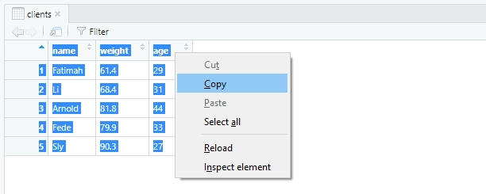

---
output:
  html_document:
    theme: readable
    highlight: tango
    self_contained: false
    css: textbook.css
---


# Writing Data 

<br>
<br>

<div class="tip">

## Key Concepts

In this chapter, we'll explore the following key concepts:

* CSV, TSV, & Delimited Files
* R Data Sets (RDS)
* RData Format

## Key Takeaways

Too long; didn't read? Here's everything you need to know:

* Importing data is **reading data**; exporting data is **writing data**
* Keep your working directories in mind, all files write to them by default
* Base R function `write.table()` writes most common file types
* Base R function `write.csv()` writes CSVs, TSVs, and more
* Package "readr" has `write*()` functions for each file type
* Save an object with `save()` and `.rds` extensions
* Save objects and workspaces using extension `.RData`
* Write data to your clipboard with `writeClipboard()`

<br>
<br>
<br>

</div>

<br>
<br>

<div class="caution">

<br>

**ATTENTION**

Readers are expected to have read the chapter "Getting Data into R".

<br>

</div>

<br>
<br>

## Functions for Writing Data

We **read data** into R, or *import*, with `read*()` functions.

Similarly, we **write data** from R, or *export*, with `write*()` functions.

* Most base R reading functions have equivalent writing functions
* Most package "readr" functions also have similar writing functions
* Packages for Excel, JSON, and other file formats have writing functions

<br>

What is **writing data**?

Simply put, it's the act of storing data in a location and format of your choosing.

Typically, your data are stored in an object like a matrix or data frame.

It's simply a matter of exporting a data-laden object.

<br>
<br>

### A Brief Note on Working Directories

Unless otherwise specified, data are written to your working directory by default.

* You can often specify different paths to save your data with argument **file =**
* Print your working directory with function `getwd()`
* Change your working directory with function `setwd()`
* Create new directories with function `dir.create()`
* See contents of directories with function `dir()`


<br>
<br>

### Base R's Workhorse Writing Function: `write.table()`

R's workhorse reading function, on which other functions depend, is `read.table()`.

R's workhorse writing function is `write.table()`.

<br>

Function wrappers like `write.csv()` are powered by `write.table()` under the hood.


```r
write.csv
```

```
## function (...) 
## {
##     Call <- match.call(expand.dots = TRUE)
##     for (argname in c("append", "col.names", "sep", "dec", "qmethod")) if (!is.null(Call[[argname]])) 
##         warning(gettextf("attempt to set '%s' ignored", argname), 
##             domain = NA)
##     rn <- eval.parent(Call$row.names)
##     Call$append <- NULL
##     Call$col.names <- if (is.logical(rn) && !rn) 
##         TRUE
##     else NA
##     Call$sep <- ","
##     Call$dec <- "."
##     Call$qmethod <- "double"
##     Call[[1L]] <- as.name("write.table")
##     eval.parent(Call)
## }
## <bytecode: 0x00000000131c4f20>
## <environment: namespace:utils>
```

<br>

If all else fails (and it probably won't), you can depend on `write.table()`.

<br>
<br>

### Writing Text Files: `write.csv()` & `write_csv()`

Comma-separated values (CSV) files are the most common type of output in R.

However, we can use the same `write*()` functions to create TSVs and more.

<br>

**Practice Data:** Let's create a simple data frame to practice writing data.


```r
name <- c("Fatimah", "Li", "Arnold", "Fede", "Sly")   # Character vector
weight <- c(61.4, 68.4, 81.8, 79.9, 90.3)             # Double vector
age <- c(29L, 31L, 44L, 33L, 27L)                     # Integer vector

clients <- data.frame(name, weight, age,              # Create data frame
                      stringsAsFactors = FALSE)       # Don't forget this!

clients
```

```
##      name weight age
## 1 Fatimah   61.4  29
## 2      Li   68.4  31
## 3  Arnold   81.8  44
## 4    Fede   79.9  33
## 5     Sly   90.3  27
```

<br>

**Base R:** Write CSV files using function `write.csv()`.


```r
write.csv(x = clients,                # Write object "clients"
          file = "clients.csv")       # Write file name and extension
```

**Include Extensions:** When writing a file, *include the extension in the file name*.

* Saving an R script? Include `.r`
* Saving an Excel sheet? Include `.xlsx`
* Saving a CSV? Include `.csv`

<br>

**TSVs & Other Delimiters:** You're not restricted to using commas with `write.csv()`.


```r
write.csv(x = clients,
          file = "clients.tsv",       # Use appropriate extension
          sep = "\t")                 # Save as tab-delimited
```

<br>

**Notable Arguments:** Function `write.csv()` has some notable parameters, e.g.

* **x =** specifies the name of the object to write
* **file =** specifies the output file name; requires quotes and extension
* **sep =** specifies the delimiter, e.g. commas, tabs, semicolons, etc.
* **na =** specifies the character(s) to use instead of missing values

<br>

**Package "readr":** Function `write_csv()` is the same as `write.csv()` except:

* Significantly faster at writing data
* Does not write row names automatically
* Cannot write files with non-comma delimiters
* More consistent argument names; **file =** is now **path =**

<br>

**Writing with "readr":** Observe `write_csv()` in action:


```r
library(readr)

write_csv(x = clients,
          path = "clients.csv")
```

<br>

**TSV Files with "readr":** Bummer! Can't write TSV files with `write_csv()`.

Hark! Package "readr" has function `write_tsv()` for precisely that!


```r
library(readr)

write_tsv(x = clients,
          path = "clients.tsv")     # Right tool for the job
```

<br>

In fact, package "readr" has writing functions optimized for many file types.

We encourage you to check out each one, e.g. `help(write_delim)`:

* `write_csv()`
* `write_csv2()`
* `write_delim()` 
* `write_excel_csv()`
* `write_file()`
* `write_rds()`
* `write_tsv()`

<br>
<br>

<div class="figure" style="text-align: center">

<p class="caption">(\#fig:unnamed-chunk-8)Mind blown.</p>
</div>

<br>
<br>

## Saving Your Work: R Datasets (RDS)

Manually restoring your workspace to your former session's glory is a pain.

Hence, base R has functions `save()` and `load()` to save objects locally.

<br>

**Saving an Object:** Save your original object, `clients`, as a `.rds` file:


```r
save(clients, 
     file = "clients_object.rds")
```

<br>

**Saving More than One Object:** List each object first and save as `.RData`:


```r
save(age, name, weight, clients,
     file = "clients_all.RData")
```

<br>

**Saving your Workspace:** Save your history and all objects with `save.image()`:


```r
save.image(file = "my_workspace.RData")
```

<br>

**Load Objects & Workspaces:** Simply input the file name into function `load()`:


```r
load("clients_object.rds")      # Load a single object file
load("clients_all.RData")       # Load multiple objects
load("my_workspace.RData")      # Laod entire workspace
```

<br>

**Why save objects and workspaces?**

* Perfectly reproduce your environment for collaborators
* Load typical header information for scripts, like authors and versions
* Save and load objects that take a lot of time or computing power to create
* We haven't learned many object types, but some are useful when reproduced often

<br>
<br>

## Writing Data to Statistical Software Files

The "foreign" and "haven" packages help read and write files used in SAS, SPSS, etc.

<br>

Package "foreign" uses `write.foreign()` as a catch-all writing function.

Argument **package =** accepts "SPSS", "SAS", and other software names.

It also has wrapper functions like `write_dta()` for Sata files, e.g.


```r
library(foreign)

write.foreign(df = clients, 
              datafile = "clients.sas", 
              package = "SAS")
```

<br>

Package "haven" only has four specific functions rather than a single workhorse:


```r
library(haven)

write_dta(clients, "clients.dta")   # Stata
write_sas(clients, "clients.sas")   # SAS
write_sav(clients, "clients.sav")   # SPSS
write_xpt(clients, "clients.xpt")   # SAS, too
```


<br>
<br>

## Copying Data to Your Clipboard

Read data from the clipboard with `readClipboard()`; write with `writeClipboard()`.

<br>

The concept, briefly: 

1. When copying text, it goes to your clipboard - the same as `writeClipboard()`
2. When pasting text, it comes from your clipboard - the same as `readClipboard()`

<br>

<div class="figure" style="text-align: center">

<p class="caption">(\#fig:unnamed-chunk-15)You can write character data to your clipboard from R.</p>
</div>

<br>

**Character Data Only:** Here, we'll copy two objects to the clipboard.

* Note that only the character data will copy to your clipboard
* Non-characyet data must be coerced with function `as.character()`


```r
txt <- "This is a sentences comprised of text."
num <- 2.718

writeClipboard(txt)                 # Accepts character data
writeClipboard(num)                 # Will not accept numeric data
writeClipboard(as.character(num))   # Accepts when coerced to character
```

<br>
<br>

## Copying Data to Excel

There's a "quick and dirty" method to copying and pasting data from R into Excel.

1. Open the tabular data object with function `View()`
2. Highlight each cell, starting at lower-right, ending at upper-left
3. Right click or **Ctrl + C** to copy the RStudio Viewer data
4. Right click or **Ctrl + V** to paste into Excel

<br>

<div class="figure" style="text-align: center">

<p class="caption">(\#fig:unnamed-chunk-17)Copy and paste right from your RStudio viewer.</p>
</div>

<br>
<br>

## Further Resources

* [Exporting Data (Quick-R)](https://www.statmethods.net/input/exportingdata.html)
* [R Data Import/Export (CRAN)](https://cran.r-project.org/doc/manuals/r-release/R-data.html)

<br>
<br>

## Works Cited

* SpongBob SquarePants
* Tim & Eric's Awesome Show
* Gravity Falls

<br>
<br>
