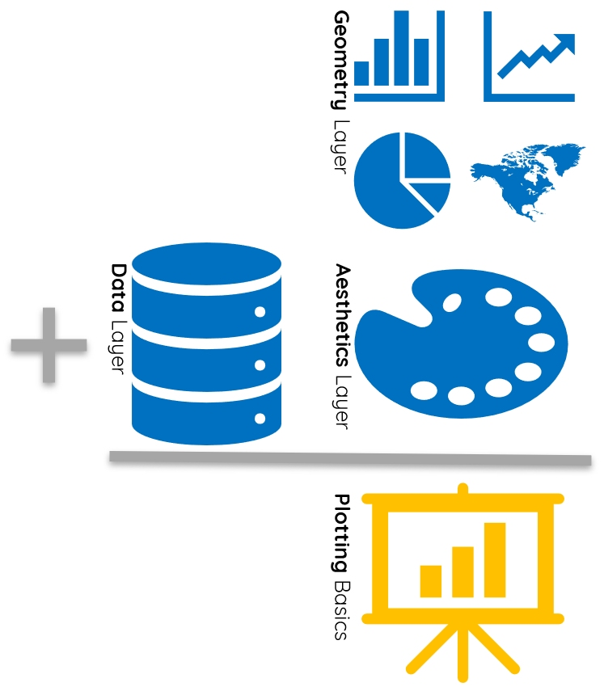

---
output:
  html_document:
    theme: readable
    highlight: tango
    self_contained: false
    css: textbook.css
---

# The Grammar of Graphics

<br>
<br>

<div class="tip">

## Key Concepts

In this chapter, we'll explore the following key concepts:

* Exploratory Data Analysis (EDA)
* Exploratory Data Visualization (EDV)
* Explanatory vs. Explanatory Plots
* The Grammar of Graphics
* Data & Non-Data Ink
* Aesthetic Mappings
* Attributes
* Overplotting
* Faceting

## New Packages

This chapter uses the following packages:

* ggplot2
* GGally
* scales
* 

## Key Takeaways

Too long; didn't read? Here's what you need to know:

* Item X
* Item Y
* Item Z

<br>
<br>

</div>

<br>
<br>

## Why Visualize Data?

We visualize data for two principal reasons. We want to:

1. Learn about our data, i.e. **exploratory data visualization**
2. Tell our data's stories to others, i.e. **explanatory data visualization**

<br>
<br>

### Explanatory Visualization

**Explanatory visualization** is polished, publication-quality, and interpretable:

* Meant to be consumed by broad, non-specialist audiences
* Takes significant time and iterations to perfect
* Conveys one or two "big ideas", each

```{r message=F, warning=F, echo=F, cache=T}

library(readr)

url <- paste0("https://raw.githubusercontent",
              ".com/jamisoncrawford/ddp_app/",
              "master/Data/onet_bls_merged.csv")

set.seed(1)

```

<br>

Just note the length of the code and its result. What idea does this plot convey? 

```{r message=F, warning=F, cache=T}

library(ggplot2)

ggplot(read_csv(url), aes(x = val, y = myr)) +
  geom_jitter(alpha = 0.3, color = "tomato") +
  geom_smooth(method = "lm", se = FALSE, 
              color = "grey50", lwd = 0.5, alpha = 0.3) +
  facet_wrap(~ elm) +
  labs(title = "Annual income vs. Holland personality scores", 
       x = "Personality Score",
       y = "Income (K)",
       caption = "Sources: US DOL O*NET & BLS") +
  scale_y_continuous(labels = c("0", "50", "100", "150", "$200")) +
  theme_minimal()

```

<br>
<br>

### Exploratory Visualization

**Exploratory visualization** is "quick and dirty" and intends to discover.

* Meant to be consumed by yourself, colleagues, or other specialists
* Created quickly, with no polish, refinement, or audience in mind 
* Can convey many ideas, or none - that's why you do it!

<br>

This code is manageable! Observe a simple call to `ggpairs()` and the `iris` dataset.

```{r message=F, warning=F, cache=T}

library(ggplot2)
library(GGally)

ggpairs(data = iris, 
        aes(color = Species))

```

<center> *With just a little code, pairs plots visualize every variable against the other.* </center>

<br>

Hopefully, you wouldn't publish this. But we can quickly find patterns in a pairs plot:

* We can see positive correlations between sepal and petals for two species
* We observe that "Setosa" have thinner, longer sepals compared to others
* We also observe that "Versicolor" has the least variation in size

Such visual exploration can help refine hypotheses before analysis begins!

<br>
<br>

### Do I have to Visualize?

Exploratory viz is a key component in **exploratory data analysis**, or **EDA**.

Failing to visually explore your data can get you in hot water. Let's try it!

<br>

Observe the following data frame containing four data sets.

Variable `x1` corresponds to `y1`, `x2` to `y2`, and so forth:

```{r message=F, warning=F, echo=F, cache=T}

library(datasets)

set1 <- data.frame(x = anscombe[,1], y = anscombe[,5])
set2 <- data.frame(x = anscombe[,2], y = anscombe[,6])
set3 <- data.frame(x = anscombe[,3], y = anscombe[,7])
set4 <- data.frame(x = anscombe[,4], y = anscombe[,8])

```

```{r, cache=T}

library(datasets)

anscombe

```

At a glance, they look like the have some similaries!

<br>

**Check It:** Let's perform a few statistical EDA functions on each subset, 1-4.

What do you notice when we figure out and organize:

* Average of all X and Y values with `mean()`
* Variance of all X and Y values with `var()`
* Correlation between X and Y for all sets with `cor()`
* Linear regression coefficients between X and Y with `lm()` 

```{r echo=F, warning=F, message=F, cache=T}

x_mean <- sapply(list(set1$x, 
                      set2$x, 
                      set3$x, 
                      set4$x), mean)

y_mean <- sapply(list(set1$y, 
                      set2$y, 
                      set3$y, 
                      set4$y), mean)

x_var <- sapply(list(set1$x, 
                     set2$x, 
                     set3$x, 
                     set4$x), var)

y_var <- sapply(list(set1$y, 
                     set2$y, 
                     set3$y, 
                     set4$y), var)

correl <- c(cor(set1$x, set1$y), 
            cor(set2$x, set2$y),
            cor(set3$x, set3$y),
            cor(set4$x, set4$y))

coeff <- c(lm(y ~ x, set1)$coef[2],
           lm(y ~ x, set2)$coef[2],
           lm(y ~ x, set3)$coef[2],
           lm(y ~ x, set4)$coef[2])

data.frame(x_mean, 
           y_mean, 
           x_var, 
           y_var, 
           correl, 
           coeff, 
           row.names = c("Set 1", "Set 2", "Set 3", "Set 4"))

```

<br>

**Heavens to Murgatroyd!** These are practically the same sets!

* The mean and variance of X is the exact same across sets
* The mean and variance of Y is *almost* exactly the same across sets
* The correlation between X & Y is extremely close across sets
* The coefficient of determination is also extremely close

<br>

Once visualized, all four linear relationships appear to be exactly the same:

```{r warning=F, echo=F, message=F, cache=T}

library(tidyr)
library(dplyr)
library(ggplot2)
library(stringr)
library(datasets)

ansc <- anscombe %>%
  gather(key = set_var, value = value, x1:y4) %>%
  mutate(set = str_extract(set_var, pattern = "[1-4]{1}"),
         var = str_extract(set_var, pattern = "[x-y]{1}")) %>%
  select(-set_var)

xy <- bind_cols(ansc[1:44, 1:3] %>%
                rename(x = value) %>%
                select(-var),
              ansc[45:88, 1:3] %>%
                rename(y = value) %>%
                select(-var)) %>%
      select(set, x, y, -set1)

ggplot(xy, aes(x = x, y = y)) +
  geom_smooth(method = "lm", se = FALSE) +
  facet_wrap(~set) +
  labs(title = "Linear relationship in Anscombe's Datasets",
       x = "X Values",
       y = "Y Values",
       caption = "Source: Francis Anscombe (1973)") +
  theme_classic()

```

<br>

**Well, that settles that.** Pack it up, folks - the data are the same.

<br>

*Hold up.*

<br>

*Wait a minute.*

<br>

*Something ain't right.*

<br>

**Let's try replotting** the actual datasets and not just their linear models.

<br>

```{r echo=F, warning=F, message=F, cache=T}

ggplot(xy, aes(x = x, y = y)) +
  geom_point(size = 2, alpha = 0.5) +
  geom_smooth(method = "lm", se = FALSE, alpha = 0.3) +
  facet_wrap(~set) +
  labs(title = "Actual relationships in Anscombe's Datasets",
       subtitle = "You've been had!",
       x = "X Values",
       y = "Y Values",
       caption = "Source: Francis Anscombe (1973)") +
  theme_classic()

```

<br>

**Boom!** Not the same datasets *at all*. 

<br>

Despite having the same mean, variance, correlations, and coefficients:

* Dataset 1 is a normally distributed linear relationship
* Dataset 2 is a parabolic curve
* Dataset 3 is a perfect linear relationship with a high-leverage outlier
* Dataset 4 shows absolutely no relationship but again has an outlier

<br>

**Conclusion:** Always conduct exploratory visualization as a staple of any analysis.

<br>
<br>

<div class = "note">

**FUN FACT:**

**You just got Anscombe'd.** [Francis John "Frank" Anscombe](https://en.wikipedia.org/wiki/Frank_Anscombe) was an English statistician who helped pioneer the field in the twentieth century. He wrote:

<br>

> "...a computer should make both calculations and graphs..."

<br>

To demonstrate, Anscombe invented these datasets: [Anscombe's Quartet](https://en.wikipedia.org/wiki/Anscombe%27s_quartet).

</div>

<br>
<br>

## The Grammar of Graphics

We've compared human languaes and programming languages in the past.

Let's take the anology further. **Observe the following sentence:**

```{r, echo=F, fig.align="center", fig.cap = "The quick brown fox jumps over the lazy dog.", out.width="100%", cache=T}

knitr::include_graphics("https://mir-s3-cdn-cf.behance.net/project_modules/disp/7a5a8f10364877.560e3a9483d9b.png")

```

<center> Source: [Chionetti, A. (2013)](https://www.behance.net/gallery/10364877/The-quick-brown-fox-jumps-over-the-lazy-dog) </center>

<br>

Recall that language consists of nouns, verbs, adjectives, articles, prepositions, etc.

If we change any **part of speech**, we change the meaning of our sentence. Observe:

<br>

> The quick brown fox jumps **off** the lazy dog.

Now the fox has escalated things, opting to use the poor dog as a springboard.

<br>

> The quick brown fox **runs** over the lazy dog.

Well this is just getting graphic.

<br>

> The **decrepit** brown fox jumps over the lazy dog.

That is one lazy dog!

<br>

**Parts of Speech:** Every *part of speech* (like adjectives, e.g. "quick", "lazy") has a function.

Nouns describe things, verbs describe actions, adjectives describe qualities, etc.

<br>

**Parts of Viz:** Like language, there are *parts of visualization*. Each part has a function.

* A chart's *data* could be anything, like quarterly revenues or ELA scores 

* A chart's *geometry* could represent the data as bars, points, lines, or shapes

* A chart's *theme* could use different fonts, gridlines, transparencies, etc.

<br>

These are just some *parts of viz* in a larger framework: **The Grammar of Graphics**. 

<br>
<br>

### A Brief Overview

In 1999, statistician [Leland Wilkinson](https://en.wikipedia.org/wiki/Leland_Wilkinson) published [**The Grammar of Graphics**](https://books.google.com/books/about/The_Grammar_of_Graphics.html?id=ZiwLCAAAQBAJ).

This framework allows us to dissect and alter plots in the same way we would a sentence.

Let's begin with *parts of viz*, or **layers**.

<br>
<br>

### Layers: Parts of Viz

In the grammar of graphics framework, each visualization is comprised of **layers**. 

* Each **layer** performs a unique function in a visualization
* Like *parts of speech*, a **layer** can perform one function in infinite ways
    - For example, the **data layer** functions to input your data
    - A noun can be "fox" or "dog; a dataset can be "DOL" or "TSA"
    
<br>
<br>

### Essential Layers: Data, Mappings, & Shapes

Like human *sentences*, every complete visualization has 3 essential layers:

<br>

```{r, echo=F, fig.align="center", fig.cap = "The three essential layers for a complete visualization.", out.width="100%", cache=T}



```

```{r echo=F, message=F, warning=F, cache=T}

library(readr)
library(dplyr)
library(ggplot2)

url <- paste0("https://raw.githubusercontent.com/",
              "jamisoncrawford/wealth/master/Tidy",
              "%20Data/hancock_lakeview_tidy.csv")

lakeview <- read_csv(url) %>%
  filter(project == "Lakeview",
         !is.na(race))

hancock <- read_csv(url) %>%
  filter(project == "Hancock",
         !is.na(race))

```

<br>
<br>

#### The Data Layer

The **data layer** conveys the dataset informing the visualization.

* The data layer inputs a dataset, but doesn't specify the variables you show
* Visualizations can have more than one data layer, e.g. overlay plots

<br>

The **data layer** in everyday conversation:

> "Are you pulling occupations from O*NET or BLS? We only need SOC-level."

<br>

**Intepretation:** Your data layer is comprised of your data source.

<br>
<br>

Observe the same plot - the only difference is the **data layer**. What changes?

```{r echo=F, message=F, warning=F, cache=T}

library(gridExtra)
library(ggplot2)

set.seed(1)

p1 <- ggplot(lakeview, aes(x = factor(race, 
                                      levels = c("Asian", "Black", "Hispanic", "Native", "White"), 
                                      labels = c("Asian", "Black", "Hispanic", "Indigenous", "White")),
                           y = net)) +
  geom_jitter(alpha = 0.15, 
              color = "dodgerblue2", 
              width = 0.2) +
  labs(title = "Weekly net by ethnicity",
       subtitle = "Lakeview Amphitheater, 2015",
       x = NULL,
       y = "Weekly Net Income",
       caption = "Source: Onondaga County") +
  scale_y_continuous(labels = c("$ 0", "500", "1,000", "1,500", "2,000", "2,500")) +
  coord_flip() +
  theme_classic()

p2 <- ggplot(hancock, aes(x = factor(race, 
                                     levels = c("Hispanic", "Black", "Multiracial", "Native", "White"), 
                                     labels = c("Hispanic", "Black", "Multiracial", "Indigenous", "White")),
                          y = net)) +
  geom_jitter(alpha = 0.15, 
              color = "dodgerblue2", 
              width = 0.2) +
  labs(title = "Weekly net by ethnicity",
       subtitle = "Hancock Airport, 2018",
       x = NULL,
       y = "Weekly Net Income",
       caption = "Source: Syracuse Regional Airport Authority") +
  scale_y_continuous(labels = c("$ 0", "500", "1,000", "1,500", "2,000", "2,500")) +
  coord_flip() +
  theme_classic()

grid.arrange(p1, p2, ncol=2)

```

<br>
<br>

#### The Aesthetics Layer

The **aesthetics layer** conveys which variables to visualize.

* **Aesthetics** refers to the visual ways to represent variables
* Aesthetics include size, shape, color, fill, line type, transparency, etc.
* The most common aesthetic mapping is using x- and y-axes to show quantities
* Aesthetics adjust dynamically with your data - *they are not static*

<br>

The **aesthetics layer** in everyday conversation:

> “Can you color-code the datapoints by gender?”

<br>

**Intepretation:** Aesthetics use visual elements like color to convey more data.

<br>
<br>

Observe the same plot - the only difference is the **aesthetics layer**. What changes?

```{r echo=F, message=F, warning=F, cache=T}

library(gridExtra)
library(ggplot2)

set.seed(1)

p1 <- ggplot(hancock, aes(x = factor(race, 
                                     levels = c("Hispanic", "Black", "Multiracial", "Native", "White"), 
                                     labels = c("Hispanic", "Black", "Multiracial", "Indigenous", "White")),
                          y = net)) +
  geom_jitter(alpha = 0.15, 
              color = "dodgerblue2", 
              width = 0.2) +
  labs(title = "Weekly net by ethnicity",
       subtitle = "Hancock Airport, 2018",
       x = NULL,
       y = "Weekly Net Income",
       caption = "Source: Syracuse Regional Airport Authority") +
  scale_y_continuous(labels = c("$ 0", "500", "1,000", "1,500", "2,000", "2,500")) +
  coord_flip() +
  theme_classic()

p2 <- ggplot(hancock, aes(x = gross,
                          y = net)) +
  geom_jitter(alpha = 0.15, 
              color = "dodgerblue2", 
              width = 0.2) +
  labs(title = "Weekly net vs. gross",
       subtitle = "Hancock Airport, 2018",
       x = "Weekly Gross Income",
       y = "Weekly Net Income",
       caption = "Source: Syracuse Regional Airport Authority") +
  scale_x_continuous(labels = c("$ 0", "1,000", "2,000", "3,000")) +
  scale_y_continuous(labels = c("$ 0", "500", "1,000", "1,500", "2,000", "2,500")) +
  coord_flip() +
  theme_classic()

grid.arrange(p1, p2, ncol=2)

```

<br>
<br>

#### The Geometry Layer

The **geometry layer** conveys the shape your variables use to visualize data.

* **Geometries** include scatter plots, bar charts, line graphs, etc.
* Some geometries are only compatible with certain variables
* Geometries can also take **attributes**, like size, shape, color, etc.
* Geometry attributes do not adjust dynamically with data - *they are static*

<br>

The **geometry layer** in everyday conversation:

> “I’m trying to emphasize the increase in elevated blood lead levels over time.”

<br>

**Intepretation:** It sounds like they'd want a line graph or bar chart to show change.

<br>
<br>

Observe the same plot - the only difference is the **geometry layer**. What changes?

```{r echo=F, message=F, warning=F, cache=T}

library(gridExtra)
library(ggplot2)

set.seed(1)

p1 <- ggplot(hancock, aes(x = factor(race, 
                                     levels = c("Hispanic", "Black", "Multiracial", "Native", "White"), 
                                     labels = c("Hispanic", "Black", "Multiracial", "Indigenous", "White")),
                          y = net)) +
  geom_jitter(alpha = 0.15, 
              color = "dodgerblue2", 
              width = 0.2) +
  labs(title = "Weekly net by ethnicity",
       subtitle = "Hancock Airport, 2018",
       x = NULL,
       y = "Weekly Net Income",
       caption = "Source: Syracuse Regional Airport Authority") +
  scale_y_continuous(labels = c("$ 0", "500", "1,000", "1,500", "2,000", "2,500")) +
  coord_flip() +
  theme_classic()

p2 <- ggplot(hancock, aes(x = factor(race, 
                                     levels = c("Hispanic", "Black", "Multiracial", "Native", "White"), 
                                     labels = c("Hispanic", "Black", "Multiracial", "Indigenous", "White")),
                          y = net)) +
  geom_boxplot(alpha = 0.15,
               color = "dodgerblue2") +
  labs(title = "Weekly net by ethnicity",
       subtitle = "Hancock Airport, 2018",
       x = NULL,
       y = "Weekly Net Income",
       caption = "Source: Syracuse Regional Airport Authority") +
  scale_y_continuous(labels = c("$ 0", "500", "1,000", "1,500", "2,000", "2,500")) +
  coord_flip() +
  theme_classic()

grid.arrange(p1, p2, ncol=2)

```

<br>
<br>

<div class = "tip">

PRO TIP

It seems like a small distinction, but the difference is critical:

* Both "Attributes" and "Aesthetics" use color, size, line width, fill, etc.
* "Attributes" are static and unchanging
* "Aesthetics" are dynamic and change with your data

<br>

All "aesthetics" are specified in the "aesthetics" layer.

All "attributes" are specified in the "geometries" layer.

</div>

<br>
<br>

### Remaining Layers

The 4 remaining **layers** in the **grammar of graphics** include:

* The **coordinates layer** modifies plot zoom, truncation, and labeling
* The **statistics layer** performs statistical transformations like lines of best fit
* The **facets layer** creates multiple comparison plots, a.k.a. small multiples
* The **themes layer** modifies font, gridlines, and other "non-data ink" polish

<br> 

We'll explore some key functions from these **layers** in the following sections.

<br>
<br>

## Package "ggplot2"

Package "ggplot2" is a popular, powerful package for data visualization in R.

* Authored by Hadley Wickham; maintained by RStudio
* An implementation of the "Grammar of Graphics" framework (hence "gg")
* Has a series of function families, each corresponding to a different **layer**

Expressions in "ggplot2" use a particular syntax. Note that `+` connects the **layers**. 

<br>

Let's look at a "complete" graph:

```{r message=F, warning=F, cache=T}

library(ggplot2)

ggplot(data = hancock) +      # Data layer
  aes(x = net) +              # Aesthetics layer
  geom_histogram()            # Geometry layer

```

<br>

Note that the preferred "ggplot2" format is as follows (both do the same thing):

```{r eval=F}

ggplot(data = hancock,
       aes(x = net)) +        # "aes()" is nested in "ggplot()"
  geom_histogram()

```

<br>

**Let's break it down.** Here are the three layers of a "ggplot2" graphic and how they work:

<br>

```{r, echo=F, fig.align="center", fig.cap = 'Breaking down a "complete" graphic.', out.width="90%", cache=T}

knitr::include_graphics("figures/ggplot2_recipe.jpg")

```

<br>

**Adding Aesthetics:** Let's plot the same data, except with:

* `aes()` argument **x =** mapped to `net`
* `aes()` argument **y =** mapped to `gross`
* `geom_histogram()` changed to `geom_point()`

```{r, cache=T}

ggplot(data = hancock,
       aes(x = net,
           y = gross)) +    # Now mapping "gross" to y-axis
  geom_point()              # Changed from geom_histogram()
  
```

<br>

**Modifying Attributes:** We can change attributes (non-data ink) in the `geom_*()` call.

* Modify transparency with argument **alpha =**
* Modify color and fill with **color =** and **fill =**, respectively

```{r, cache=T}

ggplot(data = hancock,
       aes(x = net,
           y = gross)) +
  geom_point(alpha = 0.35,        # Modify transparency between 0 & 1
             color = "tomato")    # Modify color; some colors are known

```

<br>

**Modify Labels:** We can add function `labs()` with `+` to modify labels and titles:

```{r, cache=T}

ggplot(data = hancock,
       aes(x = net,
           y = gross)) +
  geom_point(alpha = 0.35,
             color = "tomato") +
  labs(title = "Weekly gross v. net incomes in public construction",
       subtitle = "Hancock Airport, 2018",
       x = "Net Earnings",
       y = "Gross Earnings",
       caption = "Source: Syracuse Regional Airport Authority")

```

<br>

**Premade Themes:** Add premade themes with `+` and `theme_` functions:

```{r, cache=T}

ggplot(data = hancock,
       aes(x = net,
           y = gross)) +
  geom_point(alpha = 0.35,
             color = "tomato") +
  labs(title = "Weekly gross v. net by public construction workers",
       subtitle = "Hancock Airport, 2018",
       x = "Net Earnings",
       y = "Gross Earnings",
       caption = "Source: Syracuse Regional Airport Authority") +
  theme_minimal()                                                   # New theme

```

<br>

**Conclusions:** In package "ggplot2", we build on these three essential **layers**.

* The **data** layer, the **aesthetics** layer, and the **geometry** layer
* Call data, aesthetics, and geometry in `ggplot()`, `aes()`, and `geom*()` functions
* Once you've build an initial plot, you can add new layers to enhance it, like **themes**
* Each addition makes plots more decodable and better emphasizes big ideas 

<br>
<br>

## Notable Layer Functions

Each layer in "ggplot2" has an *astounding* number of functions. Let's check some out.

<br>
<br>

### The Aesthetics Layer

We've seen the principal function of the **aesthetics layer**, `aes()`.

Most importantly, you should *some* arguments to which you can map variables:

* **x =** maps to the x-axis
* **y =** maps to the y-axis
* **z =** maps to the z-axis (3-dimensional, typically)
* **color =** maps to colors of points and lines
* **fill =** maps to colors of shapes, e.g. bars
* **size =** maps to the size of points
* **labels =** maps to the labels of points, lines, and shapes
* **width =** maps to the width of lines
* **type =** maps to the line type

Read more about aesthetics in the ["ggplot2" vignette](https://cran.r-project.org/web/packages/ggplot2/vignettes/ggplot2-specs.html).

<br>

Take the following scatter plot of U.S. unemployed against total population since 1970:

```{r, cache=T}

library(ggplot2)

ggplot(data = economics, 
       aes(x = unemploy,
           y = pop)) +
  geom_point() +
  theme_minimal()

```

<br>

We can convey additional information by mapping aesthetics to other variables.

The following maps point size to `psavert`, or the personal savings rate.

```{r, cache=T}

library(ggplot2)

ggplot(data = economics, 
       aes(x = unemploy,
           y = pop,
           size = psavert)) +     # Map personal savings rate to size
  geom_point(alpha = 0.2) +       # Set transparency to 20%
  theme_minimal()

```

We can see that regardless of unemployment, savings dwindle as populations grow.

(Population, by the way, is practically interchangeable with date).

<br>
<br>

<div class="warning">

CAUTION: OVERPLOTTING & OVERMAPPING

<br>

It's tempting to map many variables to different aesthetics, so be careful to not:

* "Overplot", or obfuscate clarity with too many mappings
* "Overmapping", or mapping a variable to two or more aesthetics

<br>

For example, don't map "population", e.g. to both color and the y-axis.

* As datapoints move upward on the y-axis, the color changes
* It *may* make your plot pretty, but it makes it harder to decode
* What's more, color is redundant and pointless - axes are more decodable
* In effect, this is known in data visualization as "belt-and-suspenders design"

<br>

Belts or suspenders... you don't need both!

</div>

<br>
<br>

### The Geometry Layer

Each shape your data takes in the **geometry layer** has an associated function.

* View all geometries on the ["ggplot2" reference page](https://ggplot2.tidyverse.org/reference/)
* Notably, every geometry function begins with `geom_`
* Some statistical functions have equivalents that begin with `stat_`
* You can combine more than one geom function in a singple visual

<br>

**Rectangular Geoms:** When using geoms with rectangular shapes, set **stat =** to "identity".

```{r, cache=T}

options(scipen = 999)                 # Disable scientific notation

ggplot(data = hancock, 
       aes(x = reorder(race, -net),   # Reorder ethnicities by "net" 
           y = net)) +
  geom_bar(stat = "identity") +       # Specify stat = "identity"
  labs(x = NULL,
       y = "Weekly Net") +
  theme_minimal()

```

<br>

**Overlap & Transparency:** When multiple points overlap, we can use transparency (**alpha =**).

```{r, cache=T}

ggplot(data = hancock, 
       aes(x = reorder(race, -net), 
           y = net)) +
  geom_point(alpha = 0.15) +          # Set transparency to 15%
  labs(x = NULL,
       y = "Weekly Net") +
  theme_minimal()

```

<br>
<br>

**Overlapping & Jittering:** In combination with transparency, you can "jitter" your points.

* "Jittering" adds random horizontal and vertical noise to break up points
* In function `geom_point()`, set **position =** to "jitter"
* Arguments **height =** and **width =** controls jitter
* Alternatively, use function `geom_jitter()`

```{r, cache=T}

ggplot(data = hancock, 
       aes(x = reorder(race, -net), 
           y = net)) +
  geom_jitter(alpha = 0.15,           # Change geom to geom_jitter()
              width = 0.25) +         # Set "jitter" width to 0.25
  labs(x = NULL,
       y = "Weekly Net") +
  theme_minimal()

```

<br>
<br>

### The Statistics Layer

The **statistics layer** is where data undergo statistical transformations under the hood.

* All stat layer functions begin with `stat_`
* Many geometries already use stats, like `geom_smooth()`
* Argument **method =** can use different models with "lm", "glm", "rlm", etc.
* Stat functions typically not called directly, but run within geom functions

<br>

**Smoothers:** Function `stat_smooth()` adds a LOESS line and standard error area.

```{r message=F, warning=F, cache=T}

ggplot(hancock, 
       aes(x = net,
           y = gross)) +
  geom_point() +
  stat_smooth() +                 # Function stat-smooth(), same as geom_smooth()
  theme_minimal()

```

<br>

**Remove Standard Error:** Set argument **se =** to FALSE to disable standard error.

```{r message=F, warning=F, cache=T}

ggplot(hancock, 
       aes(x = net,
           y = gross)) +
  geom_point() +
  stat_smooth(se = FALSE) +       # Argument se = controls standard error
  theme_minimal()

```

<br>

**Chane Modeling Method:** Set argument **method =** to "lm" for linear models, etc.

```{r message=F, warning=F, cache=T}

ggplot(hancock, 
       aes(x = net,
           y = gross)) +
  geom_point() +
  stat_smooth(se = FALSE,
              method = "lm") +    # Argument method = changes your model
  theme_minimal()

```

<br>
<br>

### The Coordinates Layer: Planes

The **coordinates layer** ultimately controls the limits and labels of your axes.

* All **coordinates** functions begin with `coord_`
* Most common is `coord_cartesian()`, which modifies a plot's Cartesian plane

<br>

**Flipping Coordinates!** No, we're not cursing out **coordinates**.

However, you can reverse the x- and y-axes by using function `coord_flip()`:

```{r, echo=F, message=F, warning=F, cache=T}

ggplot(data = hancock, 
       aes(x = reorder(race, net), 
           y = net)) +
  geom_bar(stat = "identity") +
  labs(x = NULL,
       y = "Weekly Net") +
  theme_minimal()

```

```{r, cache=T}

ggplot(data = hancock, 
       aes(x = reorder(race, net), 
           y = net)) +
  geom_bar(stat = "identity") +
  labs(title = "Flipped!",
       x = NULL,
       y = "Weekly Net") +
  theme_minimal() +
  coord_flip()                        # coord_flip() !

```

<br>
<br>

**Zooming or Filtering:** Modifying coordinates typically goes one of two ways:

* Zoom in on some specified coordinates
* Zoom in *and filter out* data that are no longer visible 

*Zoom* with `coord_cartesian()`.

*Filter* with `lims()`.

<br>

**The Whole Plot (Before):** Observe the entirety of the plot without zooming in:

```{r message=F, warning=F, cache=T}

ggplot(hancock,
       aes(x = net,
           y = gross)) +
  geom_point() +
  geom_smooth() +
  theme_minimal()

```

<br>

**Zoomed In:** We can zoom, without affecting our data, with `coordcartesion()`.

Note the direction and standard error of the LOESS line from `geom_smooth()`. 

```{r message=F, warning=F, cache=T}

ggplot(hancock,
       aes(x = net,
           y = gross)) +
  geom_point() +
  geom_smooth() +
  theme_minimal() +
  coord_cartesian(xlim = c(0, 1250), 
                  ylim = c(0, 2000))    # Zoom in and keep your data!

```

<br>

**Filtered:** We can use `lims()` to zoom in *and filter* data no longer plotted.

Now note how the LOESS line and standard error have changed per this "new" dataset.  

```{r message=F, warning=F, cache=T}

ggplot(hancock,
       aes(x = net,
           y = gross)) +
  geom_point() +
  geom_smooth() +
  theme_minimal() +
  lims(x = c(0, 1250), 
       y = c(0, 2000))                  # Zoom in and filter your data!

```

<br>
<br>

<div class = "question">

QUESTION

Why do the LOESS curves and standard errors change between plots?

</div>

<br>
<br>

### The Coordinates Layer: Scales

**Scales** in "ggplot2" affect your axis gridlines, ticks, breaks, and labels.

* Scale functions begin with `scale_`
* Specify which axis with `scale_x_` or `scale_y_`
* Also specify `discrete`, `continuous`, or another variable type
* Example: A discrete (categorical) variable on the y-axis is `scale_y_discrete()` 

<br>

**Axis Titles:** Change (or remove) axis titles with argument **name =**:

```{r message=F, warning=F, cache=T}

ggplot(hancock,
       aes(x = net,
           y = gross)) +
  geom_point(alpha = 0.1) +
  geom_smooth(color = "grey70") +
  theme_minimal() +
  scale_x_continuous(name = "Weekly Net") +     # Axis? Continuous or discrete?
  scale_y_continuous(name = "Weekly Gross")     # Argument name = for axis titles

```

<br>

**Breaks:** Specify axes' major label and tick marks with argument **breaks =** and `c()`:

```{r message=F, warning=F, cache=T}

ggplot(hancock,
       aes(x = net,
           y = gross)) +
  geom_point(alpha = 0.1) +
  geom_smooth(color = "grey70") +
  theme_minimal() +
  scale_x_continuous(name = "Weekly Net",
                     breaks = c(0, 1250, 2500)) +
  scale_y_continuous(name = "Weekly Gross",
                     breaks = c(0, 1500, 3000))           # Even breaks

```

<br>

**Labels:** Customize individual labels with argument **labels =** (*ojo* - can get lengthy):

```{r message=F, warning=F, cache=T}

ggplot(hancock,
       aes(x = net,
           y = gross)) +
  geom_point(alpha = 0.1) +
  geom_smooth(color = "grey70") +
  theme_minimal() +
  scale_x_continuous(name = "Net",
                     breaks = c(0, 1250, 2500),
                     labels = c("$ 0", "1.25", "2.5 K")) +
  scale_y_continuous(name = "Gross",
                     breaks = c(0, 1500, 3000),
                     labels = c("$ 0", "1.5", "3 K"))     # Labels in quotes

```

<br>
<br>

**Pretty Breaks:** Package "scales" allows us to more easily format `scale_*()` functions.

* Format breaks automatically (pretty-like)
* Label dollar amounts and percentages with ease

<br>

**Pretty Names:** With "scales", argument **name =** accepts new standards:

```{r message=F, warning=F, cache=T}

library(scales)

ggplot(hancock,
       aes(x = net,
           y = gross)) +
  geom_point(alpha = 0.1) +
  geom_smooth(color = "grey70") +
  theme_minimal() +
  scale_x_continuous(name = "Net",
                     breaks = c(0, 1250, 2500),
                     labels = dollar) +                   # Auto-labeling: Good
  scale_y_continuous(name = "Gross",
                     breaks = c(0, 1500, 3000),
                     labels = dollar)                     # Less flexibility: Bad

```

<br>

**Pretty Breaks:** With "scales", argument **breaks =** accepts `pretty_breaks()`:

```{r message=F, warning=F, cache=T}

library(scales)

ggplot(hancock,
       aes(x = net,
           y = gross)) +
  geom_point(alpha = 0.1) +
  geom_smooth(color = "grey70") +
  theme_minimal() +
  scale_x_continuous(name = "Net",
                     breaks = pretty_breaks(5),
                     labels = dollar) +                   # pretty_breaks() !
  scale_y_continuous(name = "Gross",
                     breaks = pretty_breaks(12),
                     labels = dollar)                     # Pretty sick

```

<br>
<br>

<div class="tip">

PRO TIP: PACKAGE "SCALES" APPLICATIONS

The "scales" package has a host of amazing formatting functions. Commonly:

* `dollar()` and `dollar_format()` for currency
* `percent()` and `percent format()` for percents
* `number()` and `number_format()` for numbers

These and [other functions](https://cran.r-project.org/web/packages/scales/scales.pdf) are incredibly useful, especially for cleaning.

</div>

<br>
<br>

### The Faceting Layer 

The **faceting layer** allows us to create **facets**, a.k.a [small multiples](https://en.wikipedia.org/wiki/Small_multiple) or trellis charts.

* All **faceting** functions begin with `facet_`
* `facet_wrap()` creates a grid; `facet_grid()` creates side-by-sides
* There are other arguments, but the formula `x ~ y` (variables), is critical

<br>

**Single-Variable Faceting:** The formula `x ~ y` needs only one side.

You can replace the empty side with `.` or leave it blank.

```{r message=F, warning=F, cache=T}

ggplot(hancock,
       aes(x = net,
           y = gross)) +
  geom_point(alpha = 0.5) +
  geom_smooth(alpha = 0.5,
              method = "lm") +
  theme_minimal() +
  scale_x_continuous(name = "Net",
                     breaks = pretty_breaks(3),
                     labels = dollar) +
  scale_y_continuous(name = "Gross",
                     breaks = pretty_breaks(3),
                     labels = dollar) +
  facet_wrap(facets = race ~ .)                     # Only one side needed

```

<br>

**Facet Grid:** When you want side-by-side comparisons for all plots, use `facet_grid()`:

```{r message=F, warning=F, cache=T}

ggplot(hancock,
       aes(x = net,
           y = gross)) +
  geom_point(alpha = 0.5) +
  geom_smooth(alpha = 0.5,
              method = "lm") +
  theme_minimal() +
  scale_x_continuous(name = "Net",
                     breaks = pretty_breaks(3),
                     labels = dollar) +
  scale_y_continuous(name = "Gross",
                     breaks = pretty_breaks(3),
                     labels = dollar) +
  facet_grid(facets = . ~ race, )                     # Now with facet_grid() !

```

<br>

**Modify** `facet_*()` functions with arguments beyond the `x ~ y` formula.

* **rows =** accepts the number of rows in a facet grid
* **cols =** accepts the number of columns
* **labeller =** accepts new strip names

<br>
<br>

### The Themes Layer

The **themes layer** allows you to customize ever pixel of non-data ink in your plot.

* Function `themes()` is the workhorse function for this layer
* `themes()` arguments are a large but consistent framework
* Functions beginning with `theme_` set premade themes
* The **themes layer** *adjusts every non-data pixel*

<br>

Everything we've done so far, plus changing the facet strip labels:

```{r message=F, warning=F, cache=T}

ggplot(hancock,
       aes(x = net,
           y = gross)) +
  geom_point(alpha = 0.5,
             color = "grey30") +
  geom_smooth(alpha = 0.5,
              method = "lm") +
  theme_minimal() +
  scale_x_continuous(name = "Net",
                     breaks = pretty_breaks(3),
                     labels = dollar) +
  scale_y_continuous(name = "Gross",
                     breaks = pretty_breaks(3),
                     labels = dollar) +
  facet_wrap(facets = . ~ race) +
  theme(strip.text = element_text(face = "bold",
                                  color = "grey40",
                                  family = "Verdana"))   # The framework in action

```

<br>

**So what the hell was that?** *There's a whole consistent framework here!*

There's a few hierarchies of functions and arguments that we'll look at below.

We've saved the above plot in object `p`, which we'll use herein.

```{r, echo=F, message=F, warning=F, cache=T}

library(scales)
library(ggplot2)

p <- ggplot(hancock,
       aes(x = net,
           y = gross)) +
  geom_point(alpha = 0.5,
             color = "grey30") +
  geom_smooth(alpha = 0.5,
              method = "lm") +
  theme_minimal() +
  scale_x_continuous(name = "Net",
                     breaks = pretty_breaks(3),
                     labels = dollar) +
  scale_y_continuous(name = "Gross",
                     breaks = pretty_breaks(3),
                     labels = dollar) +
  facet_wrap(facets = . ~ race) +
  theme(strip.text = element_text(face = "bold",
                                  color = "grey40",
                                  family = "Verdana"))

```

<br>

**First Entering `theme()`:** You'll get hit with four short arguments:

1. **line =** modifies all lines in the plot
2. **rect =** modifies all rectangles in the plot
3. **text =** modifies all text in the plot
4. **title =** modifies just titles in the plot

```{r eval = F}

p + theme(text = ...)

```

<br>

**Latter Arguments in `theme()`:** More specific *argument families* for each element.

* **axis** arguments for axis lines, ticks, and text
* **legend** arguments for boxes, keys, spacing, text, and titles
* **panel** arguments for overall plot spacing and grid lines
* **plot** arguments for tags, titles, and margins
* **strip** arguments for facet strip text and backgrounds

```{r eval = F}

p + theme(axis.title = ...)

```

<br>

**Once Argument is Selected:** Arguments typically accept **theme element** functions:

* All **element functions** begin with `element_`
* `element_rect()` applies to rectangles
* `element_line()` applies to lines
* `element_text()` applies to text
* `element_blank()` removes it

```{r warning=F, message=F, cache=T}

p + theme(axis.title = element_text(color = "gray50",
                                    face = "bold",
                                    size = 10))

```

<br>
<br>

### Interactive Charts with "plotly"

On a brief side note, you can make your "ggplot2" plots interactive with "plotly".

<br>

**Saving "ggplot" Objects:** You can save plots as objects with assignment, or `<-`:

```{r message=F, warning=F, cache=T}

library(scales)
library(ggplot2)

p <- ggplot(hancock,
       aes(x = net,
           y = gross)) +
  geom_point(alpha = 0.5,
             color = "grey30") +
  geom_smooth(alpha = 0.5,
              method = "lm") +
  theme_minimal() +
  scale_x_continuous(name = "Weekly Net",
                     labels = dollar,
                     breaks = pretty_breaks(3)) +
  scale_y_continuous(name = "Weekly Gross",
                     labels = dollar,
                     breaks = pretty_breaks(4)) +
  facet_wrap(facets = . ~ race)

```

<br>

**Plotlify!** Once loaded, use function `ggplotly()` on your **ggplot oject**:

```{r message=F, warning=F, cache=T}

library(plotly)   

ggplotly(p)       # Insert your ggplot object!

```

Sweet.

<br>
<br>

### Further Resources

* ["Visualization with ggplot2: Part I"](http://rpubs.com/JamisonCrawford/ggplot2) (Crawford, 2019)
* ["Visualization with ggplot2: Part II"](http://rpubs.com/JamisonCrawford/ggplot22) (Crawford, 2019)
* ["Visualization with ggplot2: Part III"](http://rpubs.com/JamisonCrawford/ggplot23) (Crawford, 2019)

<br>
<br>