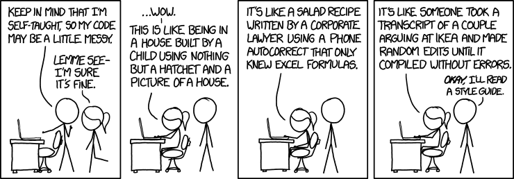

<br>

R is also a **programming environment**. Environments are software applications that evaluate and compile code to create desired output. If we think of R as human-readable language, just like the English you're reading now, we can imagine an environment as being similar to word processors like Google Docs or Microsoft Word. We know the language (i.e. English) and the rules (i.e. grammar), but we need an environment (e.g. Word) to create the desired output (e.g. a document). 


## Understanding Directories

A **directory** is the technical term for a *folder* and the *path* to that folder. A basic understanding of working with directories is critical to importing and exporting from R, as well as saving your code.

* Directory paths exist in a hierarchy, e.g. `"~/Projects/DS4PS"`
* These hierarchical paths exist in terms of "parent" and "child"
* The uppermost directory is known as the "root" directory
* The **working directory** is where R imports and exports files

<br>

**Determine the Working Directory:** You can find out your working directory by calling the `getwd()` function:

```{r 000.3, eval=F}

getwd()

```

<br>

**Set the Working Directory:** You can specify your working directory by calling function `setwd()` and specifying the path:

```{r 000.4, eval=F}

setwd("~/Projects/DS4PS")

```

<br>

**Listing Files:** Print the contents of your working directory by calling functions `dir()` or `list.files()`:

```{r 000.5, eval=T}

dir()

```

<br>

**Determine Existence:** Find out whether a directory exists by calling function `dir.exists()` with a path:

```{r 000.6, eval=T}

dir.exists("~/Projects/DS4PS/nonexistent_dir")

```


<br>

**Create Directories:** Make a new directory by calling function `dir.create()` with a path:

```{r 000.7, eval=F}

dir.create("~/Projects/DS4PS/my_new_directory")

```

<br>

## Scripting

R is a **scripting language**. As opposed to working interactively or in-console, scripting is the process of recording and saving your commands in a particular order, organizational style, and (optionally) with annotation (i.e. comments). This allows:

* Precisely reproducing data processing tasks and analyses
* Recording assumptions or summary decisions in analysis
* Sharing your work with others or publishing it online
* Creating new functions and packages
* Preventing or mitigating errors

<br>

```{r 000.c, echo=F, fig.align="center", fig.cap="*Left: A script in base R. Right: A script in RStudio.*", out.width="100%"}

knitr::include_graphics("ch-001-image3.jpg")

```

<br>

To **open a new script** in R, click `File` > `New script`. To open one in *RStudio*, click `File` > `New File` > `R Script`.

<br>

## Object-Oriented Programming

R is an **object-oriented programming**, or **OOP**, language. In short, pretty much everything is an **object**, including:

* Built-in and external datasets
* Stored sequences of values
* Functions (i.e. commands)
* Built in constants, e.g. `pi`
* Packages (i.e. libraries)

<br>

```{r 000.8, eval=T, echo=F, message=F, warning=F}

my_sequence <- 1:10

logical_object <- c(T, F, T, F, T)
numeric_object <- c(3, 1, 4, 1, 5)
character_object <- c("This", "is", "a", "character", "object")
dataset_object <- data.frame(logical = logical_object,
                             numeric = numeric_object,
                             character = character_object)

```

**Print Object Contents:** You can view object contents simply be typing the object name - this is called **autoprinting**:

```{r 000.9, eval=T}

my_sequence

```

<br>

**Explicitly Print Contents:** We can explicitly tell R to print an object's contents by calling function `print()`:

```{r 000.10, eval=T}

print(my_sequence)

```

<br>

**Listing Objects:** Objects are stored in the local environment. You can print them by calling function `ls()` by itself:

```{r 000.11, eval=T}

ls()

```

<br>

**Removing Objects:** In order to remove an object from your environment, call function `rm()` with the object name:

```{r 000.12, eval=T}

rm(my_sequence)

```

<br>

**Interacting Objects:** Objects work similarly to algebra. For example: 

<br>

<center>

<div class="quiz">

Observe the following and solve for variable `x`

</div>

<br>

$$ x + 2 = 4 $$

</center>

<br>

**Discussion:** You may have surmised that variable `x` equals 2. Algebra derives from the Arabic *al jabr*, which translates literally to "the reunion of broken parts". In OOP, we practice the *reunion of objects*. The following assigns the value 2 to object `x`:

```{r 000.13, eval=T}

x <- 2

```

<br>

We can evaluate the expression now that `x` contains the correct value.

```{r 000.14, eval=T}

x + 2

```

<br>

**Conclusion:** Every object in OOP is a building block. You're well on your way to building data analytic palaces.

<br>


---------------


<br>

## Coding Conventions: Best Practices in Formatting & Annotation

> “Any fool can write code that a computer can understand. Good programmers write code that humans can understand.” (Martin Fowler)

**Conventions** describe the ways in which R users format, comment, and name objects in their code. There are several best practices that can help keep your code clean, organized, consistent, and interpretable. For whom do we use conventions?

* Present You
* Future You
* Consumers
* Collaborators

<br>

### Indentation

In the same way we use indentation to indicate the start of a new paragraph, indentation in code is a powerful cue that a command is comprised of more than one line. Observe the following - what arguments are passed in function `read.csv()`?

<br>

```{r eval=F}

read.csv(file = "~/Projects/DS4PS/my_data.csv", header = TRUE, stringsAsFactors = FALSE)

```

<br>

In the above example, function `read.csv()`, arguments `file =`, `header =`, and `stringsAsFactors =` are passed to function `read.csv()`. It's a bit crowded, but we can make it much more interpretable:

<br>

```{r eval=F}

read.csv(file = "~/Projects/DS4PS/my_data.csv", 
         header = TRUE, 
         stringsAsFactors = FALSE)

```

<br>

In the second example, each argument in the `read.csv()` function uses a new line. When pressing the "return" key in the middle of a function call, R automatically indents ensuing lines at the beinning of the `(`, making the code much more legible.

<br>

### Spacing

Let's view a similar example with function `read.csv()`, properly indented, but, this time, we won't use spaces:

<br>

```{r eval=F}

read.csv(file="~/Projects/DS4PS/my_data.csv", 
         col.names=c("ID","name","Gender","Weight","Dosage"),
         row.names=1:25,
         sep=",",   
         header=TRUE, 
         stringsAsFactors=FALSE)

```

<br>

In the above call to function `read.csv()`, while indentation is helpful, it's difficult to parse what exactly we're telling each argument to do. We can clean this up considerably with consistent spacing:

<br>

```{r eval=F}

read.csv(file = "~/Projects/DS4PS/my_data.csv", 
         col.names = c("ID", "name", "Gender", "Weight", "Dosage"),
         row.names = 1:25,
         sep = ",",   
         header = TRUE, 
         stringsAsFactors = FALSE)

```

<br>

While the code may still be difficult to interpret for beginners, it's at least more visually navigable. What's more, we can use spacing to great effect not only within function calls, but between them, like so:

<br>

```{r eval=F}

data_2017 <- read.csv(file = "~/Projects/DS4PS/2017_data.csv", 
                      header = TRUE, 
                      stringsAsFactors = FALSE)

data_2018 <- read.csv(file = "~/Projects/DS4PS/2018_data.csv", 
                      header = TRUE, 
                      stringsAsFactors = FALSE)

data_2019 <- read.csv(file = "~/Projects/DS4PS/2019_data.csv", 
                      header = TRUE, 
                      stringsAsFactors = FALSE)

```

<br>

Not all R codes use the same spacing techniques, but what's most important is that they're sensible and consistent.

<br>

### Annotation

> “Your closest collaborator is you six months ago, but you don’t reply to emails.” (Karl Broman)

Code **annotation** is the practice of including headers, comments, and other signposting that explains what your code is doing:

* The hashtag, or `#`, is used to create comments and headers
* Comments can be placed in the middle of a command without interference
* The `#` can also be used as a header to indicate a new section of code
* Multiline annotation is possible by including an apostrophe, i.e. `#'`

<br>

```{r eval=F}

# IMPORT PATIENT RECORDS

    #' The following imports patient records for
    #' experiment x and the current dosages
    #' administered to each.

dat <- read.csv(file = "~/Projects/DS4PS/my_data.csv",        # Import "my_data.csv"
                col.names = c("ID", "name", 
                              "Gender", "Weight", "Dosage"),  # Rename columns
                row.names = 1:25,                             # Label rows as 1-25
                header = TRUE,                                # First row = variable name
                stringsAsFactors = FALSE)                     # Don't convert to categorical

```

<br>

### Verbosity

> “Good code is its own best documentation. As you’re about to add a comment, ask yourself, ‘How can I improve the code so that this comment isn’t needed?’” (Steve McConnell)

**Verbosity** describes the degree to which your code is human-readable. Verbose code avoids abbreviations and uses full argument names. For example, the following function calls to `read.csv()` perform the exact same tasks:

<br>

```{r eval=F}

read.csv("~/Projects/DS4PS/my_data.csv",           # Not verbose
         T,
         ",", 
         "", 
         ".")

read.csv(file = "~/Projects/DS4PS/my_data.csv",    # Verbose
         header = TRUE,
         sep = ",", 
         quote = "", 
         dec = ".")

```

<br>

When in doubt, err on the side of verbosity. *No one will ever complain that your code is too legible.*

<br>

### Naming Conventions & Case

**Naming conventions** describe consistently used guidelines when naming new objects and, in particular, the use of **case**. Like uppercase and lowercase letters in human language, case refers to the use of capitalization and separating characters when joining two or more words (e.g. `-`, `_`, and `.`). Here are a few examples of case in naming conventions:

<br>

```{r eval=F}

newDataset     # Lower camel caps
NewDataset     # Upper camel caps

new.dataset    # Lower leopard case
New.Dataset    # Upper leopard case

new_dataset    # Lower snake case
New_Dataset    # Upper snake case

new-dataset    # Lower kebab case
New-Dataset    # Upper kebab case

```

<br>

While "Camel Caps" is near-universally recognized, the remaining case categories are somewhat informal. Nomenclature aside, so long as you use case consistently and sensibly, you can call it whatever animal you wish!

<br>

**Pro Tip:** Packages and functions used in base R consistently use `lower.leopard` case, separated with `.`, while those created by RStudio use `lower_snake` case. If you see frequent `_` separators, it's safe to assume you're not seeing base R.

<br>

### Style Guides

Many organizations that frequently use scripting languages employ a **style guide**. Style guides codify conventions for all employees. Per Google's own style guide, its goal is to "make our R code easier to read, share, and verify." 

<br>

View their style guide [here](http://web.stanford.edu/class/cs109l/unrestricted/resources/google-style.html) to see how conventions are standardized across an organization.

<br>

```{r 002.n, echo=F, fig.align="center", out.width="75%"}



```
<center> *Don't be this person. Source: [XKCD](https://xkcd.com/1513/)* </center>

<br>