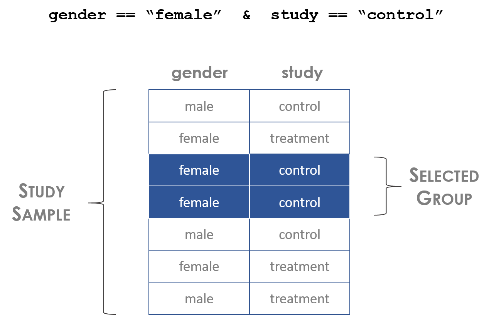
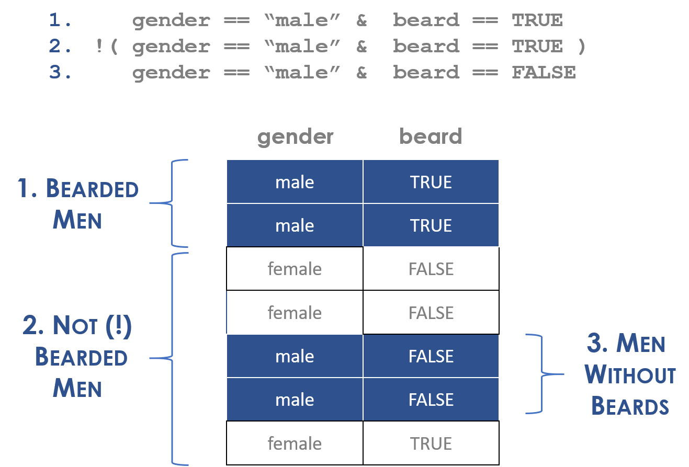
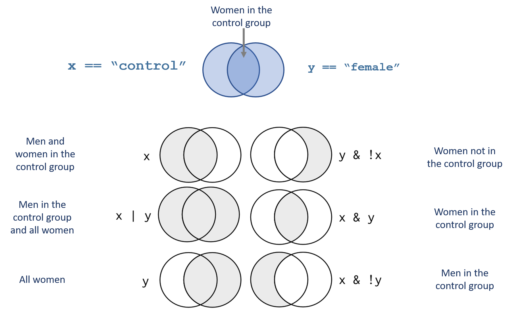

---
output:
  html_document:
    theme: readable
    highlight: tango
    self_contained: false
    css: textbook.css
---


```{r, echo=F }
knitr::opts_chunk$set( echo=TRUE, message=F, warning=F, fig.width=8 )
```


```{r, echo=F}
library( dplyr )
library( Lahman )
library( pander )
```


<style>
th {
    text-align: left;
}
td {
    text-align: left;
}
</style>


# Constructing Groups 


<div class="tip">

## Key Concepts

We translate questions from plain English into computer code using **logical statements**. 

Logical statements generate logical vectors or "selector vectors" where:

* TRUE signifies an observation belongs to our defined group 
* FALSE signifies an observation does not

We use these vectors to:

* count group membership 
* determine the proportion of the population belonging to the group 
* create subsets of data belonging to the group 

<br>
<br>

</div>


Most data analysis require us to split our data into groups or segments so that we can look for trends or compare outcomes across various subpopulations. 

<br>

> What percentage of women over 30 have graduate degrees?  

<br>

To be an effective data analyst we need to know how to translate question from our native human language into phrases a computer will understand.
 
**Group of Interest:**

* female 
* age over 30 
* graduate degree 
 
**In R as a logical statement:**

```r
gender == "female" & age > 30 & grad.degree == TRUE
```

Logical statements help us translate our research questions from human languages into computer code. 


```{r, fig.cap="Logical statements define group membership", out.width='70%', echo=F }

```


## Logical Operators 


Similar to mathematical operators, logical operators are a basic building block of data programming. Most often when working with data we are not creating complicated statistical models. We are identifying members of a group (print all of the females from the study), and describing a subset of the data (compare the average price of houses with a pool to houses without a pool).

In order to accomplish these simple tasks we need to use logic statements. A logic statement answers the question, does an observation belong to our group?

Many times groups are simple: identify all professions that have average salaries over $100k a year, for example.

Groups can be complex: identify the African American children from a specific zip code in Chicago that live in households with single mothers.

In this chapter we will use nine basic logical operators:

Operator |  Description
-------- |  -----------
**<**        | less than
**<=**     | less than or equal to
**>**       | greater than
**>=**      | greater than or equal to
**==**      | exactly equal to
**!=**	     | not equal to
**x \| y**	 | x OR y
**x & y**	   | x AND y
**!**       | opposite of 
**[ ]**       | subset

Logical operators create logical vectors, a vector that contains only TRUE or FALSE. The TRUE means that the observation belongs to a group, FALSE means it does not.

```{r, eval=F}
x1 <- c( 7, 9, 1, 2 )
x1 > 5
```

```{r, echo=F}
x1 <- c( 7, 9, 1, 2 )
( x1 > 5 ) %>% pander
```


```{r, eval=F}
gender <- c("male","male","female","female")
gender == "female"
```

```{r, echo=F}
gender <- c("male","male","female","female")
( gender == "female" ) %>% pander()
```


<br>
<br>

<div class="question">
Try it yourself:
</div>


```{r, include=FALSE}
tutorial::go_interactive( greedy=FALSE )
```

```{r ex="ex-01", type="sample-code", tut=TRUE}
x1 <- c( 7, 9, 1, 2 )
# what will the return vector be for each?
x1 > 7
x1 >= 7
x1 == 9 | x1 == 1


gender <- c("male","male","female","female")
# what will the return vector be for each?
gender == "female"
gender != "female"
gender == "male"
gender == "MALE"
```


Note that the logical statement for "equals" is written with two equal signs. This is important to remember, because using a single equal sign can introduce subtle errors into your analysis. 

```{r}
x1 <- c( 7, 9, 1, 2 )
x1 == 9

x1 = 9  # single equal overwrites your data
x1
```

We can write compound logical statements using the **AND** `&` and **OR** `|` operators:

```{r, echo=F}
gender <- c("male","male","female","female")
study.group <- c("treatment","control","treatment","control")
data.frame( id=1:4, gender, study.group ) %>% pander()
```


```{r, eval=F}
gender == "female"  &  study.group == "treatment"
```

```{r, echo=F}
( gender == "female"  &  study.group == "treatment" ) %>% pander()
```


```{r, eval=F}
gender == "female"  |  study.group == "treatment"
```

```{r, echo=F}
( gender == "female"  |  study.group == "treatment" ) %>% pander()
```


## Selector Vectors

Note that we use operators to create logical vectors where TRUE designates observation that belong to the defined group, and FALSE designates observations outside the group. The term **"selector vector"** is a useful way to remember this purpose. 

After you have defined a group by composing a logical statement, then the vector can be used to count group members and take subsets of other variables to calculate group statistics. 

```{r, echo=F}
name <- c("frank","wanda","sanjay","nancy")
group <- c("treat","treat","control","control")
gender <- c("male","female","male","female")
strength <- c(27,43,19,58)
dat <- data.frame( name, gender, group, strength )
dat %>% pander
```


```{r}
these.female <- dat$gender == "female"

sum( these.female )                   # number of women in the study
mean( these.female )                  # proportion of the study that is women
dat[ these.female , ]                 # all data belonging to women
mean( dat$strength[ these.female ] )  # average outcome for women in the study
```


I will consistently name my logical vectors "these.GROUP" throughout the chapters, where GROUP represents the group label. For example, I selected women above, so the selector vector is called "these.female".  


## Usefulness of Selector Vectors

Selector vectors, i.e. logical vectors that were created by defining a group, have three main uses in our analysis. 

**ONE**: Logical vectors give us an easy way to count things within defined groups. 

We can apply a **sum()** function to a logical vector, and the result will be a tally of all of the TRUE cases. The **mean()** function will give us the proportion of the sample that belongs to our defined group.


```{r}
# how many females do we have in our study?

sum( gender == "female" )

# how many females do we have in our treatment group?

sum( gender == "female" & group == "treat" )

# what proportion of our study are men? 

mean( gender == "male" )
```

**TWO:** We can create a selector variable that is used for subsets. A selector vector used in a subset operator will drop all observations that are FALSE, isolating data belonging to the group:

```{r}
these.female <- gender == "female"
name[ these.female ]
strength[ these.female ]
```

Or we can create a subset of the full dataset:

```{r, eval=F}
dat[ these.female , ]
```

```{r, echo=F}
dat[ these.female, ] %>% pander
```


# Subsets

The subset operators **[ ]** are one of the most common you will use in R.

The primary rule of subsets is to use a data operator to create a logical selector vector, and use that to generate subsets. Any observation that corresponds to TRUE will be retained, any observation that corresponds to FALSE will be dropped.

Consider this data:

```{r, echo=F}
name <- c("frank","wanda","sanjay","nancy")
group <- c("treat","treat","control","control")
gender <- c("male","female","male","female")
strength <- c(27,43,19,58)
dat <- data.frame( name, gender, group, strength )
dat %>% pander
```


Vectors are only one dimension (a single column), so you only provide one argument to the subset operator: 


```{r}
these.treated <- dat$group == "treat"
name[ these.treated ]
strength[ these.treated ]
```


Data frames are two dimensions (rows and columns). Thus we need to provide two arguments to the subset operator, one to control which rows we select, and one to control which columns we select. 

The two dimensions are seperated by a comma, and if you leave one blank it will not drop anything in the row or column.

> **`dat[  ROW POSITION ,  COLUMN POSITION  ]`**


```{r}
these.control <- dat$group == "control"
dat[ these.control , ]          # all data in the control group
dat[ , c("name","gender") ]    # select two columns of data

# create a subset
dat.women <- dat[ dat$gender == "female" , ]
dat.women
```


<div class="question"> 

Specify the following desired selections from the table:

```{r, echo=F}
name <- c("frank","wanda","sanjay","nancy")
group <- c("treat","treat","control","control")
gender <- c("male","female","male","female")
strength <- c(27,43,19,58)
dat <- data.frame( name, gender, group, strength )
dat %>% pander()
```

</div>


```{r, include=FALSE}
tutorial::go_interactive( greedy=FALSE )
```

```{r ex="ex-02", type="pre-exercise-code", tut=TRUE}
name <- c("frank","wanda","sanjay","nancy")
group <- c("treat","treat","control","control")
gender <- c("male","female","male","female")
strength <- c(27,43,19,58)
dat <- data.frame( name, gender, group, strength )
```

```{r ex="ex-02", type="sample-code", tut=TRUE}
# all women
these.women <- dat$gender == "female"
dat[ these.women , ]

# all women in the control group

# everyone that scored over 20 on the strength test

# only the study group and strength columns from the dataset
```


## Compound Logical Statements


We can combine multiple logical statements using the AND, OR, and NOT operators ( &, |, ! ). This functionality gives us an incredible ability to specify very granular groups within our analysis. This will be important as we begin to construct analysis in a way that we search for apples to apples comparisons within our data in order to make inferences about program effectiveness. 

These statements require some precision, however. Use care when applying that AND, OR, and NOT operators as to not include unintended data in your sample. 


## The Opposite-Of Operator


The **!** operator is a special case, where it is not used to define a new logical vector, but rather it swaps the values of an existing logical vector.

```{r}
! TRUE
! FALSE
```


```{r}
x1 <- c(7,9,1,2)
these <- x1 > 5
these
! these
```


Be careful with the order of operations though! If we are working with this data, for example:

```{r, echo=F}
group <- c("treat","treat","control","control")
gender <- c("male","female","male","female")
dat <- data.frame( group, gender )
dat %>% pander()
```


And we define men in the treatment group:

```{r, eval=T}
these <- group == "treat" & gender == "male" 
dat[ these , ] %>% pander
```

Note that the opposite of men in the treatment group is **NOT** women in the control group:

```{r, eval=T}
these <- ! ( group == "treat" & gender == "male" )
dat[ these , ] %>% pander
```


Women in the control group would be:

```{r, eval=T}
# not treatment group & not men
these <- ! ( group == "treat" ) &  ! ( gender == "male" ) 
dat[ these , ]
```


# Care With Logical Statements


A common mistake you will make when you first start constructing logical statements is define a group, and then since you are in a hurry you flip the logic and think you are making a valid comparison. 

> Do bearded men earn more than men without beards? 


The **opposite-of** "men with beards" ("male" & "beards") is not men without beards, it is men without beards OR women (with or without beards). 

```{r, fig.cap="Compound statements can be tricky", out.width='60%', echo=F }

```


In the example above, the statement "NOT bearded men" means all people outside of the category of men without beards (the "complement"), which includes women with or without beards as well. 


Also note that parentheses matter. Compare this statement to the statement above:

```
! gender == "male" & beard == TRUE
```

Because we excluded the parentheses this statement now defines the group "NOT men AND with beards", or bearded women. 


```{r, fig.cap="Examples of group construction with compound statements", out.width='90%', echo=F }

```


It's important to note that the **opposite-of** operator does not flip the LOGIC of the question, it only flips TRUES and FALSE in the produced vector.

```{r}
group == "treat" & gender == "male" 
! ( group == "treat" & gender == "male"  )
```


Pay close attention to the order of operations when constructing logical statements. 


Since all logical operators have the same precedence, the **opposite-of** operator will be applied first here, then the **and* operator. Thus these are not the same:


```{r, echo=F}
group <- c("treat","treat","control","control")
gender <- c("male","female","male","female")
dat <- data.frame( group, gender )
dat %>% pander()
```


```{r, eval=F}
these <- ! ( group == "treat" & gender == "male" )
dat[ these , ] 
```


```{r, echo=F}
dat[ ! ( group == "treat" & gender == "male" ) , ] %>% pander
```


```{r, eval=F}
these <- ! group == "treat" & gender == "male" 
dat[ these , ]
```


```{r, echo=F}
# men in the control group
dat[ ! group == "treat" & gender == "male" , ] %>% pander  
```


# Advanced Operations with Logical Vectors


## Find and Replace


We can use selector variables to replace observations with new values using the assignment operator. This is similar to a find and replace operation.

```{r}
animals <- c( "mole", "mouse", "shrew", "mouse", "rat", "shrew" )

# the lab assistant incorrectly identified the shrews

animals

animals[ animals == "shrew" ] <- "possum"

animals
```


We don't know if linda received the treatment:

```{r, echo=F}
name <- c("adam","jamal","linda","sriti")

study.group <- c( "treatment","control","treatment","control")

data.frame( name, study.group ) %>% pander()
```

```{r}
# replace 
study.group[ name == "linda" ] <- NA

study.group
```


## NAs in Logical Statements

Recall that missing values are an extremely important concept in statistics. If one-third of our survey sample reports that they never smoked pot, one-third reports they have smoked pot, and one-third did not answer the question, then what do we report for the proportion of the population that has smoked pot? 

We might prefer to be cautious and count only the people that have confirmed they have smoked pot, resulting in an estimate of 33.3%. 

If we throw out the missing data, then 50% of respondents have smoked pot.

If we assume those that refuse to answer have likely smoked pot, our estimate might be 66.6% of the sample. 

These different results are a function of how we treat the missing data in our survey, so it is important that we can keep track of missing values, especially during subset operations. 


Note how NAs effect compound logical statements:

```{r}
TRUE & TRUE

TRUE & FALSE

TRUE & NA

FALSE & NA
```

To make sense of these rules consider the following: 

If one condition is already FALSE, the missing value does not matter because under the & condition BOTH must be TRUE for the observation to belong to our defined group. After we know that one of the conditions is FALSE the missing value is irrelevant. For example, if we want to select all women in the treatment group, and we have a man with an unclear treatment group status, he is still excluded from the group because he is a man. 

On the other hand, if one condition is TRUE, and another is NA, R does not want to throw out the data because the state of the missing value is unclear. As a result, it will preserve the observation, but it will replace all of the data with missing values to signal the lack of certainty associated with that observation.

```{r, echo=F}
dat %>% pander
```

```{r}
keep.these <- c(T,F,NA,F)
dat[ keep.these , ]
```

To remove these rows with missing values in your selector vector, replace all NAs with FALSE:

```{r}
keep.these[ is.na(keep.these) ] <- FALSE
dat[ keep.these , ]
```


# Subsets with Factors

Note the rules listed above about subsetting factors. After applying a subset, they will retain all of the original levels, even when they are not longer useful. You need to drop the unused levels if you would like them to be omitted from functions that use the factor levels for analysis.


```{r}

df <- data.frame( letters=LETTERS[1:5], numbers=seq(1:5) )

levels( df$letters )

sub.df <- df[ 1:3, ]

sub.df$letters

levels( sub.df$letters )

droplevels( sub.df$letters )

sub.df$letters <- droplevels( sub.df$letters )


```


