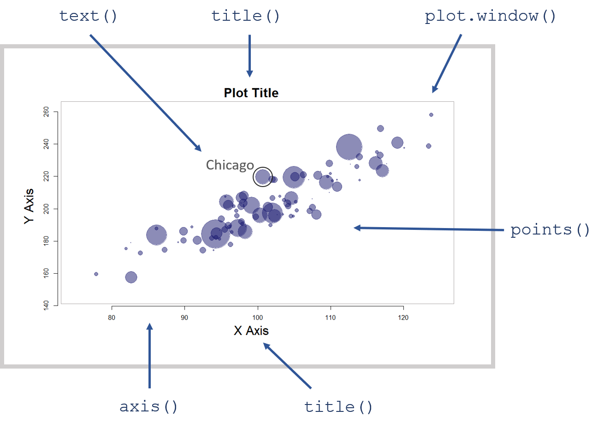

---
output:
  html_document:
    theme: readable
    highlight: tango
    toc: false
    toc_depth: 1
    number_sections: false
    self_contained: false
    css: textbook.css
---


# DATA VIZ 

```{r, echo=F }
knitr::opts_chunk$set( echo = TRUE, message=F, warning=F, fig.width=8)
```


Visualization can be a powerful way to generate insights from data. Creating impactful graphics is not a trivial undertaking, however. There is a science to how the brain consumes visual information. And there is an art to combining elements of graphics in ways that make the data both aesthetically pleasing and informative. It takes practice to develop these skills. 

This section of the textbook is not about the design of a specific visualization or graphic, but rather the implementation. Once you have an idea for your graphic in your mind, you need a few basic R functions to create the visualization. We will cover these nuts and bolts of building custom graphics, some popular R packages for visualization, and some tricks to take your data viz game to the next level using dynamic graphics and animations.

```{r, fig.cap="The core graphics package allows you to control every element of a visualization.", echo=F, out.width='50%' }

```

If you would like to start building your data viz muscles, we recommend the following resources as good jumping-off points. 

Popular blogs that demonstrate the step-by-step process of making a mediocre graphic into a compelling graphic:

* [Makeover Mondays](http://www.makeovermonday.co.uk/gallery/)
* [Flowing Data](http://flowingdata.com/)
* [Junk Charts](http://junkcharts.typepad.com/junk_charts/)
* [NYT Graphics Blog](http://kpq.github.io/chartsnthings/)
* [Help Me Viz](https://twitter.com/HelpMeViz)


Useful introductory textbooks on data visualization:

* [Schwabish, J. A. (2014). An economist's guide to visualizing data. Journal of Economic Perspectives, 28(1), 209-34.](resources/schwabish-visualizing-data-for-economists.pdf)
* [T. Chiasson, D. Gregory, & Contributors (2013). Data + Design: A simple introduction to preparing and visualizing information.](https://static1.squarespace.com/static/55d9f3fbe4b001723c108c17/t/56214bdae4b0b08cace11af0/1445022682859/Ebook+On+Data+Visualization.pdf)
* [Tableau: Which Chart Goes with What Data](https://www.tableau.com/sites/default/files/media/which_chart_v6_final_0.pdf) 


Inspiration and help with R graphics:

* [R Graph Gallery](https://www.r-graph-gallery.com/)
* [R Graph Catalog](http://shiny.stat.ubc.ca/r-graph-catalog/)
* [R Graph Compendium](http://shinyapps.org/apps/RGraphCompendium/index.php)
* [ggplot2 Geoms Gallery](https://ggplot2.tidyverse.org/reference/)


