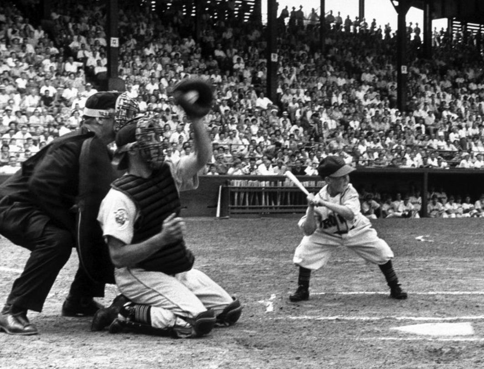

# Customizing Plots


## Key Concepts

We can create almost any customized visualization using a small number of functions from the Core R graphics engine:


```{r, eval=F}
points(
  x=x, y=y,				       # plots points at the x,y positions 
  pch=19, 				       # the type of point to plot
  cex=2,					       # aspect ratio of point size
  col="red",				     # color of points
  bg="green"				     # fill color for open symbols
 )


text(
  x=x, y=y,				       # draws a line by connecting points 
  labels=some.text,			 # vector of labels to plot on the graph
  pos=3, 					       # position: 1=below, 2=left, 3=above, 4=right
  cex=2,					       # aspect ratio of text size
  col="red"				       # color of text
 )


lines(
  x=x, y=y,				       # draws a line by connecting points 
  lty="l",					     # type of lines, same as above
  lwd=0.5, 				       # line thickness
)


segments(
  x0=x0, y0=y0,		         # starting points of the segments (usually a vector)
  x1=x1, y1=y1,		         # end points of the segments (usually a vector)
  ...			                 # other arguments from lines()
 )


title(
  main="Plot Title",       # text for the plot title
  xlab="x variable",       # text for the x-axis label
  ylab="y variable",       # text for the y-axis label
  line= -1                 # move the title closer / further
)
 

axis(
  side=1                   # 1=below, 2=left, 3=above, 4=right
  at=c(10,20,30),          # position of tick marks
  labels=c("S","M","L")    # labels for tick marks 
)
```


## Packages Used in This Chapter

We will use some data from the **Lahman** baseball data package for examples in this chapter.

The **Master** data frame contains information about professional baseball players. We will focus on the relationship between height and weight of the players. 

```{r}
library( Lahman )
data( Master )
```

```{r, echo=F}
head( Master[, c(14,15,17:20,2) ] ) %>% pander()
```


```{r, echo=F}
Master <- filter( Master, birthYear > 1849 & birthYear < 1996 )

t1 <- tapply( Master$height, Master$birthYear, mean, na.rm=T )
t2 <- as.numeric( names( t1 ) )
plot( t2, t1, pch=19, type="b",
      frame.plot=F,
      xlab="Year of Birth",
      ylab="Average Height (inches)",
      main="Height of MLB Players Over Time" )

t1 <- tapply( Master$weight, Master$birthYear, mean, na.rm=T )
t2 <- as.numeric( names( t1 ) )
plot( t2, t1, pch=19, type="b",
      frame.plot=F,
      xlab="Year of Birth",
      ylab="Average Weight (lbs)",
      main="Weight of MLB Players Over Time" )

bmi <- (Master$weight * 0.45359237) / (Master$height / 39.370)^2 
t1 <- tapply( bmi, Master$birthYear, mean, na.rm=T )
t2 <- as.numeric( names( t1 ) )
plot( t2, t1, pch=19, type="b",
      frame.plot=F,
      xlab="Year of Birth",
      ylab="Average BMI",
      main="Body Mass Index of MLB Players Over Time" )
```


## Layering Approach

Graphs in R are created by layering elements on top of each other. The easiest way to understand this is to build a plot from the ground up.

The following graph is comprised of six components:

* points
* plot box
* x-axis
* y-axis
* x-label
* y-label

Many other elements can be added to the plot, but this is a good start.


```{r}
# remove players with no height or weight measures
Master <- select( Master, height, weight )
Master <- na.omit( Master ) 

# find max and min values for each
xmin <- min(Master$height)
xmax <- max(Master$height)
ymin <- min(Master$weight)
ymax <- max(Master$weight)

# empty plot
plot.new()
plot.window( xlim=c(xmin,xmax), ylim=c(ymin,ymax) )
box( col="gray" )
text( 64, 200, "(Empty Plot Window)", cex=2 )
```


```{r}
# add points
plot.new()
plot.window( xlim=c(xmin,xmax), ylim=c(ymin,ymax) )
box( col="gray" )
points( Master$height, Master$weight, pch=19 )
```


```{r}
# add an x-axis and y-axis
plot.new()
plot.window( xlim=c(xmin,xmax), ylim=c(ymin,ymax) )
box( col="gray" )
points( Master$height, Master$weight, pch=19 )
axis( side=1 )
axis( side=2, las=1 )
```


```{r}
# add axis labels
plot.new()
plot.window( xlim=c(xmin,xmax), ylim=c(ymin,ymax) )
box( col="gray" )
points( Master$height, Master$weight, pch=19 )
axis( side=1 )
axis( side=2, las=1 )
title( xlab="Height (inches)", ylab="Weight (lbs)" )
title( main="Relationship Between Height and Weight of MLB Players" )
```


Now let's see if we can improve the aestetics a bit. This is pretty dense data, so let's see if we can use some color transparency to get a sense of typical players versus outliers.

Let's adjust the xlim and ylim arguments so we don't show the empty bottom left quadrant, and let's use the **gray()** color function to add some transparency to the over-plotted data points. The first argument is a value between 0 and 1 specifying how dark you want the gray (0 being white, 1 being black, and any value in-between being a shade of gray). The second argument is another value between 0 and 1 specifying the transparency of the points, 0 being invisible and 1 being no transparency. 

We can also jitter them a bit (a tiny amount of random error to each data point) so they are not all plotted on top of each other since height and weight only take integer values.

```{r, fig.height=6}
height.jitter <- Master$height + rnorm( nrow(Master) )
weight.jitter <- Master$weight + rnorm( nrow(Master) )

plot.new()
plot.window( xlim=c(60,xmax), ylim=c(110,ymax) )
points( height.jitter, weight.jitter, 
        pch=19, cex=1.2, col=gray(0.5,0.02) )
axis( side=1 )
axis( side=2 )
title( xlab="Height (inches)", ylab="Weight (lbs)",
       main="Relationship Between Height and Weight of MLB Players" )
```


This is helpful, but maybe we want to highlight the data core some more. Let's add another layer with only that data that falls within the 25th to 75th percentiles of height and weight.

```{r}
quantile( Master$height ) %>% pander()
quantile( Master$weight ) %>% pander()
```


```{r, fig.height=6}
height.jitter <- Master$height + rnorm( nrow(Master) )
weight.jitter <- Master$weight + rnorm( nrow(Master) )

height.25th <- quantile( Master$height, 0.25, na.rm=T )
height.75th <- quantile( Master$height, 0.75, na.rm=T )
these.height.25th.to.75th <- Master$height > height.25th & Master$height < height.75th

weight.25th <- quantile( Master$weight, 0.25, na.rm=T )
weight.75th <- quantile( Master$weight, 0.75, na.rm=T )
these.weight.25th.to.75th <- Master$weight > weight.25th & Master$weight < weight.75th

these.both.25th.to.75th <- these.height.25th.to.75th & these.weight.25th.to.75th

plot.new()
plot.window( xlim=c(60,xmax), ylim=c(110,ymax) )
axis( side=1 )
axis( side=2 )
title( xlab="Height (inches)", ylab="Weight (lbs)",
       main="Relationship Between Height and Weight of MLB Players" )

points( height.jitter, weight.jitter, 
        pch=19, cex=1.2, col=gray(0.5,0.02) )

points( height.jitter[ these.both.25th.to.75th ], 
        weight.jitter[ these.both.25th.to.75th ], 
        pch=19, cex=0.3, col="firebrick3" )
```


That didn't quite work out because a player might be "average" height (height between 25th and 75th percentile), but be heavier or lighter than normal. The criteria we applied basically draws a box and finds data within the box. 

Let's rethink this a bit, and select players with "average" size using ratios between height and weight, often expressed as Body Mass Index (BMI). This selection criteria will not limit us to a square.  


```{r, fig.height=6}
bmi <- (Master$weight * 0.45359237) / (Master$height / 39.370)^2 

bmi.25th <- quantile( bmi, 0.25, na.rm=T )
bmi.75th <- quantile( bmi, 0.75, na.rm=T )
these.bmi.25th.to.75th <- bmi > bmi.25th & bmi < bmi.75th

plot.new()
plot.window( xlim=c(60,xmax), ylim=c(110,ymax) )
axis( side=1 )
axis( side=2 )
title( xlab="Height (inches)", ylab="Weight (lbs)",
       main="Relationship Between Height and Weight of MLB Players" )

points( height.jitter, weight.jitter, 
        pch=19, cex=2, col=gray(0.5,0.02) )

points( height.jitter[ these.bmi.25th.to.75th ], 
        weight.jitter[ these.bmi.25th.to.75th ], 
        pch=19, cex=0.1, col="firebrick3" )
```


## Highlighting Cases

Let's look back at the original plot. Do you see anything strange? 

```{r, echo=F}
# add axis labels
plot.new()
plot.window( xlim=c(xmin,xmax), ylim=c(ymin,ymax) )
points( Master$height, Master$weight, pch=19 )
axis( side=1 )
axis( side=2 )
title( xlab="Height (inches)", ylab="Weight (lbs)" )
title( main="Relationship Between Height and Weight of MLB Players" )
points( Master$height[which.min(Master$height)], 
        Master$weight[which.min(Master$weight)], 
        col="firebrick", cex=2, lwd=2 )
text( Master$height[which.min(Master$height)]+1, 
      Master$weight[which.min(Master$weight)]+20, 
      "Is This an Error?", col="firebrick", pos=4, cex=1.5 )
```


The smallest data point in the dataset seems to represent a baseball player that is 40 inches tall and weighs 80 pounds. That *must* be some sort of data entry error, right? 

```{r}
data( Master) 
Master[ which.min(Master$height) , c(14,15,17:20,2) ] %>% pander()
```

```{r, echo=F, out.width='70%' }

```


It turns out that [Eddie Gaedel](https://www.theversed.com/10266/the-tragic-story-of-eddie-gaedel-the-shortest-player-in-mlb-history/#.i0Qgkojft1), at 3 foot 7 inches, was the shortest man to ever play on a professional team. He was hired by the owner of the St. Louis Browns as a publicity stunt. He was so short that his strike zone, which goes form the knee to mid-chest, was too small for most pitchers. Crowds would cheer as he would quickly accumulate walks. 

Perhaps it would be useful to annotate some of the outliers on our graph. To do this, we can use the text() function.

```{r, eval=F}
text(
  x=x, y=y,				       # draws a line by connecting points 
  labels=some.text,			 # vector of labels to plot on the graph
  pos=3, 					       # position: 1=below, 2=left, 3=above, 4=right
  cex=2,					       # aspect ratio of text size
  col="red"				       # color of text
 )

```


Let's start by circling some data points. We do this by plotting a slightly larger point around the originals for the tallest, shortest, and heaviest players.

```{r}
plot.new()
plot.window( xlim=c(0,1), ylim=c(0,1) )
points( 0.5, 0.5, pch=19, col="gray", cex=3 )
points( 0.5, 0.5, pch=1, cex=5, col="firebrick" )
title( main="Large Hollow Point Plotted \nOver Solid Point" )
```


```{r, echo=F}
data( Master )
```


```{r}
this.shortest <- which.min(Master$height)
this.tallest  <- which.max(Master$height)
this.heaviest <- which.max(Master$weight)

Master[ c(this.shortest,this.tallest,this.heaviest), c(14,15,17:20,2) ] %>% pander()
```


Let's highlight the three outliers in our dataset. 

```{r}
plot( Master$height, Master$weight, 
      pch=19, col="gray",
      frame.plot=FALSE,
      xlab="Height (inches)", 
      ylab="Weight (lbs)", 
      main="Relationship Between Height and Weight of MLB Players" )

points( Master$height[ this.shortest ], 
        Master$weight[ this.shortest ], 
        col="firebrick", cex=2, lwd=2 )

points( Master$height[ this.tallest ], 
        Master$weight[ this.tallest ], 
        col="firebrick", cex=2, lwd=2 )

points( Master$height[ this.heaviest ], 
        Master$weight[ this.heaviest], 
        col="firebrick", cex=2, lwd=2 )

text( Master$height[ this.shortest ], 
      Master$weight[ this.shortest ], 
      "Some Text Here", col="firebrick", pos=3 )
```

We add text to the graph through the x,y coordinate for the text, the text itself, and the **pos=** argument is used to specify where the text should go. 

* pos=1: below
* pos=2: left
* pos=3: top
* pos=4: right
* no pos: on the point

You can see that we have a problem above. Our text above Eddie Gaedel is lopped off because it wanders outside of the plot window. We can add additional real estate by expanding plot window with the **xlim=** and **ylim=** arguments. 

You can add a line break to a string by including the carriage return symbol "\n". 

```{r, fig.height=5}
data( Master) 

plot( Master$height, Master$weight, 
      pch=19, col="gray", cex=0.8,
      xlim=c(30,100), ylim=c(50,450),
      frame.plot=FALSE,
      xlab="Height (inches)", 
      ylab="Weight (lbs)", 
      main="Relationship Between Height and Weight of MLB Players" )

d.small <- Master[ c(this.shortest,this.tallest,this.heaviest), c(14,15,17:20,2) ]

points( d.small$height, 
        d.small$weight, 
        col="firebrick", cex=2, lwd=2 )

text( Master$height[ this.shortest ], 
      Master$weight[ this.shortest ], 
      "Eddie Gaedel \nHeight: 43 Inches \nWeight: 65 Lbs", 
      col="firebrick", cex=0.8, pos=3, offset=1 )

text( Master$height[ this.tallest ], 
      Master$weight[ this.tallest ], 
      "Jon Rauch \nHeight: 83 Inches \nWeight: 290 Lbs", 
      col="firebrick", cex=0.8, pos=4, offset=1 )

text( Master$height[ this.heaviest ], 
      Master$weight[ this.heaviest ], 
      "Walter Young \nHeight: 77 Inches \nWeight: 320 Lbs", 
      col="firebrick", cex=0.8, pos=3, offset=1 )
```


## Visual Hypothesis Testing

As you can see, the **text()** function can be used to add narrative to a graphic. It can also be used in place of plotting points. 

Let's think about testing the hypothesis that players have gotten larger over time. When we look at the basic relationship between height and weight we see the distribution of player sizes, but this plot has no information about the time-periods in which they played so we can't tell if they are growing larger over time. What if we replace the plotting points with birth years?

```{r}
plot.new()
plot.window( xlim=c(60,xmax), ylim=c(110,ymax) )

text( x=Master$height, 
      y=Master$weight, 
      labels=Master$birthYear )
```


This is too dense to be meaningful. Maybe we can try to make the text smaller?

```{r}
plot.new()
plot.window( xlim=c(60,xmax), ylim=c(110,ymax) )
text( x=Master$height, 
      y=Master$weight, 
      labels=Master$birthYear, cex=0.5 )
```


Still not very insightful. We have over 19,000 players in the database, which appears to be too many for this graphic. Let's thin the data out by taking a random sample of the full dataset.

```{r, fig.height=6}
par( mar=c(0,0,0,0) )
m.sample <- sample_n( Master, 100 ) 
plot.new()
plot.window( xlim=c(65,78), ylim=c(130,280) )
text( x=m.sample$height, 
      y=m.sample$weight, 
      labels=m.sample$birthYear, cex=0.8 )
axis( side=1, line=-2 )
axis( side=2, line=-2 )
```

This is a big improvement. We can eyeball the data and start to pull out some trends. The people born in the 1800's tend to be near the bottom of each pile of years, for example.

Perhaps we can improve our visual hypothesis testing if we add some color coding. Let's identify all of the individuals born since 1980 and color their birth years red to highlight the youngest cohort in the data. If people have gotten larger over time, we would expect this group to cluster near the top of the distribution.


```{r, eval=F}
red.gray <- ifelse( m.sample$birthYear >= 1980, "firebrick", "gray" )

text( x=m.sample$height, 
      y=m.sample$weight, 
      labels=m.sample$birthYear,
      col=red.gray )
```


```{r, echo=F, fig.height=6}
red.gray <- ifelse( m.sample$birthYear >= 1980, "firebrick", "gray" )
par( mar=c(0,0,0,0) )  # minimize margins
plot.new()
plot.window( xlim=c(65,78), ylim=c(130,280) )
text( x=m.sample$height, 
      y=m.sample$weight, 
      labels=m.sample$birthYear,
      col=red.gray, cex=1 )
axis( side=1, line=-2 )
axis( side=2, line=-2 )
title( main="Player Height and Weight by Birth Year", line=-2 )
```


And we in fact see the pattern emerge. The youngest cohort, highlighted in red, seems to cluster near the top right, which suggests they have grown both taller and heavier over time. 

This hypothesis can be test more rigorously in other ways, but the demonstration at least gives an idea about how we might explore the data efficiently using flexible R graphing functions. 


```{r, eval=F, echo=F}

data( Teams )

plot( Teams$H, Teams$W, pch=19, col="gray" )

lines( lowess( Teams$H, Teams$W ), col="red", lwd=4 )


# identify( Teams$H, Teams$W, Teams$name )

plot( Teams$ERA, Teams$W, pch=19, col="gray" )

lines( lowess( Teams$ERA, Teams$W ), col="red", lwd=4 )


era.20.bins <- cut( rank( Teams$ERA), breaks=20 )

t2 <- tapply( Teams$W, era.20.bins, mean, na.rm=T )
t3 <- tapply( Teams$ERA, era.20.bins, mean, na.rm=T )

points( t3, t2, pch=19, col="red", cex=2 )

names( Teams )

```


## Additional Parameters

The small number of functions introduced here in these chapters on data visualization can be used to make highly-customizable graphics that help you discover important patterns in the data and share the story with others. 

We are only scratching the surface on the options available within plotting functions. To see the default list of parameter settings in the R **plot()** function, type:

```{r, eval=F}
par()
help( par )
```

These chapters show how core R graphics can be used to create highly-customized graphics. You can see that you have fine-tuned access to all aspects of the figures you create. You don't have to become familiar with all of the options to develop solid visualization skills. Rather, you will likely focus on a few specific functions. A little time invested in learning the arguments for plot(), points(), lines(), text(), title(), and axis() goes a long way.   


