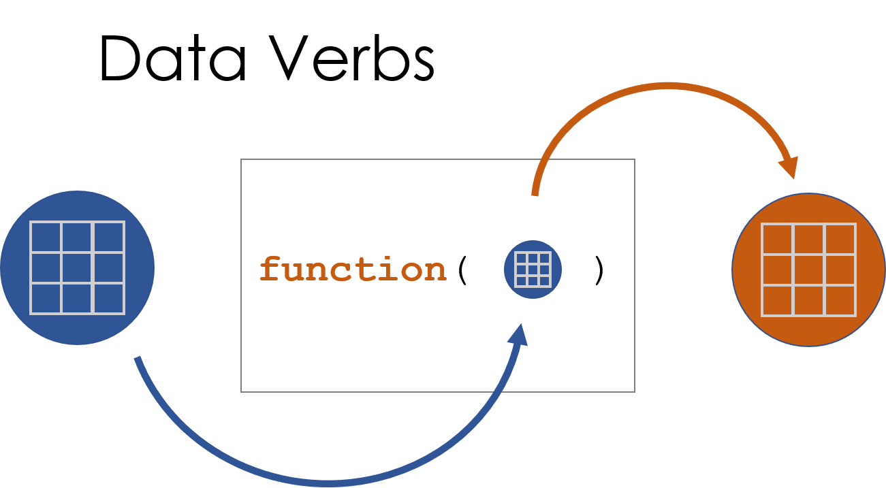
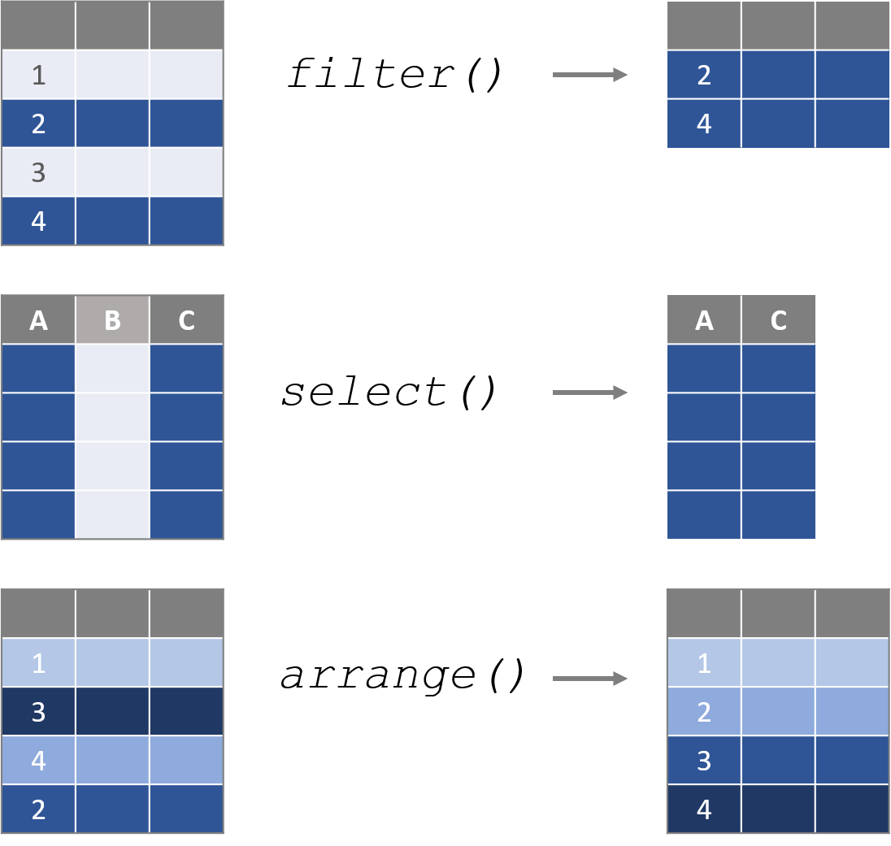
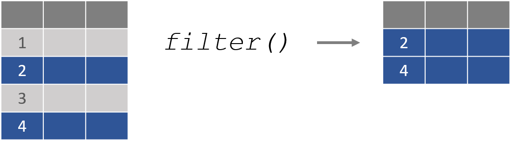
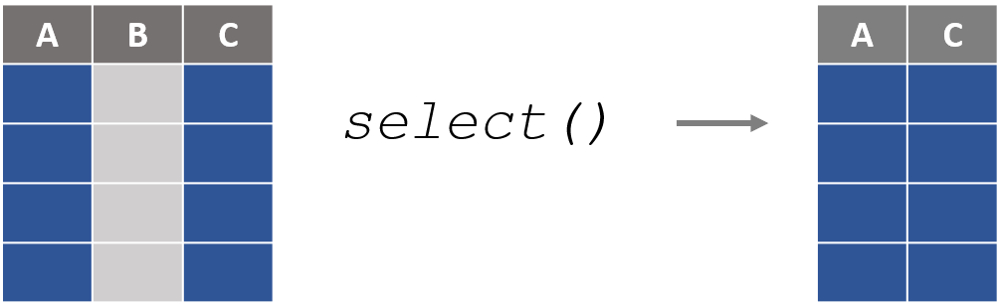
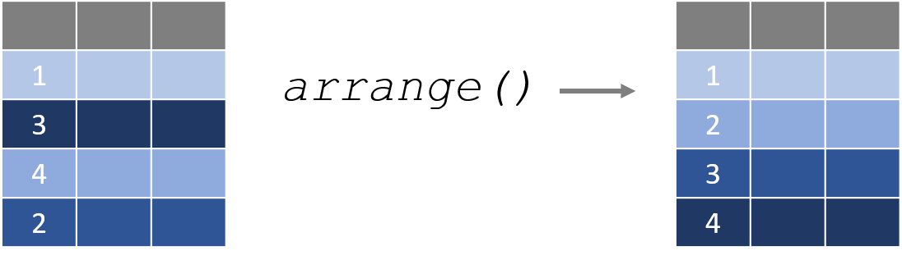

---
output:
  html_document:
    theme: readable
    highlight: tango
    toc: true
    toc_depth: 1
    number_sections: true
    self_contained: false
    css: textbook.css
---

```{r, echo=F }
knitr::opts_chunk$set( echo = TRUE, message=F, warning=F, fig.width=10)
```


# DATA VERBS 


In this section we are shifting the focus from vector operations to dataset operations. 

Some of the most popular packages for building and manipulating datasets come from what is affectionately referred to as the "tidyverse", a set of packages developed by Hadley Wickam and the R Studio team. They are designed to make basic dataset operations more intuitive and robust. 

These packages were created with a common framework for data design called "tidy data". When datasets are built as or wrangled into the tidy format they are much easier to analyze, and they will play nicely with a large set of packages the follow the same philosophy of data design. 

The core R packages contain all of the functions necessary to wrangle datasets, but they are sometimes counter-intuitive or clumbsy in the sense that they might start with a data frame and return a table or a list, making them hard to use in data recipes. All of the "data verbs" that we will cover in this section start with a data frame and return a data frame, making them easier to use as data steps within a larger project.

We will begin with some extremely useful verbs contained within the `dplyr` package. 

```{r, fig.cap="A data verb requires a dataset as input, and returns a transformed dataset.", echo=F, out.width='60%' }

```


# The **dplyr** Package

```{r, echo=F }

knitr::opts_chunk$set( echo = TRUE, message=F, warning=F, fig.width=8 )

```

<style>
th {
    text-align: left;
}
td {
    text-align: left;
}
</style>


## Packages Used in This Chapter

```{r}
library( dplyr )
library( pander )
```


## Key Concepts

```{r, fig.cap="Data verbs are functions that require a dataframe as the primary argument, perform some transformation on the data, then return a new dataframe.", echo=F, out.width='60%' }

```


For a nice overview of all of the dataset verbs in `dplyr` check out [The `dplyr` Cheatsheet](https://www.rstudio.com/wp-content/uploads/2015/02/data-wrangling-cheatsheet.pdf).


## The **dplyr** Package

This chapter will demonstrate a few basic dataset functions contained within the **dplyr** package. There are a few things to note as you get started:

* `dplyr` functions are all data verbs that accept a dataset as the argument, transform the data, and return a new dataset. 
* The first argument is always the dataset name, and variables (columns) can be referenced directly by name without quotation marks. 
* `dplyr` functions will return data as a "tibble" (*tbl_df* class), which is a regular data frame wrapped in a nice print method that includes metadata in the printout. 

For example, here is the regular data frame preview: 

```{r, echo=F}
head( PlantGrowth, 10 )
```

The tibble will print the first few rows and columns of a dataset, and includes dataset dimensions and vector classes:

```{r, echo=F}
tbl_df( PlantGrowth )
```

We will cover the following **_dplyr_** functions in this section of the textbook:

DATA VERB | ACTION  
---------|----------  
filter() | Select rows  
select() | Select columns 
arrange() | Sort the dataset by one or more columns 
mutate() | Create a new variable by transforming an existing variable or variables 
summarize() | Create summary statistics for specified variables 
group_by() | Split the dataset (implicitly) into a separate dataset for each group 


## Use **filter()** to Subset Rows

```{r, fig.cap="", echo=F, out.width='60%' }

```

In the last chapter we learned how to use operators to translate from plain English questions to data queries. 

As an example, a city manager might want to know the average amount owed on a delinquent property tax. 

```{r, echo=F}
library( scales )
amount.owed <- dollar( c(0,5549,0,1709,0,634,0,0,0,9353,0,1366,0,0,0) )
tax.id <- 1:15
data.frame( tax.id, amount.owed ) %>% head(10) %>% pander()
amount.owed <- c(0,5549,0,1709,0,634,0,0,0,9353,0,1366,0,0,0) 
taxdat <- data.frame( tax.id, amount.owed )
```


We could write the query as follows:

1. Define the group. 
2. Select the data that belongs to the group. 
3. Analyze the group subset. 


```{r}
these.late <- taxdat$amount.owed > 0                 # 1. Define group
overdue.amounts <- taxdat$amount.owed[ these.late ]  # 2. Select data
overdue.amounts
mean( overdue.amounts )                              # 3. Analyze data
```

The **filter()** function in the  **_dplyr_** package is a slightly more elegant verb for selecting the group and subsetting the data by rows.

> filter(  dataset name ,  logical expression  )


```{r}
filter( taxdat, amount.owed > 0 )
```

Note that we do not need to reference the dat$ references inside **dplyr** functions. 


## **select()** Columns

```{r, fig.cap="", echo=F, out.width='60%' }

```

In the core R operators, we select colums from a dataset using the subset function:

```{r, eval=F}
data( USArrests ) # historic data on crime rates in the US
```

```{r, eval=T, echo=F}
USArrests %>% head() %>% pander()
```

```{r, eval=F}
USArrests[ , c("Murder","Assault") ]
```

```{r, echo=F}
head( USArrests[ , c("Murder","Assault") ] ) %>% pander()
```

The **_select()_** function converts this operation into a data verb: 

```{r, eval=F}
select( USArrests, Murder, Assault )
```

```{r, echo=F}
select( USArrests, Murder, Assault ) %>% head() %>% pander()
```

The **_select()_** function adds a lot of additional arguments that make it easy to quickly identify and keep only the necessary variables. We can demonstrate a few using the built-in *iris* dataset  in R.

```{r, echo=T}
head( iris ) %>% pander()
```

Exclude a column with the negative sign:

```{r, eval=F}
select( iris, -Species ) 
```

```{r, echo=F}
select( iris, -Species ) %>% head() %>% pander()
```

Select by variable names:

```{r, eval=F}
select( iris, ends_with( "Length" ) ) 
```

```{r, echo=F}
select( iris, ends_with( "Length" ) ) %>% head() %>% pander()
```

```{r, eval=F}
select( iris, starts_with( "Petal" ) ) 
```

```{r, echo=F}
select( iris, starts_with( "Petal" ) ) %>% head() %>% pander()
```

```{r, eval=F}
select( iris, matches("pal") ) 
```

```{r, echo=F}
select( iris, matches("pal") ) %>% head() %>% pander()
```


Or we can select by a range of variables by placing a colon between the first and last:

```{r, eval=F}
select( iris, Sepal.Length:Petal.Width ) 
```

```{r, echo=F}
select( iris, Petal.Length:Species ) %>% head() %>% pander()
```


## **arrange()** Sorts Data


```{r, fig.cap="", echo=F, out.width='60%' }

```


The **_arrange()_** function sorts a dataset by one or more columns. By default, it sorts from smallest to largest.

```{r, eval=F}
arrange( PlantGrowth, weight ) 
```

```{r, echo=F}
PlantGrowth %>%
  arrange( weight ) %>%
  slice( 1:5 ) %>%
  pander()
```

If we prefer the dataset be sorted from largest to smallest, we can apply the descending function **desc()** to the sort variable.

```{r, eval=F}
arrange( PlantGrowth, desc(weight) ) 
```

```{r, echo=F}
PlantGrowth %>%
  arrange( desc(weight) ) %>%
  slice( 1:5 ) %>%
  pander()
```

Or alternatively we can use the shortcut syntax of adding a negative sign in front of the variable:

```{r, eval=F}
arrange( PlantGrowth, -weight ) 
```


We can also sort by multiple columns at once:

```{r, eval=F}
arrange( PlantGrowth, group, weight ) 
```


```{r, echo=F}
PlantGrowth %>%
  group_by( group ) %>%
  top_n( 5, weight ) %>%
  arrange( group, weight ) %>% 
  select( group, weight ) %>%
  head( 10 ) %>%
  pander()
```

NOTE, the equivalent core R functions would use **subset[]** and **order()** functions together. You might see examples on Stack Overflow written like this:

```{r, eval=F}
PlantGrowth[ order(PlantGrowth$weight, decreasing=TRUE) , ]
```

```{r, echo=F}
PlantGrowth[ order(PlantGrowth$weight, decreasing=TRUE) , ] %>% head() %>% pander()
```

As you can see, the `dplyr` versions are typically more intuitive and concise!


## Variable Transforms with **mutate()**

One of the most common operations in data analysis is to create a new variable from one or more existing variables, a "variable transformation". Some examples include:

```{r, eval=F}
x_squared <-  x * x

celsius <-  ( fahrenheit - 32 ) * ( 5/9 )

body.mass.index <-  kg / meters^2

per.capita.income <-  income / population
```

The **_mutate()_** function creates a new transformed variable from the formula you specify and adds it to the original dataset.

As an example, perhaps we have data on the number of nonprofits located in each US city. If we look at the raw count of nonprofits, it makes it look as though the large cities have the most vibrant nonprofit sectors:


```{r, echo=F}
dat.npos <- 
structure(list(city = c("ROSEBURG", "BIRMINGHAM", "BISMARCK", 
"BLOOMINGTON", "BLOOMINGTON", "BOISE", "CHICAGO", "BOSTON", "ALBANY", 
"HARLINGEN", "BRYAN", "BUFFALO", "BURLINGTON", "CANTON", "CASPER", 
"CEDAR RAPIDS", "CHAMPAIGN", "CHARLESTON", "CHARLESTON", "CHARLOTTE", 
"CHARLOTTESVLE", "CHATTANOOGA", "CHEYENNE", "ALBANY", "CHICAGO", 
"CHICAGO", "CHICO", "CINCINNATI", "CLARKSVILLE", "CLEVELAND", 
"COLORADO SPGS", "COLUMBIA", "COLUMBIA", "COLUMBUS", "COLUMBUS", 
"CRP CHRISTI", "CUMBERLAND", "FRISCO", "DALLAS", "DANVILLE", 
"DAVENPORT", "ALBUQUERQUE", "DAYTON", "DAYTONA BEACH", "DECATUR", 
"DECATUR", "DENVER", "DES MOINES", "NOVI", "DETROIT", "DOTHAN", 
"DOVER", "ALEXANDRIA", "DUBUQUE", "DULUTH", "EAU CLAIRE", "EL PASO", 
"ELKHART", "ELMIRA", "ENID", "ERIE", "ALLENTOWN", "EUGENE", "EVANSVILLE", 
"FARGO", "FAYETTEVILLE", "FAYETTEVILLE", "FLAGSTAFF", "FLORENCE", 
"FLORENCE", "FORT COLLINS", "FORT MYERS", "STUART", "FORT SMITH", 
"FT WALTON BCH", "FORT WAYNE", "ALTOONA", "FRESNO", "GADSDEN", 
"GAINESVILLE", "GLENS FALLS", "GOLDSBORO", "GRAND FORKS", "GRAND JCT", 
"GRAND RAPIDS", "GREAT FALLS", "GREEN BAY", "GREENSBORO", "GREENVILLE", 
"GREENVILLE", "AMARILLO", "HARRISBURG", "CANTON", "HARTFORD", 
"HATTIESBURG", "HICKORY", "HONOLULU", "HOUMA", "SUGAR LAND", 
"HOUSTON", "HUNTINGTON", "HUNTSVILLE", "INDIANAPOLIS", "IOWA CITY", 
"JACKSON", "JACKSON", "JACKSON", "JACKSONVILLE", "JACKSONVILLE", 
"JAMESTOWN", "JANESVILLE", "JOHNSON CITY", "JOHNSTOWN", "JONESBORO", 
"JOPLIN", "KALAMAZOO", "KANSAS CITY", "ANCHORAGE", "TEMPLE", 
"KNOXVILLE", "KOKOMO", "LA CROSSE", "LAFAYETTE", "LAFAYETTE", 
"LAKE CHARLES", "LAKELAND", "ABILENE", "LANCASTER", "LANSING", 
"LAREDO", "LAS CRUCES", "LAS VEGAS", "LAWRENCE", "LAWTON", "LEWISTON", 
"LEXINGTON", "LIMA", "LINCOLN", "LITTLE ROCK", "LONGVIEW", "LOS ANGELES", 
"LOS ANGELES", "ANNISTON", "LOUISVILLE", "APPLETON", "LUBBOCK", 
"LYNCHBURG", "MACON", "MADISON", "ASHEVILLE", "MANSFIELD", "MCALLEN", 
"MEDFORD", "MELBOURNE", "MEMPHIS", "MERCED", "FT LAUDERDALE", 
"ATHENS", "MILWAUKEE", "MINNEAPOLIS", "MOBILE", "MODESTO", "ATLANTA", 
"MONROE", "MONTGOMERY", "MUNCIE", "MYRTLE BEACH", "NAPLES", "NASHVILLE", 
"NEW HAVEN", "NEW LONDON", "NEW ORLEANS", "GERMANY", "NEW YORK", 
"HOPARCONG", "VIRGINIA BCH", "OCALA", "MIDLAND", "OKLAHOMA CITY", 
"OMAHA", "ORLANDO", "OWENSBORO", "AUGUSTA", "PANAMA CITY", "PARKERSBURG", 
"PENSACOLA", "PEORIA", "GARNET VALLEY", "PHILADELPHIA", "PHOENIX", 
"PINE BLUFF", "PITTSBURGH", "PITTSFIELD", "POCATELLO", "AUSTIN", 
"PORTLAND", "MARICOPA", "PORTLAND", "PROVIDENCE", "PROVO", "PUEBLO", 
"PUNTA GORDA", "RALEIGH", "RAPID CITY", "READING", "REDDING", 
"RENO", "RICHLAND", "RICHMOND", "BAKERSFIELD", "ROANOKE", "ROCHESTER", 
"ROCHESTER", "ROCKFORD", "ROCKY MOUNT", "SACRAMENTO", "SACRAMENTO", 
"MIDLAND", "SAINT CLOUD", "SAINT JOSEPH", "SAINT LOUIS", "SALINAS", 
"SALT LAKE CTY", "COLUMBIA", "SAN ANGELO", "SAN ANTONIO", "SAN DIEGO", 
"BANGOR", "NAVATO", "SAN FRANCISCO", "HYANNIS", "SN LUIS OBISP", 
"SANTA BARBARA", "SANTA FE", "SARASOTA", "SAVANNAH", "SCRANTON", 
"BATON ROUGE", "SEATTLE", "SHARON", "SHEBOYGAN", "SHERMAN", "SHREVEPORT", 
"SIOUX CITY", "SIOUX FALLS", "SOUTH BEND", "SPOKANE", "SPRINGFIELD", 
"SPRINGFIELD", "SPRINGFIELD", "STATE COLLEGE", "STEUBENVILLE", 
"STOCKTON", "SUMTER", "SYRACUSE", "TALLAHASSEE", "TAMPA", "TERRE HAUTE", 
"TEXARKANA", "BEAUMONT", "TOLEDO", "TOPEKA", "TUCSON", "TULSA", 
"BELLINGHAM", "TUSCALOOSA", "TYLER", "UTICA", "BENTON HARBOR", 
"VICTORIA", "VISALIA", "BILLINGS", "WACO", "BOLIVIA", "WASHINGTON", 
"WATERLOO", "WAUSAU", "WEST PALM BCH", "WHEELING", "WICHITA", 
"WICHITA FALLS", "WILLIAMSPORT", "GULFPORT", "WILMINGTON", "YAKIMA", 
"YORK", "YOUNGSTOWN", "YUBA CITY", "YUMA", "BINGHAMTON"), msa = structure(c(1L, 
29L, 30L, 31L, 32L, 33L, 34L, 35L, 3L, 36L, 37L, 38L, 39L, 40L, 
41L, 42L, 43L, 44L, 45L, 46L, 47L, 48L, 49L, 4L, 50L, 51L, 52L, 
53L, 54L, 55L, 56L, 57L, 58L, 59L, 60L, 61L, 62L, 63L, 64L, 65L, 
66L, 5L, 67L, 68L, 69L, 70L, 71L, 72L, 73L, 74L, 75L, 76L, 6L, 
77L, 78L, 79L, 80L, 81L, 82L, 83L, 84L, 7L, 85L, 86L, 87L, 88L, 
89L, 90L, 91L, 92L, 93L, 94L, 95L, 96L, 97L, 98L, 8L, 99L, 100L, 
101L, 102L, 103L, 104L, 105L, 106L, 107L, 108L, 109L, 110L, 111L, 
9L, 112L, 113L, 114L, 115L, 116L, 117L, 118L, 119L, 120L, 121L, 
122L, 123L, 124L, 125L, 126L, 127L, 128L, 129L, 130L, 131L, 132L, 
133L, 134L, 135L, 136L, 137L, 10L, 138L, 139L, 140L, 141L, 142L, 
143L, 144L, 145L, 2L, 146L, 147L, 148L, 149L, 150L, 151L, 152L, 
153L, 154L, 155L, 156L, 157L, 158L, 159L, 160L, 11L, 161L, 12L, 
162L, 163L, 164L, 165L, 13L, 166L, 167L, 168L, 169L, 170L, 171L, 
172L, 14L, 173L, 174L, 175L, 176L, 15L, 177L, 178L, 179L, 180L, 
181L, 182L, 183L, 184L, 185L, 186L, 187L, 188L, 189L, 190L, 191L, 
192L, 193L, 194L, 195L, 16L, 196L, 197L, 198L, 199L, 200L, 201L, 
202L, 203L, 204L, 205L, 206L, 17L, 207L, 208L, 209L, 210L, 211L, 
212L, 213L, 214L, 215L, 216L, 217L, 218L, 219L, 220L, 18L, 221L, 
222L, 223L, 224L, 225L, 226L, 227L, 228L, 229L, 230L, 231L, 232L, 
233L, 19L, 234L, 235L, 236L, 20L, 237L, 238L, 21L, 239L, 240L, 
241L, 242L, 243L, 244L, 22L, 245L, 246L, 247L, 248L, 249L, 250L, 
251L, 252L, 253L, 254L, 255L, 256L, 257L, 258L, 259L, 260L, 261L, 
262L, 263L, 264L, 265L, 23L, 266L, 267L, 268L, 269L, 24L, 270L, 
271L, 272L, 25L, 273L, 274L, 26L, 275L, 276L, 277L, 278L, 279L, 
280L, 281L, 282L, 283L, 284L, 27L, 285L, 286L, 287L, 288L, 289L, 
290L, 28L), .Label = c("0", "40", "120", "160", "200", "220", 
"240", "280", "320", "380", "450", "460", "480", "500", "520", 
"600", "640", "680", "720", "733", "743", "760", "840", "860", 
"870", "880", "920", "960", "1000", "1010", "1020", "1040", "1080", 
"1120", "1123", "1240", "1260", "1280", "1303", "1320", "1350", 
"1360", "1400", "1440", "1480", "1520", "1540", "1560", "1580", 
"1600", "1602", "1620", "1642", "1660", "1692", "1720", "1740", 
"1760", "1800", "1840", "1880", "1900", "1920", "1922", "1950", 
"1960", "2000", "2020", "2030", "2040", "2082", "2120", "2160", 
"2162", "2180", "2190", "2200", "2240", "2290", "2320", "2330", 
"2335", "2340", "2360", "2400", "2440", "2520", "2560", "2580", 
"2620", "2650", "2655", "2670", "2700", "2710", "2720", "2750", 
"2760", "2840", "2880", "2900", "2975", "2980", "2985", "2995", 
"3000", "3040", "3080", "3120", "3150", "3160", "3240", "3280", 
"3283", "3285", "3290", "3320", "3350", "3360", "3362", "3400", 
"3440", "3480", "3500", "3520", "3560", "3580", "3600", "3605", 
"3610", "3620", "3660", "3680", "3700", "3710", "3720", "3760", 
"3810", "3840", "3850", "3870", "3880", "3920", "3960", "3980", 
"4000", "4040", "4080", "4100", "4120", "4150", "4200", "4243", 
"4280", "4320", "4360", "4400", "4420", "4472", "4480", "4520", 
"4600", "4640", "4680", "4720", "4800", "4880", "4890", "4900", 
"4920", "4940", "4992", "5082", "5120", "5160", "5170", "5200", 
"5240", "5280", "5330", "5345", "5360", "5483", "5523", "5560", 
"5600", "5602", "5640", "5720", "5790", "5800", "5880", "5920", 
"5960", "5990", "6015", "6020", "6080", "6120", "6160", "6162", 
"6200", "6240", "6280", "6323", "6340", "6403", "6440", "6442", 
"6483", "6520", "6560", "6580", "6640", "6660", "6680", "6690", 
"6720", "6740", "6760", "6800", "6820", "6840", "6880", "6895", 
"6920", "6922", "6960", "6980", "7000", "7040", "7120", "7160", 
"7200", "7240", "7320", "7360", "7362", "7460", "7480", "7490", 
"7510", "7520", "7560", "7602", "7610", "7620", "7640", "7680", 
"7720", "7760", "7800", "7840", "7880", "7920", "8003", "8050", 
"8080", "8120", "8140", "8160", "8240", "8280", "8320", "8360", 
"8400", "8440", "8520", "8560", "8600", "8640", "8680", "8750", 
"8780", "8800", "8840", "8872", "8920", "8940", "8960", "9000", 
"9040", "9080", "9140", "9200", "9260", "9280", "9320", "9340", 
"9360"), class = "factor"), nonprofits = c(46L, 1192L, 229L, 
207L, 220L, 647L, 2L, 10536L, 117L, 197L, 199L, 1504L, 465L, 
488L, 141L, 284L, 257L, 649L, 374L, 1922L, 395L, 572L, 157L, 
1543L, 57L, 10247L, 277L, 2560L, 142L, 3733L, 866L, 271L, 772L, 
259L, 2655L, 344L, 116L, 12L, 6008L, 118L, 470L, 1085L, 1100L, 
439L, 117L, 121L, 4324L, 877L, 1L, 4948L, 122L, 154L, 130L, 163L, 
428L, 191L, 423L, 219L, 114L, 84L, 409L, 763L, 528L, 400L, 305L, 
191L, 424L, 204L, 113L, 107L, 427L, 516L, 346L, 224L, 154L, 660L, 
166L, 882L, 95L, 388L, 238L, 87L, 162L, 181L, 1465L, 134L, 291L, 
1569L, 163L, 1070L, 278L, 1081L, 1L, 1841L, 106L, 306L, 1233L, 
147L, 37L, 4913L, 298L, 372L, 2415L, 195L, 136L, 693L, 91L, 1212L, 
96L, 222L, 187L, 516L, 292L, 78L, 183L, 548L, 2481L, 613L, 218L, 
889L, 103L, 206L, 349L, 228L, 148L, 441L, 197L, 737L, 721L, 88L, 
159L, 1017L, 179L, 77L, 130L, 831L, 218L, 527L, 854L, 233L, 17417L, 
1L, 111L, 1294L, 447L, 327L, 314L, 312L, 1154L, 458L, 191L, 279L, 
352L, 459L, 1180L, 128L, 1306L, 223L, 2633L, 5278L, 589L, 390L, 
5438L, 201L, 497L, 125L, 198L, 369L, 2023L, 2914L, 414L, 1344L, 
1L, 26503L, 1L, 1561L, 198L, 319L, 1413L, 1070L, 1854L, 112L, 
461L, 139L, 179L, 383L, 428L, 4L, 8538L, 3367L, 88L, 3260L, 346L, 
70L, 2205L, 742L, 1L, 3854L, 1496L, 241L, 159L, 116L, 2380L, 
176L, 426L, 237L, 470L, 227L, 1517L, 524L, 361L, 242L, 1558L, 
376L, 121L, 1L, 2607L, 437L, 229L, 127L, 3146L, 504L, 1352L, 
2L, 134L, 1624L, 3503L, 223L, 1L, 12149L, 543L, 462L, 802L, 494L, 
800L, 311L, 671L, 717L, 5830L, 161L, 154L, 125L, 388L, 186L, 
361L, 347L, 544L, 381L, 399L, 860L, 219L, 135L, 484L, 88L, 1139L, 
565L, 2473L, 178L, 97L, 319L, 745L, 279L, 1046L, 1097L, 308L, 
169L, 278L, 367L, 218L, 113L, 299L, 245L, 276L, 1L, 15701L, 159L, 
144L, 1345L, 200L, 600L, 163L, 144L, 257L, 341L, 225L, 464L, 
560L, 131L, 91L, 335L), pop = c(0L, 982142L, 105488L, 134442L, 
166706L, 563441L, 0L, 6227093L, 122512L, 393566L, 185426L, 1137266L, 
209381L, 405334L, 73520L, 207765L, 197867L, 641930L, 247710L, 
1873232L, 182290L, 504474L, 89221L, 915927L, 0L, 9449406L, 218635L, 
2078725L, 236281L, 2891549L, 599988L, 158067L, 625160L, 270099L, 
1712854L, 400470L, 102434L, 0L, 6219078L, 106934L, 360185L, 845698L, 
940090L, 587859L, 151867L, 110719L, 2891368L, 526361L, 0L, 5376674L, 
148759L, 156918L, 130800L, 92547L, 243379L, 158847L, 772280L, 
196855L, 88708L, 59093L, 279234L, 703045L, 347156L, 308734L, 
201499L, 312994L, 407103L, 138717L, 146208L, 134897L, 291162L, 
606165L, 413981L, 226480L, 182076L, 525518L, 127071L, 1056568L, 
104066L, 244247L, 128795L, 120102L, 98107L, 142284L, 1145416L, 
80562L, 244376L, 1392452L, 161385L, 1070950L, 236935L, 673099L, 
0L, 1203823L, 126849L, 362665L, 936984L, 206559L, 0L, 5655671L, 
314933L, 401694L, 1795384L, 126994L, 161569L, 476577L, 114171L, 
1292647L, 169207L, 135263L, 159964L, 503372L, 222960L, 93329L, 
172590L, 460943L, 1937583L, 284267L, 368771L, 772842L, 99458L, 
132045L, 412750L, 201905L, 189134L, 590116L, 129477L, 511250L, 
463602L, 240346L, 201670L, 2138576L, 109052L, 119902L, 107882L, 
541341L, 152609L, 279428L, 653720L, 222694L, 17647612L, 0L, 117149L, 
1104451L, 387391L, 269932L, 227912L, 354250L, 477748L, 253798L, 
170274L, 736973L, 200587L, 540583L, 1225231L, 250699L, 1734139L, 
174376L, 1734633L, 3229181L, 584411L, 509682L, 4968292L, 152207L, 
358823L, 117344L, 258267L, 316931L, 1454684L, 1762030L, 272360L, 
1127116L, 0L, 19840495L, 0L, 1656031L, 326833L, 265118L, 1202303L, 
795047L, 2083626L, 95398L, 521097L, 166798L, 148797L, 445778L, 
357197L, 0L, 6437940L, 4080707L, 78447L, 2288824L, 131528L, 80701L, 
1627571L, 279994L, 0L, 2543571L, 973136L, 486067L, 156244L, 159385L, 
1519260L, 97922L, 407310L, 176906L, 412844L, 238406L, 1118299L, 
815693L, 244884L, 141244L, 1109788L, 401117L, 150649L, 0L, 2107092L, 
394118L, 186075L, 105201L, 2696326L, 407435L, 1517536L, 0L, 108000L, 
1916880L, 3022468L, 152934L, 0L, 7259326L, 217483L, 265577L, 
416051L, 159793L, 694819L, 335980L, 627755L, 684388L, 3925621L, 
117296L, 115328L, 119111L, 408123L, 121891L, 207088L, 266522L, 
461262L, 207990L, 380024L, 619596L, 151411L, 125101L, 673613L, 
106601L, 739242L, 316440L, 2745350L, 150546L, 134447L, 384583L, 
612097L, 175537L, 964462L, 861139L, 195993L, 188331L, 203393L, 
298865L, 157232L, 85813L, 429404L, 144050L, 229587L, 0L, 8415633L, 
129252L, 132644L, 1299356L, 148354L, 585126L, 140031L, 116376L, 
361281L, 299266L, 236542L, 428175L, 563288L, 164580L, 190526L, 
252181L)), row.names = c(NA, -290L), class = "data.frame", .Names = c("city", 
"msa", "nonprofits", "pop"))
dat.npos <- dat.npos[ dat.npos$pop > 250000 , ] 
dat.npos <- filter( dat.npos, city != "SN LUIS OBISP" )
```

```{r, echo=F}
dat.npos %>%
  arrange( desc( nonprofits ) ) %>%
  select( city, nonprofits ) %>%
  head( 10 ) %>% pander()
```

But these numbers may be misleading. Once we account for the population size through a new nonprofit density metric (nonprofits per 1,000 residents), we can see that some smaller cities have higher densities per capita.

```{r}
dat.npos <- mutate( dat.npos, density = nonprofits / (pop/1000) )
```


```{r, echo=F}
dat.npos %>%
  arrange( desc( density ) ) %>%
  select( city, density ) %>%
  head( 10 ) %>% pander()
```

## **rename()** Variables

More often than not you will read in a dataset that has strange or meaningless variable names:

```{r}
x1 <- c("male","male","female","female")
x2 <- c("treatment","control","treatment","control")
dat <- data.frame( x1, x2 )
```

```{r, echo=F}
dat %>% pander()
```


The core R functions make it a little awkward to rename these variables. 

```{r}
names( dat ) <- c("gender","study.group")
```

```{r, echo=F}
dat %>% pander()
```


The **rename()** function provides a more intuitive syntax:

```{r, eval=F}
rename( dat, gender=x1, study.group=x2 )
```


## **summarize()** Variables

The next chapter will cover descriptive statistics in more depth, including some useful packages and functions for generating statistics for a variety of variable types and reporting nice tables.

Most descriptive functions, however, are not data verbs in the sense that they accept a data frame as the input and return a transformed data frame or tibble. The **dplyr** function **summarize()** is the primary function that will be used in data recipes (see the next chapter). 

Like other data verbs, the first argument will be the input dataset. In this case, there is no pre-determined set of descriptive statistics. The user needs to specify the desired metrics. 

```{r, echo=F}

# height <- c(73,67,62,65)
# weight <- c(180,190,130,140)
# name <- c("adam","jamal","linda","sriti")
gender <- factor( sample( c("male","female"), 100, replace=T ) )
group <- factor( sample( c( "treatment","control" ), 100, replace=T ) )
strength <- ( rnorm(100,100,15) + 30*(1-as.numeric(gender)) + 10*as.numeric(group) ) %>% round(0)
dat <- data.frame( group, gender, strength, stringsAsFactors=F )
dat %>% head() %>% pander()
```


```{r}
summarize( dat, n=n(), min=min(strength), mean=mean(strength), max=max(strength) )
```

Similarly, the native **table()** function is useful, but returns a table object. The **dplyr** **count()** function will function almost identically, but it will return a data frame.


```{r}
dplyr::count( dat, group, gender )
```


The real power of this function is the ability to use it with the **group_by()** function to analyze outcomes for many data subsets at once.


```{r}
grouped.dat <- group_by( dat, group, gender )
dplyr::summarize( grouped.dat, 
                  n=n(), 
                  min=min(strength), 
                  mean=round( mean(strength), 1 ), 
                  max=max(strength) ) 
```

We will discuss this functionality in-depth two chapters from now. 


