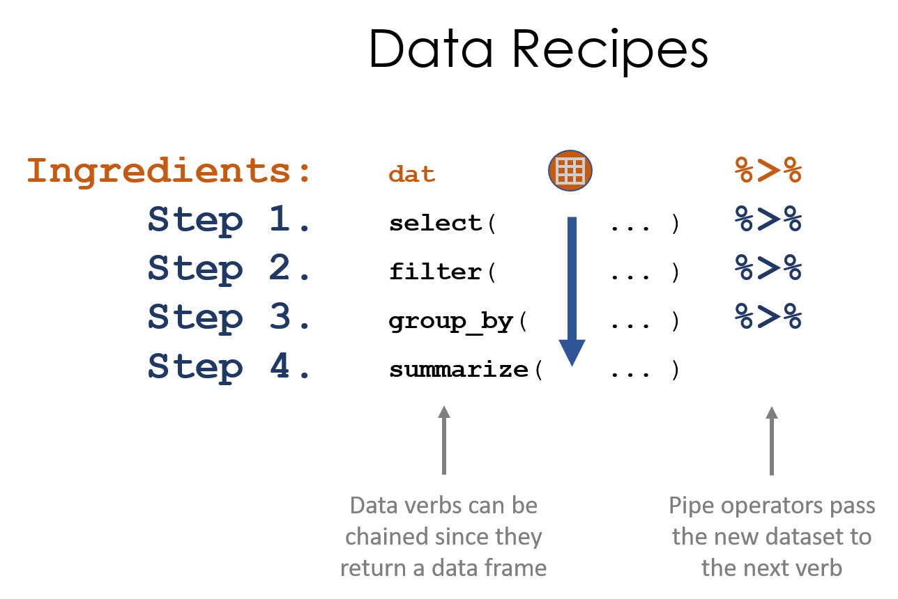
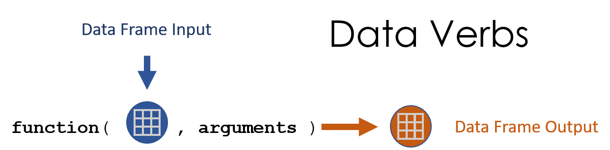
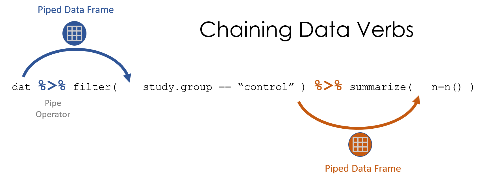

---
output:
  html_document:
    theme: readable
    highlight: tango
    toc: true
    toc_depth: 1
    number_sections: true
    self_contained: false
    css: textbook.css
---

```{r, echo=F }
knitr::opts_chunk$set( echo = TRUE, message=F, warning=F, fig.width=8 )
```


# Data Recipes


<style>
th {
    text-align: left;
}
td {
    text-align: left;
}
</style>


## Packages Used in This Chapter

```{r}
library( dplyr )
library( pander )
library( ggvis )
```


## Key Concepts

```{r, fig.cap="Data recipes are written using a series of data steps. We can simplify this process using pipes", echo=F, out.width='80%' }

```

<br><br>

```{r, fig.cap="Recall, data verbs use data frames as the primary input and the output value.", echo=F, out.width='80%' }

```

<br><br>

```{r, fig.cap="The pipe operator passes a data frame forward through a chain of data verbs. We only reference the dataset name once, and all other times it's implicitly called through piping.", echo=F, out.width='90%' }

```


## The Pipe Operator **%>%**

The idea of functions() was first introduced using a metaphor of a cookie recipe that has ingredients (data and arguments) and requires that each step of the process building on the results of the previous step.

The pipe operator allows us to follow this same model to build "data recipes", a stylized way of writing a program as a series of data verbs chained together to wrangle and analyze the data. The pipe operator passes the data from one verb to the next without having to name it directly.

```{r, fig.cap="The pipe operator allows us to pass a transformed dataset forward in the recipe.", echo=F, out.width='80%' }

```


## Building Data Recipes

Data recipes are simple scripts that follow a series of steps, just like a recipe.

This chapter demonstrates how data verbs and pipe operators can be used to write recipes to generate interesting insights. 

To demonstrate the idea, we will use a dataset of [US Baby Names](https://www.kaggle.com/ryanburge/hipster-names/data) released by the Social Security Administration. This version was downloaded by [Ryan Burge](https://www.kaggle.com/ryanburge) and posted on Kaggle. I've re-posted it on GitHub so it can be read directly into R easily:


```{r}
URL <- "https://github.com/DS4PS/Data-Science-Class/blob/master/DATA/BabyNames.rds?raw=true"
names <- readRDS( gzcon( url( URL )))
names %>% head() %>% pander()
```


Let's start by building a recipe to identify the top 10 male names for Baby Boomers.

1. Create a subset of data for men born between 1946 and 1964. 
2. Sort by the annual count of each name in the subset. 
3. Keep only the most popular year for each name. 
4. Identify the top 10 most popular during this period. 
5. Print the results in a nice table that includes name and peak year data. 

The recipe will look something like this:

```{r}
names %>% 
  filter( Gender =="M" & Year >= 1946 & Year <= 1964 ) %>%
  arrange( desc( Count ) ) %>%
  distinct( Name, .keep_all=T ) %>%
  top_n( 10, Count ) %>%
  select( Name, Year, Count ) %>%
  pander()
```


There are many ways to construct a data recipe. We could have alternatively taken this approach:

1. Create a subset of data for men born between 1946 and 1964. 
2. Count the total numer of men given each name during the period.
3. Find the top 10 most popular names.

```{r}
names %>% 
  filter( Gender =="M" & Year >= 1946 & Year <= 1964 ) %>%
  group_by( Name ) %>%
  dplyr::summarize( total=sum(Count) ) %>%
  dplyr::arrange( desc(total) ) %>%
  slice( 1:10 ) %>%
  pander()
```


We can see that these two approaches to answering our question give us slightly different results, but are pretty close. 

Let's try to identify when specific female names have peaked. 

1. Create a subset of data for women. 
2. Group the data by "Name" so we can analyze each name separately.
3. Find the year with the highest count for each name.
4. Store this data as "peak.years". 

Each name will occur once in this dataset in the year that it experienced it's peak popularity.

```{r}
peak.years <- 
  names %>%
  filter( Gender == "F" ) %>%
  group_by( Name ) %>%
  top_n( 1, Count ) %>% 
  ungroup() 

peak.years %>% head( 5 ) %>% pander()
```

We can then filter by years to see which names peaked in a given period.

```{r}
filter( peak.years, Year == 1950 ) %>% 
  arrange( desc( Count ) ) %>%
  slice( 1:5 ) %>%
  pander()
```


```{r}
# library( ggvis )
names %>%
  filter( Name == "Constance" & Gender =="F" ) %>%
  select (Name, Year, Count) %>%
  ggvis( ~Year, ~Count, stroke = ~Name ) %>%
  layer_lines()
```


```{r}
top.five.1920 <- 
  filter( peak.years, Year == 1920 ) %>% 
  top_n( 5, Count ) 

top.five.1920
```


```{r}
names %>%
  filter( Name %in% top.five.1920$Name & Gender =="F" ) %>%
  select (Name, Year, Count) %>%
  ggvis( ~Year, ~Count, stroke = ~Name ) %>%
  layer_lines()
```

```{r}
top.five.1975 <- 
  filter( peak.years, Year == 1975 ) %>% 
  top_n( 5, Count ) 

names %>%
  filter( Name %in% top.five.1975$Name & Gender =="F" ) %>%
  select (Name, Year, Count) %>%
  ggvis( ~Year, ~Count, stroke = ~Name ) %>%
  layer_lines()
```


```{r}
top.five.2000 <- 
  filter( peak.years, Year == 2000 ) %>% 
  top_n( 5, Count ) 

names %>%
  filter( Name %in% top.five.2000$Name & Gender =="F" ) %>%
  select (Name, Year, Count) %>%
  ggvis( ~Year, ~Count, stroke = ~Name ) %>%
  layer_lines()
```

Ryan Burge posted a [fun project on Kaggle](https://www.kaggle.com/ryanburge/hipster-names/notebook) about how to find hipster names using this historical data. He defines hipster names as those meeting the following criteria:

* They were popular when your grandmother was young. 
* They were unpopular when your parents were young. 
* They have recently become popular again.  

Let's stick with women's names.

```{r}
df1 <- filter( names, Gender == "F" & Year >= 1915 & Year <= 1935 & Count > 3000 )
df2 <- filter( names, Gender == "F" & Year == 1980 & Count <= 1000 )
df3 <- filter( names, Gender == "F" & Year >= 2010 & Count > 2000)

hipster.names <- 
  names %>%
  filter( Name %in% df1$Name & Name %in% df2$Name & Name %in% df3$Name ) %>%
  group_by( Name ) %>%
  dplyr::summarize( total=sum(Count), peak=max(Count) ) %>%
  arrange( desc( peak ) ) 
```


Here are the top 6 female hipster names:

```{r}
top.hipster.names <- c("Emma","Evelyn","Alice","Grace","Lillian","Charlotte")

names %>%
  filter( Name %in% top.hipster.names & Gender =="F" ) %>%
  select (Name, Year, Count) %>%
  ggvis( ~Year, ~Count, stroke = ~Name ) %>%
  layer_lines()
```

And the full list:

```{r}
hipster.names %>% pander()
```


## Conclusion

The pipe operator is a little confusing when you first encounter it, but you will find that using data verbs contained in the **dplyr** package and the pipe operator will speed up your analysis and make your code more readable. 

In the next chapter we focus more on the use of groups in data science, and the applications of the **group_by()** function to make your job easier. 


